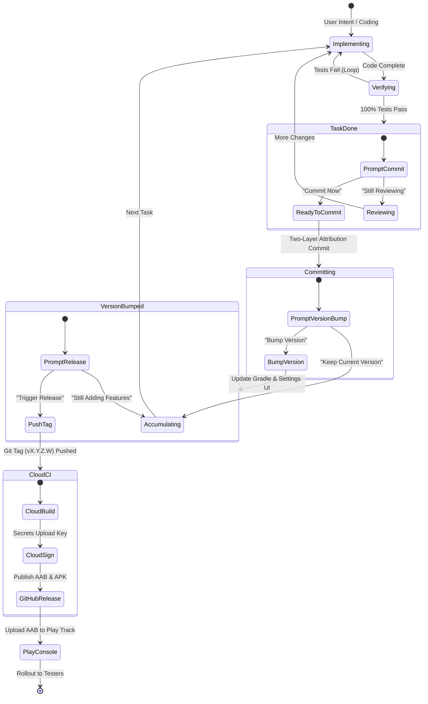

# 🧭 Development & Release Cycle Cadence

> **The Development & Release Lifecycle State Machine for ShellGuard-TOTP**  
> *A self-referential framework for guiding the developer and agents through task completion, verification, git hygiene, versioning, and cloud releases.*

---

## 🌐 The Developmental Territory

Development is not an ad-hoc stream of edits; it is a topological progression through distinct **epistemic states**. At each boundary, the state of the codebase shifts from uncertainty to verified truth, then to structured persistence, and finally to release deployment.

---

## 🔄 Epistemic State Transitions & Conversational Cadence

The agent maintains awareness of this lifecycle state and proactively prompts the user at the exact transition boundaries:

---

### Transition 1: Task Finished → Commit Check
- **Context**: The agent has finished writing/refactoring code and the pre-flight verification gate (`./gradlew testDebugUnitTest`) is 100% green.
- **Agent Prompt**:
  > *"All tests and verification gates are passing 100% green. Would you like me to commit these changes now under our two-layer attribution format, or are you still reviewing / adding more locally?"*
- **Branching Outcomes**:
  - **User: "Commit"** → Proceed to **Transition 2**.
  - **User: "Still reviewing / adding"** → Agent preserves unstaged state and returns to local execution mode.

---

### Transition 2: Commit Completed → Version Bump Check
- **Context**: Changes have been committed cleanly following `.agents/rules/git-hygiene.md`.
- **Agent Prompt**:
  > *"Changes committed cleanly. Does this change warrant bumping our release version (`versionCode` + `versionName`), or are we keeping the current version tag to bundle more tasks?"*
- **Branching Outcomes**:
  - **User: "Bump version"** → Increment `versionCode` (+1) and adjust `versionName` in `app/build.gradle.kts`, sync memory bank changelog, and proceed to **Transition 3**.
  - **User: "Keep current version / still adding"** → Agent anchors state in `activeContext.md` and returns to feature work.

---

### Transition 3: Version Bumped → Release Movement Check
- **Context**: Version has been bumped in Gradle, Settings UI footer dynamically reflects the new version, and the changelog is updated.
- **Agent Prompt**:
  > *"Version is bumped to `vX.Y.Z.W (Build N)`. Are we moving towards a release to Google Play (pushing the git tag to trigger the GitHub Actions cloud build), or continuing with additional features first?"*
- **Branching Outcomes**:
  - **User: "Release / Push tag"** → Execute `git tag vX.Y.Z.W && git push origin vX.Y.Z.W`. Cloud CI takes over to produce the signed `.aab`.
  - **User: "No, still adding"** → Agent records that a release is pending but holds tag creation until the user signals completion.

---

### Transition 4: Post-Release → Tester Rollout & Feedback
- **Context**: GitHub Actions has finished building, signing, and attaching `app-release.aab` to the GitHub Release.
- **Agent Prompt**:
  > *"Cloud build complete! The signed `app-release.aab` is ready. Would you like me to guide through uploading to the Play Console Internal Testing track and sharing the opt-in invite link with testers?"*

---

## 🧠 Epistemic Memory Rules for Agents

1. **Never Assume — Ask at Boundaries**: Do not commit without asking. Do not bump versions without asking. Do not tag releases without asking.
2. **Context Persistence Across "No" Responses**: If the user responds *"No, we're still adding"*, the agent notes this in `activeContext.md` as an accumulated sprint and re-surfaces the commit/release check after the next series of modifications.
3. **Always Ground in Evidence**: Never propose a commit or version bump while tests are failing or compilation is unverified.
