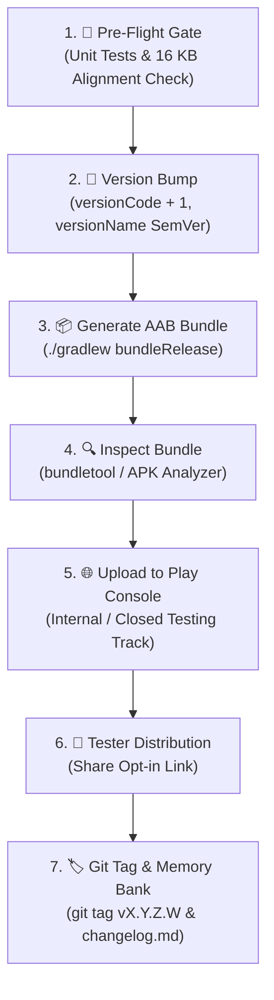

# 🚀 Google Play Console Release & Deployment Workflow

> **Standard Operating Procedure for ShellGuard-TOTP Releases**  
> *Engineered for Android App Bundle (`.aab`) Generation, Keystore Signing, 16 KB Alignment Verification, and Play Console Distribution.*

---

## 📋 Workflow Overview



---

## 🛠️ Step 1: Pre-Flight Verification Gate

Before building a release artifact, run the full verification gate to ensure zero regressions:

```bash
# Clean build cache and execute all unit and UI tests
./gradlew clean testDebugUnitTest
```

### Invariants to Verify:
- [ ] **Target SDK API 36**: Google Play Console strictly mandates `targetSdk = 36` (Android 16). Any bundle targeting API 35 or lower will be rejected during upload validation.
- [ ] **Tests Passing**: 100% pass rate across all Robolectric and unit tests (101+ passing as of Phase 11; expect growth each phase — never regress).
- [ ] **16 KB Alignment**: `gradle/libs.versions.toml` specifies `sqlcipher = "4.6.1"` and `app/build.gradle.kts` specifies `jniLibs.useLegacyPackaging = false`.
- [ ] **Security Boundaries**: `FLAG_SECURE` active for production builds (`!BuildConfig.DEBUG` in `MainActivity.kt`).
- [ ] **Network Security**: Cleartext permitted strictly for local LAN / VPN origins in `res/xml/network_security_config.xml`.

---

## 🔢 Step 2: Versioning Protocol

Every release bundle uploaded to Google Play **MUST** have a strictly higher `versionCode` than any previously uploaded bundle.

Edit [`app/build.gradle.kts`](file:///config/Documents/workspace-lucas/projects/Agents/ShellGuard-TOTP/app/build.gradle.kts):

```kotlin
android {
    defaultConfig {
        applicationId = "com.clawstack.shellguard.totp"
        minSdk = 24
        targetSdk = 36
        versionCode = N + 1         // Increment monotonically (+1 integer for every upload: 1, 2, 3...)
        versionName = "X.Y.Z.N"     // SemVer display version (e.g. "0.0.0.1", "0.0.0.2", "1.0.0.0"...)
    }
}
```

> [!TIP]
> **Durable Conflict Resolution: Updating a Release Without Bumping Version Name**:
> If you need to re-upload or hotfix a release under the same user-facing version name (e.g. `vX.Y.Z.N`), keep `versionName = "X.Y.Z.N"` unchanged and increment `versionCode` (e.g. `N` ➔ `N + 1`). In Google Play Console, it will appear as `X.Y.Z.N (Build N+1)`, and the app UI will seamlessly continue displaying `vX.Y.Z.N`.

---

## 📦 Step 3: Generate Signed Release Artifacts

### 🚀 Recommended: Automated Cloud Build via GitHub Actions (Zero Local CPU Drain)
To avoid local machine resource exhaustion, use the cloud release pipeline:

1. **Trigger via Commit Flag or Git Tag**:
   ```bash
   # Method A: Commit flag
   git commit -m "chore(release): release vX.Y.Z.N (Build N+1) --release vX.Y.Z.N"
   git push origin main

   # Method B: Git tag
   git tag vX.Y.Z.N
   git push origin vX.Y.Z.N
   ```
2. **Download Signed Artifacts**:
   - Navigate to GitHub **Actions** or **Releases** on `ClawStackStudios/ShellGuard-TOTP`.
   - Download the signed `app-release.aab` (for Google Play Console) and `app-release.apk` (for direct sideloading).

### 💻 Alternative: Local Build (Requires Local Keystore)
If building locally, run:
```bash
./gradlew bundleRelease assembleRelease
```
Artifacts output to:
- `app/build/outputs/bundle/release/app-release.aab`
- `app/build/outputs/apk/release/app-release.apk`
> The release footer at the bottom of `SettingsScreen.kt` dynamically reads `BuildConfig.VERSION_NAME` and will automatically update to match `versionName`.

---

## 🔑 Step 3: Keystore & Signing Configuration

Google Play uses **Play App Signing**. You sign the bundle with your **Upload Key**, and Google signs the final APK delivered to user devices with the App Signing Key.

### Environment Variable Setup (CI / Automated Shell):
```bash
export KEYSTORE_PATH="/path/to/my-upload-key.jks"
export STORE_PASSWORD="your_keystore_password"
export KEY_PASSWORD="your_key_password"
```

### Or GUI Signing in Android Studio:
1. Top Menu: **Build** → **Generate Signed Bundle / APK...**
2. Select **Android App Bundle (.aab)** → **Next**.
3. Choose your Keystore file, enter passwords, and select key alias `upload`.
4. Choose build variant **release**.
5. Click **Create**.

---

## 📦 Step 4: Generate the Release Android App Bundle (`.aab`)

Run the Gradle release bundle task:

```bash
./gradlew bundleRelease
```

### Output Location:
📁 `app/build/outputs/bundle/release/app-release.aab`

---

## 🔍 Step 5: Bundle Validation & 16 KB Page-Size Check

Before uploading to Play Console, inspect the generated `.aab`:

### Method A: Android Studio APK/AAB Analyzer
1. In Android Studio, go to **Build** → **Analyze APK...**
2. Select `app/build/outputs/bundle/release/app-release.aab`.
3. Open `base/lib/arm64-v8a/` and inspect `libsqlcipher.so` and `libbarhopper_v3.so`.
4. Confirm native libraries indicate 16 KB segment alignment.

### Method B: bundletool Universal APK Test (Optional)
```bash
bundletool build-apks \
  --bundle=app/build/outputs/bundle/release/app-release.aab \
  --output=app-universal.apks \
  --mode=universal \
  --ks=my-upload-key.jks \
  --ks-pass=pass:your_keystore_password
```

---

## 🌐 Step 6: Google Play Console Release Upload

1. Navigate to the **[Google Play Console](https://play.google.com/console)**.
2. Select **ShellGuard TOTP** (`com.clawstack.shellguard.totp`).
3. In the left-hand sidebar, navigate to **Testing** → **Internal testing** (or **Closed testing**).
4. Click **Create new release** (top right).
5. **Upload Bundle**: Drag and drop `app-release.aab` into the upload zone.
6. **Release Name**: Play Console will automatically populate `X.Y.Z.N (Build N)` matching your Gradle config.
7. **Release Notes**: Copy the formatted `<en-US>` notes directly from [`RELEASE-PLAY.md`](file:///config/Documents/workspace-lucas/projects/Agents/ShellGuard-TOTP/RELEASE-PLAY.md) (<500 characters):
   ```xml
   <en-US>
   • Initial release of ShellGuard-TOTP Authenticator!
   • Zero-Knowledge Privacy: Hardware KeyStore AES-256 encryption.
   • Offline Autonomy: Generate RFC 6238 2FA codes with live countdown arcs.
   • Dynamic Design: Modernist Reef Pink default theme + 6 custom accent palettes.
   • Fast Setup: CameraX QR scanner & screenshot import.
   • Self-Hosted Sync: Optional two-way delta sync with ShellGuard servers.
   • Android 15+ 16 KB page-size kernel ready.
   </en-US>
   ```
8. Click **Next** → **Save** → **Review release** → **Start rollout to Internal testing**.

---

## 👥 Step 7: Manage & Distribute to Testers

1. In Play Console under **Internal testing**, open the **Testers** tab.
2. Create an **Email list** (e.g. `ShellGuard Alpha Testers`) and add your testers' Google account emails.
3. Scroll down to **How testers join your test** and copy the **"Join on Android"** link or **"Join on the web"** link.
4. Share the link with your testers:
   - Testers tap the link on their Android device.
   - Tap **Accept Invite**.
   - Download/update the app directly from the Google Play Store!

---

## 🏷️ Step 8: Post-Release Tagging & Memory Bank Sync

After rollout, tag the repository and update project history:

```bash
# Tag the git commit matching the release version
git tag -a vX.Y.Z.N -m "Release vX.Y.Z.N (Build N) to Google Play Internal Testing"
git push origin vX.Y.Z.N
```

### Update Memory Bank:
1. Append details to [`.clinerules/memory-bank/changelog.md`](../../.clinerules/memory-bank/changelog.md).
2. Record the rollout event in [`.clinerules/memory-bank/activeContext.md`](../../.clinerules/memory-bank/activeContext.md) (slide window to 10).
3. Release-notes source of truth: `RELEASE-PLAY.md` (Play `<en-US>` block) + `RELEASE-vX.Y.Z.N.md` (GitHub Release body, auto-mirrored by the Release Pipeline on tag push).
