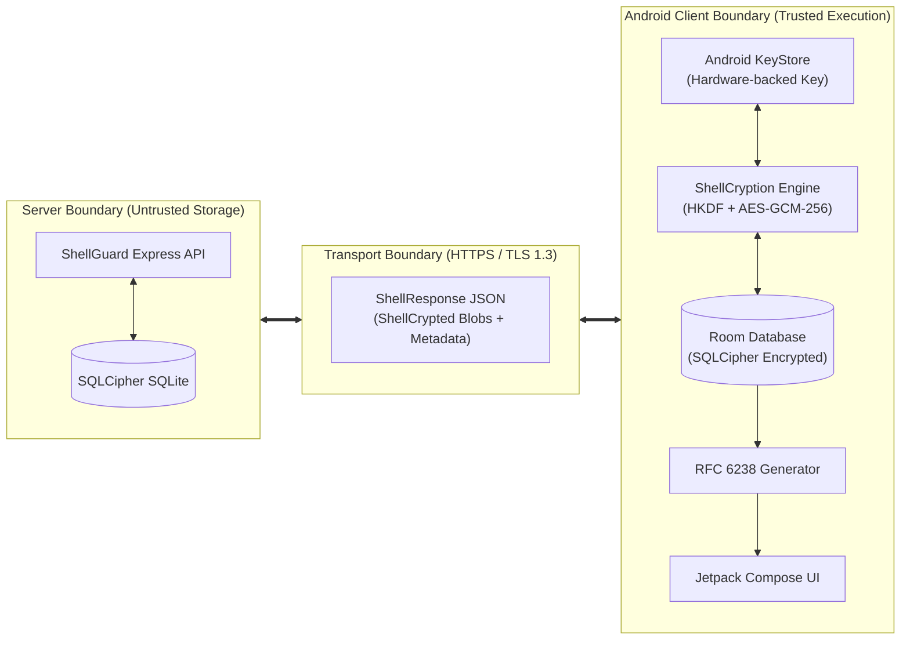
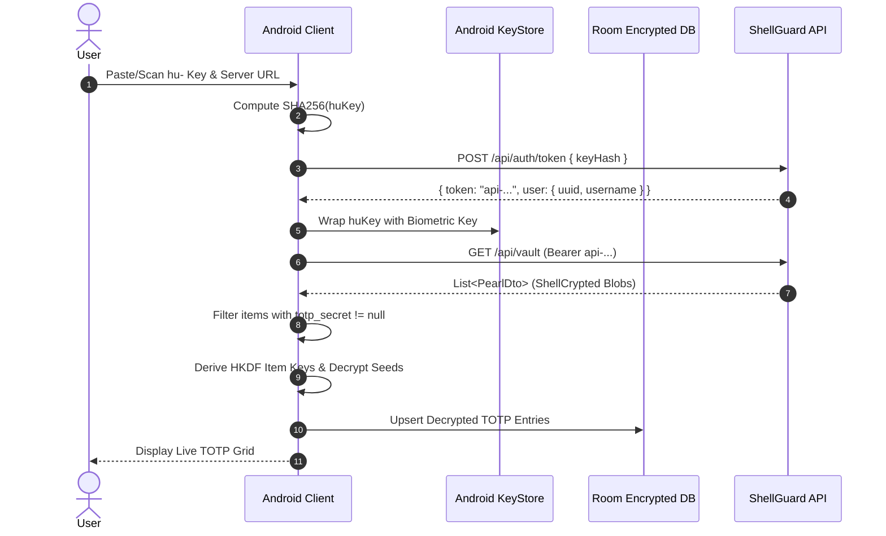
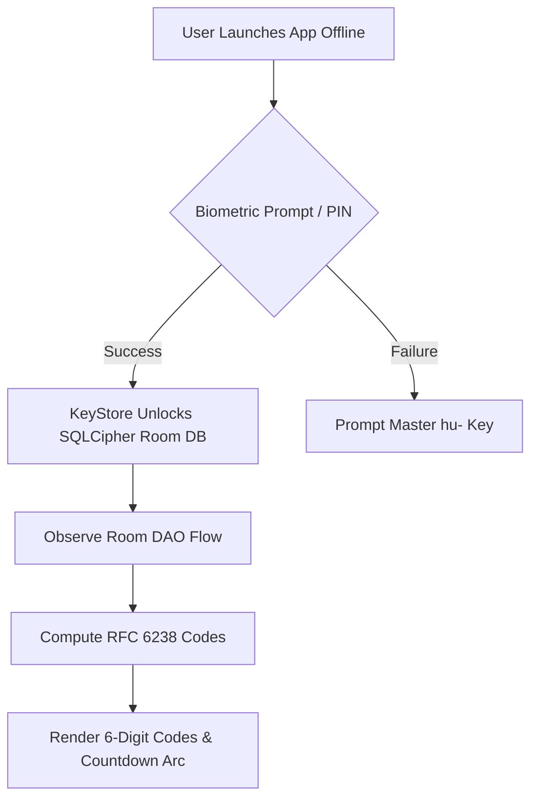
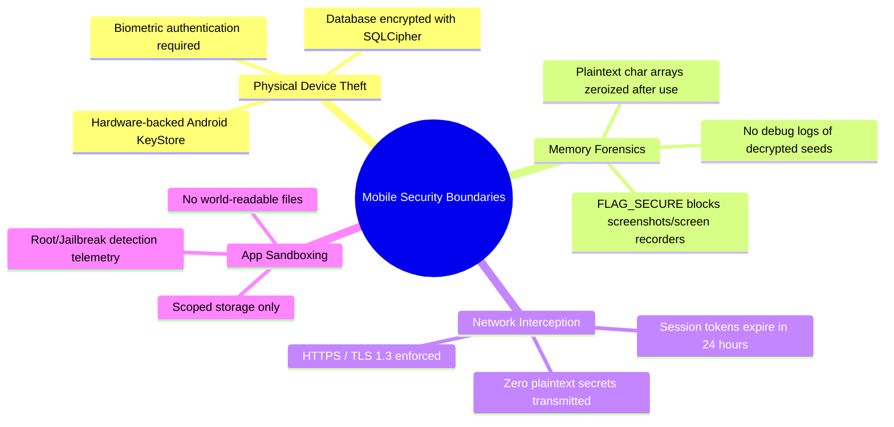

# 🏗️ ShellGuard-TOTP — Client Architecture & Boundaries

> **Technical Blueprint: Client-Server Relationships, System Boundaries & Mobile Architecture**  
> *Targeted for Google AI Studio Android Application Generator.*

---

## 1. System Role & Philosophy

The **ShellGuard-TOTP** Android application operates as a **satellite authenticator client** connected to the ShellGuard vault backend. It follows the architectural paradigm of the Bitwarden Authenticator:

- **Specialized Functionality**: Unlike the primary ShellGuard Web Vault or future Full Vault Android Client, this app focuses strictly on **2FA / TOTP generation, management, and zero-knowledge synchronization**.
- **Autonomous Operability**: Once synced, the client must never be blocked or crippled by server downtime, network firewalls, or lack of internet access.
- **Zero-Knowledge Decryption**: The server stores only ShellCrypted ciphertext envelopes. The Android client independently derives the item-specific decryption keys and unpacks the TOTP seeds in local memory.

---

## 2. Client-Server Division of Responsibilities

| Responsibility Area | ShellGuard Web Server | ShellGuard-TOTP Android Client |
|---|---|---|
| **Identity & Authentication** | Validates SHA-256 key hash of `hu-` key, issues short-lived `api-` token (default 24h). | Captures `hu-` key via QR scan or text entry, hashes key locally, requests bearer token. |
| **Secrets Decryption** | **NEVER** decrypts secrets. Blindly serves encrypted blobs. | Derives item-specific AES keys via HKDF-SHA256 and decrypts TOTP seeds in client memory. |
| **Storage & Persistence** | Authoritative remote store (`vault_pearls` table). | Local offline cache in SQLCipher Room DB. Preserves state across app restarts without network. |
| **Code Generation** | None (Zero server-side OTP generation for user vault entries). | Real-time RFC 6238 HMAC-SHA1/256/512 calculation and 30s countdown StateFlow. |
| **Delta Synchronization** | Serves full/filtered vault items via GET `/api/vault`. | Reconciles incoming items with local Room DB, handles upserts, and removes deleted items. |
| **Biometric Security** | No awareness of biometrics. | Protects cached vault keys in hardware `AndroidKeyStore` via Android `BiometricPrompt`. |

---

## 3. Lifecycle & Operational Modes

### Mode A: Initial Setup & Onboarding (Online)
1. **User Identity Pairing**: The user pastes their `hu-...` Human Identity Key or scans the Identity QR code from the ShellGuard Web UI.
2. **Server Discovery**: User configures the server base URL (e.g., `https://vault.yourdomain.com` or `http://192.168.1.50:6464`).
3. **Session Authentication**: Client sends `SHA-256(huKey)` to `POST /api/auth/token`, receiving session token `api-...` and `user.uuid`.
4. **Master Key Sealing**: If biometrics are enabled, the raw `hu-` key and `user.uuid` are encrypted using a KeyStore-generated AES-256-GCM key (`sg_biometric_master_wrapper`) and saved in encrypted shared preferences.
5. **Initial Vault Hydration**: Client calls `GET /api/vault`, filters all records with a non-empty `totp_secret`, decrypts each seed using `ShellCryptionEngine.decryptField(totpSecret, itemKey, "vault_pearls_totp", id)`, and stores them in Room DB.

---

### Mode B: Everyday Offline Operation (Zero Network)
1. **App Launch**: User opens app without internet connection.
2. **Quick Biometric Unlock**: User taps fingerprint or scans face. KeyStore unwraps the master key or unlocks the SQLCipher Room DB.
3. **Instant Cached Display**: Room DB streams cached TOTP items via Kotlin Flow.
4. **Continuous Live Generation**: TOTP engine recalculates codes every second, adjusting ticker UI without network latency.
5. **Graceful Status Badge**: App renders a discreet status banner: `"Offline — Displaying Cached Codes"`.

---

### Mode C: Background / Foreground Delta Sync (Connected)
1. **Trigger**: WorkManager periodic worker (e.g., every 1 hour) or user pull-to-refresh.
2. **Token Health Check**: If `api-` token is expired, silent re-auth occurs via stored `huKey` hash.
3. **Reconciliation**:
   - Fetches remote `List<PearlDto>`.
   - Any remote pearl with a modified `updated_at` is re-decrypted and upserted into Room.
   - Any local cached item whose ID is absent in the remote list (and is not marked as local-only) is deleted from Room.
   - Updates `SyncMetadataEntity.lastSyncTimestamp`.

---

## 4. Mobile Threat Model & Defenses

1. **Hardware-Backed Cryptographic Isolation**: Master keys never live in plaintext in shared preferences. Key derivation utilizes `AndroidKeyStore` with `setUserAuthenticationRequired(true)`.
2. **Memory Cleansing (`Zeroize`)**: Kotlin strings are immutable; sensitive secrets must be processed as `CharArray` or `ByteArray` and overwritten with zeros immediately following TOTP generation or database persistence.
3. **Screen Capture Defense (`FLAG_SECURE`)**: Every Activity applies `window.setFlags(WindowManager.LayoutParams.FLAG_SECURE, WindowManager.LayoutParams.FLAG_SECURE)` to block screen recorders, malicious overlay malware, and task switcher snapshots.
4. **LAN / Insecure Origin Handling**: If the user connects to a local HTTP Unraid/LAN instance without SSL, the app warns the user and requires explicit confirmation, while maintaining cryptographic integrity through client-side HKDF and AES-GCM envelope verification.
