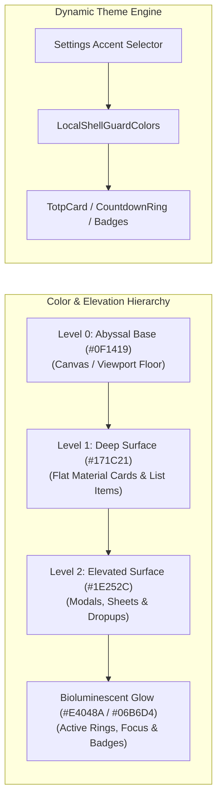

# 🎨 ShellGuard-TOTP — Android Design System: Reef Modernist Mobile

> **Material Design 3 Adaptation of the Reef Modernist ("Bioluminescent Defense") Design Language**  
> *Engineered for Native Android Jetpack Compose with Flat Material Cards, Dynamic Theme Accents, Smooth Motion & Tactile Feedback.*

---

## 💎 Brand & Visual Identity

**Reef Modernist Mobile** translates ShellGuard’s desktop vault design language into a high-performance, touch-first Android experience. It embodies **Bioluminescent Defense**—organic marine resilience fused with sharp, mathematical cryptographic precision.

The mobile interface treats authentication and data protection as an active, luminous carapace:
- **Exoskeletal Shells (Flat Material 3 Cards)**: Containers use clean geometric contours (`12dp`–`16dp` rounded corners), crisp 1dp structural borders (`#3D484E`), and subtle tonal surface elevations rather than heavy drop shadows.
- **Bioluminescent Glow**: Active 2FA codes, countdown progress arcs, and copy feedback glow with electric **Claw Cyan** (`#06B6D4`) and signature **Lobster Red** (`#E4048A`), shifting dynamically as token expiration nears.
- **Dual-Mode Fluidity**: Full native support for **Abyssal Dark** (Default Vault Mode) and **Ocean Mist** (Crisp Light Mode), with seamless transition support.
- **Dynamic Accent Customization**: Users can personalize their vault accent directly from Settings, choosing between iconic ShellGuard palettes (*Reef Bioluminescent, Electric Cyan, Imperial Shell, Emerald Bio-Flora, Solar Vent, Minimalist Pearl*) with dynamic Compose inheritance.
- **Glanceable Cryptographic Precision**: Large 3x3 grouped monospace digits (`123 456`) formatted for instant legibility in high-pressure authentication flows.



---

## 🎨 Palette & Dynamic Theme Tokens

Aligned 1:1 with ShellGuard's web design tokens (`DESIGN.md`), calibrated for Jetpack Compose:

### 🌑 Dark Mode (Abyssal Dark — Default)
- **Base Canvas (`--bg-base`)**: `Color(0xFF0F1419)` (`rgb(15, 20, 25)`)
- **Surface Card (`--bg-surface`)**: `Color(0xFF171C21)` (`rgb(23, 28, 33)`)
- **Elevated Surface**: `Color(0xFF1E252C)` (`rgb(30, 37, 44)`)
- **Text Main (`--text-main`)**: `Color(0xFFDEE3EA)` (`rgb(222, 227, 234)`)
- **Text Muted (`--text-muted`)**: `Color(0xFF879298)` (`rgb(135, 146, 152)`)
- **Border Subtle (`--border-subtle`)**: `Color(0xFF3D484E)` (`rgb(61, 72, 78)`)
- **Header Accent Border**: `Color(0xFFE4048A)` (Lobster Red)

### ☀️ Light Mode (Ocean Mist)
- **Base Canvas (`--bg-base`)**: `Color(0xFFF1F5F9)` (`rgb(241, 245, 249)`)
- **Surface Card (`--bg-surface`)**: `Color(0xFFFFFFFF)` (`rgb(255, 255, 255)`)
- **Elevated Surface**: `Color(0xFFF8FAFC)` (`rgb(248, 250, 252)`)
- **Text Main (`--text-main`)**: `Color(0xFF0F172A)` (`rgb(15, 23, 42)`)
- **Text Muted (`--text-muted`)**: `Color(0xFF64748B)` (`rgb(100, 116, 139)`)
- **Border Subtle (`--border-subtle`)**: `Color(0xFFCBD5E1)` (`rgb(203, 213, 225)`)
- **Header Accent Border**: `Color(0xFF3B0764)` (ShellGuard Purple)

---

## 🌈 Dynamic Theme Accent Customization System

To allow users to personalize their vault while preserving the signature ShellGuard aesthetic, the Android client provides **6 Curated Accent Palettes**:

| Accent Enum | Name | Primary Accent | Secondary / Glow | Character & Vibe |
|:---|:---|:---|:---|:---|
| `REEF_DEFAULT` | **Reef Bioluminescent** | `#E4048A` (Lobster Red) | `#06B6D4` (Claw Cyan) | Canonical ShellGuard dual-tone signature |
| `CYAN_VENT` | **Electric Cyan** | `#06B6D4` (Claw Cyan) | `#E4048A` (Lobster Red) | Crisp hydro-thermal neon focus |
| `PURPLE_SHELL`| **Imperial Shell** | `#A855F7` (Deep Purple) | `#06B6D4` (Claw Cyan) | Regal executive vault carapace |
| `EMERALD_TRENCH`| **Emerald Bio-Flora** | `#10B981` (Emerald) | `#06B6D4` (Claw Cyan) | Subaquatic luminescence & vitality |
| `AMBER_FLARE` | **Solar Vent** | `#F59E0B` (Amber Gold) | `#E4048A` (Lobster Red) | Warm high-visibility solar beacon |
| `MONOCHROME` | **Minimalist Pearl** | `#F8FAFC` (Pure Pearl) | `#879298` (Muted Steel) | Stealth, zero-distraction monochrome |

---

### Kotlin Theme Engine (`Theme.kt` & `Color.kt`)

```kotlin
package com.clawstack.shellguard.totp.ui.theme

import androidx.compose.foundation.isSystemInDarkTheme
import androidx.compose.material3.*
import androidx.compose.runtime.*
import androidx.compose.ui.graphics.Color

// ── Canonical ShellGuard Brand Colors ───────────────────────────
val BrandLobsterRed = Color(0xFFE4048A)      // Primary Action / Brand Gradient
val BrandClawCyan = Color(0xFF06B6D4)        // Secondary Action / Active Vents
val BrandPurple = Color(0xFF3B0764)          // ShellGuard Dark Purple
val BrandCoralOrange = Color(0xFFF97316)      // Countdown Warning (< 10s)
val BrandEmerald = Color(0xFF10B981)          // Success / Validated State

// ── Dark Mode Tokens (Abyssal Dark) ─────────────────────────────
val DarkBgBase = Color(0xFF0F1419)           // Canvas Viewport Floor
val DarkBgSurface = Color(0xFF171C21)        // Card / Container Surface
val DarkBgElevated = Color(0xFF1E252C)       // Sheets / Modals / Toolbars
val DarkTextMain = Color(0xFFDEE3EA)         // Luminous Shell Headlines & Codes
val DarkTextMuted = Color(0xFF879298)        // Secondary Subtitles & Timestamps
val DarkBorderSubtle = Color(0xFF3D484E)     // Carapace Ridge 1dp Outlines

// ── Light Mode Tokens (Ocean Mist) ──────────────────────────────
val LightBgBase = Color(0xFFF1F5F9)          // Ocean Mist Canvas
val LightBgSurface = Color(0xFFFFFFFF)       // Crisp White Card Surface
val LightBgElevated = Color(0xFFF8FAFC)      // Elevated Surfaces
val LightTextMain = Color(0xFF0F172A)        // Slate 900 Typography
val LightTextMuted = Color(0xFF64748B)       // Slate 500 Subtitles
val LightBorderSubtle = Color(0xFFCBD5E1)    // Slate 300 Outlines

// ── Theme Accents Enum ──────────────────────────────────────────
enum class ThemeAccent(
    val displayName: String,
    val primaryColor: Color,
    val secondaryColor: Color
) {
    REEF_DEFAULT("Reef Bioluminescent", BrandLobsterRed, BrandClawCyan),
    CYAN_VENT("Electric Cyan", BrandClawCyan, BrandLobsterRed),
    PURPLE_SHELL("Imperial Shell", Color(0xFFA855F7), BrandClawCyan),
    EMERALD_TRENCH("Emerald Bio-Flora", BrandEmerald, BrandClawCyan),
    AMBER_FLARE("Solar Vent", Color(0xFFF59E0B), BrandLobsterRed),
    MONOCHROME("Minimalist Pearl", Color(0xFFF8FAFC), Color(0xFF879298))
}

enum class ThemeMode {
    SYSTEM, DARK, LIGHT
}

// ── Dynamic Color Scheme Carrier ─────────────────────────────────
data class ShellGuardCustomColors(
    val bgBase: Color,
    val bgSurface: Color,
    val bgElevated: Color,
    val textMain: Color,
    val textMuted: Color,
    val borderSubtle: Color,
    val primaryAccent: Color,
    val secondaryAccent: Color,
    val warning: Color = BrandCoralOrange,
    val danger: Color = BrandLobsterRed
)

val LocalShellGuardColors = staticCompositionLocalOf<ShellGuardCustomColors> {
    error("No ShellGuardColors provided")
}

@Composable
fun ShellGuardTheme(
    themeMode: ThemeMode = ThemeMode.DARK,
    accent: ThemeAccent = ThemeAccent.REEF_DEFAULT,
    content: @Composable () -> Unit
) {
    val isDark = when (themeMode) {
        ThemeMode.SYSTEM -> isSystemInDarkTheme()
        ThemeMode.DARK -> true
        ThemeMode.LIGHT -> false
    }

    val customColors = if (isDark) {
        ShellGuardCustomColors(
            bgBase = DarkBgBase,
            bgSurface = DarkBgSurface,
            bgElevated = DarkBgElevated,
            textMain = DarkTextMain,
            textMuted = DarkTextMuted,
            borderSubtle = DarkBorderSubtle,
            primaryAccent = accent.primaryColor,
            secondaryAccent = accent.secondaryColor
        )
    } else {
        ShellGuardCustomColors(
            bgBase = LightBgBase,
            bgSurface = LightBgSurface,
            bgElevated = LightBgElevated,
            textMain = LightTextMain,
            textMuted = LightTextMuted,
            borderSubtle = LightBorderSubtle,
            primaryAccent = accent.primaryColor,
            secondaryAccent = accent.secondaryColor
        )
    }

    val materialColors = if (isDark) {
        darkColorScheme(
            primary = accent.primaryColor,
            onPrimary = if (accent == ThemeAccent.MONOCHROME) DarkBgBase else Color.White,
            secondary = accent.secondaryColor,
            background = DarkBgBase,
            onBackground = DarkTextMain,
            surface = DarkBgSurface,
            onSurface = DarkTextMain,
            surfaceVariant = DarkBgElevated,
            onSurfaceVariant = DarkTextMuted,
            outline = DarkBorderSubtle,
            error = BrandLobsterRed
        )
    } else {
        lightColorScheme(
            primary = accent.primaryColor,
            onPrimary = Color.White,
            secondary = accent.secondaryColor,
            background = LightBgBase,
            onBackground = LightTextMain,
            surface = LightBgSurface,
            onSurface = LightTextMain,
            surfaceVariant = LightBgElevated,
            onSurfaceVariant = LightTextMuted,
            outline = LightBorderSubtle,
            error = BrandLobsterRed
        )
    }

    CompositionLocalProvider(LocalShellGuardColors provides customColors) {
        MaterialTheme(
            colorScheme = materialColors,
            typography = ShellGuardTypography,
            content = content
        )
    }
}
```

---

## 🔤 Typography & Monospace Hierarchy

Matches ShellGuard desktop typography rules:
- **Headlines:** `Outfit` (Bold / SemiBold) with tight tracking (`-0.02em`)
- **Body:** `Inter` (Regular / Medium) for interface legibility
- **Monospace:** `JetBrains Mono` for 2FA verification codes, secret seeds, and hash fingerprints

```kotlin
package com.clawstack.shellguard.totp.ui.theme

import androidx.compose.material3.Typography
import androidx.compose.ui.text.TextStyle
import androidx.compose.ui.text.font.FontFamily
import androidx.compose.ui.text.font.FontWeight
import androidx.compose.ui.unit.sp

val ShellGuardTypography = Typography(
    headlineLarge = TextStyle(
        fontFamily = FontFamily.SansSerif, // Configured with Outfit font in res/font
        fontWeight = FontWeight.Bold,
        fontSize = 28.sp,
        lineHeight = 34.sp,
        letterSpacing = (-0.5).sp
    ),
    headlineMedium = TextStyle(
        fontFamily = FontFamily.SansSerif,
        fontWeight = FontWeight.Bold,
        fontSize = 22.sp,
        lineHeight = 28.sp
    ),
    bodyLarge = TextStyle(
        fontFamily = FontFamily.SansSerif, // Configured with Inter font
        fontWeight = FontWeight.Normal,
        fontSize = 15.sp,
        lineHeight = 22.sp
    ),
    bodyMedium = TextStyle(
        fontFamily = FontFamily.SansSerif,
        fontWeight = FontWeight.Normal,
        fontSize = 13.sp,
        lineHeight = 18.sp
    ),
    labelSmall = TextStyle(
        fontFamily = FontFamily.SansSerif,
        fontWeight = FontWeight.SemiBold,
        fontSize = 11.sp,
        lineHeight = 14.sp,
        letterSpacing = 0.5.sp
    ),
    displayLarge = TextStyle(
        fontFamily = FontFamily.Monospace, // JetBrains Mono
        fontWeight = FontWeight.Bold,
        fontSize = 32.sp,
        lineHeight = 36.sp,
        letterSpacing = 3.sp
    ),
    displayMedium = TextStyle(
        fontFamily = FontFamily.Monospace,
        fontWeight = FontWeight.Bold,
        fontSize = 22.sp,
        lineHeight = 26.sp,
        letterSpacing = 2.sp
    )
)
```

---

## 🎴 Material 3 Flat Card Components

### A. The Master TOTP Flat Card (`TotpCard.kt`)

Designed with **spring press feedback**, high-contrast split digits (`123 456`), issuer initial badge, and live circular countdown ring:

```kotlin
package com.clawstack.shellguard.totp.ui.components

import androidx.compose.animation.core.animateFloatAsState
import androidx.compose.animation.core.spring
import androidx.compose.foundation.*
import androidx.compose.foundation.interaction.MutableInteractionSource
import androidx.compose.foundation.interaction.collectIsPressedAsState
import androidx.compose.foundation.layout.*
import androidx.compose.foundation.shape.CircleShape
import androidx.compose.foundation.shape.RoundedCornerShape
import androidx.compose.material3.*
import androidx.compose.runtime.*
import androidx.compose.ui.Alignment
import androidx.compose.ui.Modifier
import androidx.compose.ui.draw.clip
import androidx.compose.ui.draw.scale
import androidx.compose.ui.hapticfeedback.HapticFeedbackType
import androidx.compose.ui.platform.LocalHapticFeedback
import androidx.compose.ui.text.font.FontFamily
import androidx.compose.ui.text.font.FontWeight
import androidx.compose.ui.unit.dp
import androidx.compose.ui.unit.sp
import androidx.compose.material.icons.Icons
import androidx.compose.material.icons.filled.CloudDone
import androidx.compose.material.icons.filled.Delete
import androidx.compose.material.icons.filled.PhoneAndroid
import com.clawstack.shellguard.totp.ui.theme.LocalShellGuardColors

@OptIn(ExperimentalMaterial3Api::class)
@Composable
fun SwipeableTotpCard(
    title: String,
    username: String?,
    category: String?,
    code: String,
    remainingSeconds: Int,
    progress: Float,
    isLocalOnly: Boolean,
    onCopy: (String) -> Unit,
    onEdit: () -> Unit,
    onDelete: () -> Unit,
    modifier: Modifier = Modifier
) {
    val colors = LocalShellGuardColors.current
    val dismissState = rememberSwipeToDismissBoxState(
        confirmValueChange = { value ->
            if (value == SwipeToDismissBoxValue.EndToStart) {
                onDelete()
                true
            } else false
        }
    )

    SwipeToDismissBox(
        state = dismissState,
        enableDismissFromStartToEnd = false,
        enableDismissFromEndToStart = true,
        backgroundContent = {
            Box(
                modifier = Modifier
                    .fillMaxSize()
                    .clip(RoundedCornerShape(16.dp))
                    .background(colors.danger)
                    .padding(horizontal = 20.dp),
                contentAlignment = Alignment.CenterEnd
            ) {
                Icon(
                    imageVector = Icons.Default.Delete,
                    contentDescription = "Delete 2FA Code",
                    tint = colors.textMain
                )
            }
        },
        modifier = modifier
    ) {
        TotpCard(
            title = title,
            username = username,
            category = category,
            code = code,
            remainingSeconds = remainingSeconds,
            progress = progress,
            isLocalOnly = isLocalOnly,
            onCopy = onCopy,
            onEdit = onEdit
        )
    }
}

@OptIn(ExperimentalFoundationApi::class)
@Composable
fun TotpCard(
    title: String,
    username: String?,
    category: String?,
    code: String,
    remainingSeconds: Int,
    progress: Float,
    isLocalOnly: Boolean = false,
    onCopy: (String) -> Unit,
    onEdit: () -> Unit = {},
    modifier: Modifier = Modifier
) {
    val colors = LocalShellGuardColors.current
    val haptic = LocalHapticFeedback.current
    val interactionSource = remember { MutableInteractionSource() }
    val isPressed by interactionSource.collectIsPressedAsState()

    // Smooth spring press bounce
    val scale by animateFloatAsState(
        targetValue = if (isPressed) 0.97f else 1.0f,
        animationSpec = spring(dampingRatio = 0.75f, stiffness = 400f),
        label = "CardSpringScale"
    )

    // Formatted 3x3 display: "123456" -> "123 456"
    val formattedCode = if (code.length == 6) "${code.substring(0, 3)} ${code.substring(3)}" else code

    Card(
        modifier = modifier
            .fillMaxWidth()
            .scale(scale)
            .combinedClickable(
                interactionSource = interactionSource,
                indication = null,
                onClick = {
                    haptic.performHapticFeedback(HapticFeedbackType.LongPress)
                    onCopy(code)
                },
                onLongClick = {
                    haptic.performHapticFeedback(HapticFeedbackType.LongPress)
                    onEdit()
                }
            ),
        shape = RoundedCornerShape(16.dp),
        colors = CardDefaults.cardColors(containerColor = colors.bgSurface),
        border = BorderStroke(1.dp, colors.borderSubtle),
        elevation = CardDefaults.cardElevation(defaultElevation = 0.dp)
    ) {
        Row(
            modifier = Modifier
                .fillMaxWidth()
                .padding(16.dp),
            verticalAlignment = Alignment.CenterVertically,
            horizontalArrangement = Arrangement.SpaceBetween
        ) {
            // ── Left: Issuer Badge & Account Meta ───────────────────
            Row(
                verticalAlignment = Alignment.CenterVertically,
                modifier = Modifier.weight(1f)
            ) {
                // Issuer Avatar / Initial Badge
                Box(
                    modifier = Modifier
                        .size(44.dp)
                        .clip(CircleShape)
                        .background(colors.bgElevated)
                        .border(1.dp, colors.borderSubtle, CircleShape),
                    contentAlignment = Alignment.Center
                ) {
                    Text(
                        text = title.firstOrNull()?.uppercase() ?: "🐚",
                        color = colors.primaryAccent,
                        fontSize = 18.sp,
                        fontWeight = FontWeight.Bold
                    )
                }

                Spacer(modifier = Modifier.width(12.dp))

                Column {
                    Row(verticalAlignment = Alignment.CenterVertically) {
                        Text(
                            text = title,
                            color = colors.textMain,
                            fontSize = 15.sp,
                            fontWeight = FontWeight.SemiBold,
                            maxLines = 1
                        )
                        Spacer(modifier = Modifier.width(6.dp))
                        // Provenance Pill: 📱 Local vs ☁️ Synced
                        Icon(
                            imageVector = if (isLocalOnly) Icons.Default.PhoneAndroid else Icons.Default.CloudDone,
                            contentDescription = if (isLocalOnly) "Local Only" else "Synced with Vault",
                            tint = if (isLocalOnly) colors.textMuted else colors.secondaryAccent,
                            modifier = Modifier.size(13.dp)
                        )
                    }
                    if (!username.isNullOrBlank()) {
                        Text(
                            text = username,
                            color = colors.textMuted,
                            fontSize = 13.sp,
                            maxLines = 1
                        )
                    }
                    if (!category.isNullOrBlank()) {
                        Spacer(modifier = Modifier.height(4.dp))
                        Box(
                            modifier = Modifier
                                .clip(RoundedCornerShape(4.dp))
                                .background(colors.bgElevated)
                                .padding(horizontal = 6.dp, vertical = 2.dp)
                        ) {
                            Text(
                                text = category,
                                color = colors.primaryAccent,
                                fontSize = 10.sp,
                                fontWeight = FontWeight.Medium
                            )
                        }
                    }
                }
            }

            Spacer(modifier = Modifier.width(12.dp))

            // ── Right: Monospace Code & Animated Progress Ring ──────
            Row(
                verticalAlignment = Alignment.CenterVertically,
                horizontalArrangement = Arrangement.End
            ) {
                Text(
                    text = formattedCode,
                    color = when {
                        remainingSeconds <= 5 -> colors.danger
                        remainingSeconds <= 10 -> colors.warning
                        else -> colors.primaryAccent
                    },
                    fontFamily = FontFamily.Monospace,
                    fontWeight = FontWeight.Bold,
                    fontSize = 22.sp,
                    letterSpacing = 1.5.sp
                )

                Spacer(modifier = Modifier.width(12.dp))

                TotpCountdownRing(
                    remainingSeconds = remainingSeconds,
                    progress = progress
                )
            }
        }
    }
}
```

---

## ⏱️ Dynamic Canvas Circular Countdown Ring

The circular ring depletes counter-clockwise and smoothly transitions color thresholds:

```kotlin
package com.clawstack.shellguard.totp.ui.components

import androidx.compose.animation.animateColorAsState
import androidx.compose.animation.core.tween
import androidx.compose.foundation.Canvas
import androidx.compose.foundation.layout.Box
import androidx.compose.foundation.layout.size
import androidx.compose.material3.Text
import androidx.compose.runtime.Composable
import androidx.compose.runtime.getValue
import androidx.compose.ui.Alignment
import androidx.compose.ui.Modifier
import androidx.compose.ui.graphics.StrokeCap
import androidx.compose.ui.graphics.drawscope.Stroke
import androidx.compose.ui.text.font.FontFamily
import androidx.compose.ui.text.font.FontWeight
import androidx.compose.ui.unit.dp
import androidx.compose.ui.unit.sp
import com.clawstack.shellguard.totp.ui.theme.LocalShellGuardColors

@Composable
fun TotpCountdownRing(
    remainingSeconds: Int,
    progress: Float,
    modifier: Modifier = Modifier
) {
    val colors = LocalShellGuardColors.current

    val ringColor by animateColorAsState(
        targetValue = when {
            remainingSeconds <= 5 -> colors.danger
            remainingSeconds <= 10 -> colors.warning
            else -> colors.secondaryAccent
        },
        animationSpec = tween(400),
        label = "RingColorInterpolation"
    )

    Box(
        modifier = modifier.size(38.dp),
        contentAlignment = Alignment.Center
    ) {
        Canvas(modifier = Modifier.size(34.dp)) {
            // Track
            drawCircle(
                color = colors.borderSubtle,
                style = Stroke(width = 3.dp.toPx())
            )
            // Progress Arc
            drawArc(
                color = ringColor,
                startAngle = -90f,
                sweepAngle = progress * 360f,
                useCenter = false,
                style = Stroke(width = 3.dp.toPx(), cap = StrokeCap.Round)
            )
        }
        Text(
            text = "$remainingSeconds",
            color = ringColor,
            fontFamily = FontFamily.Monospace,
            fontSize = 11.sp,
            fontWeight = FontWeight.Bold
        )
    }
}
```

---

## 🔘 Native Buttons, Chips & Bottom Sheets

```kotlin
package com.clawstack.shellguard.totp.ui.components

import androidx.compose.foundation.BorderStroke
import androidx.compose.foundation.layout.*
import androidx.compose.foundation.lazy.LazyRow
import androidx.compose.foundation.lazy.items
import androidx.compose.foundation.shape.RoundedCornerShape
import androidx.compose.material.icons.Icons
import androidx.compose.material.icons.filled.Add
import androidx.compose.material.icons.filled.QrCodeScanner
import androidx.compose.material3.*
import androidx.compose.runtime.Composable
import androidx.compose.ui.Modifier
import androidx.compose.ui.text.font.FontWeight
import androidx.compose.ui.unit.dp
import androidx.compose.ui.unit.sp
import com.clawstack.shellguard.totp.ui.theme.LocalShellGuardColors

// ── Pod / Category Filter Chips ──────────────────────────────────
@Composable
fun PodFilterChips(
    categories: List<String>,
    selectedCategory: String?,
    onCategorySelected: (String?) -> Unit,
    modifier: Modifier = Modifier
) {
    val colors = LocalShellGuardColors.current

    LazyRow(
        modifier = modifier.fillMaxWidth(),
        contentPadding = PaddingValues(horizontal = 16.dp),
        horizontalArrangement = Arrangement.spacedBy(8.dp)
    ) {
        item {
            FilterChip(
                selected = selectedCategory == null,
                onClick = { onCategorySelected(null) },
                label = { Text("All Accounts", fontSize = 13.sp) },
                colors = FilterChipDefaults.filterChipColors(
                    selectedContainerColor = colors.primaryAccent,
                    selectedLabelColor = colors.bgBase,
                    containerColor = colors.bgSurface,
                    labelColor = colors.textMuted
                ),
                border = FilterChipDefaults.filterChipBorder(
                    enabled = true,
                    selected = selectedCategory == null,
                    borderColor = colors.borderSubtle,
                    selectedBorderColor = colors.primaryAccent
                ),
                shape = RoundedCornerShape(20.dp)
            )
        }
        items(categories) { cat ->
            FilterChip(
                selected = selectedCategory == cat,
                onClick = { onCategorySelected(cat) },
                label = { Text(cat, fontSize = 13.sp) },
                colors = FilterChipDefaults.filterChipColors(
                    selectedContainerColor = colors.primaryAccent,
                    selectedLabelColor = colors.bgBase,
                    containerColor = colors.bgSurface,
                    labelColor = colors.textMuted
                ),
                border = FilterChipDefaults.filterChipBorder(
                    enabled = true,
                    selected = selectedCategory == cat,
                    borderColor = colors.borderSubtle,
                    selectedBorderColor = colors.primaryAccent
                ),
                shape = RoundedCornerShape(20.dp)
            )
        }
    }
}

// ── Extended Floating Action Button (Camera Scanner) ────────────
@Composable
fun ScannerFab(
    onScanQrClick: () -> Unit,
    modifier: Modifier = Modifier
) {
    val colors = LocalShellGuardColors.current

    ExtendedFloatingActionButton(
        onClick = onScanQrClick,
        containerColor = colors.primaryAccent,
        contentColor = colors.bgBase,
        shape = RoundedCornerShape(16.dp),
        elevation = FloatingActionButtonDefaults.elevation(defaultElevation = 4.dp),
        icon = { Icon(Icons.Default.QrCodeScanner, contentDescription = "Scan 2FA QR") },
        text = { Text("Scan QR", fontWeight = FontWeight.Bold, fontSize = 15.sp) },
        modifier = modifier
    )
}
```

---

## 🍞 Animated Auto-Clearing Toast Pill

Displays clipboard copy notifications with an animated progress bar indicating time until the clipboard is scrubbed for security:

```kotlin
package com.clawstack.shellguard.totp.ui.components

import androidx.compose.animation.*
import androidx.compose.foundation.background
import androidx.compose.foundation.border
import androidx.compose.foundation.layout.*
import androidx.compose.foundation.shape.RoundedCornerShape
import androidx.compose.material.icons.Icons
import androidx.compose.material.icons.filled.CheckCircle
import androidx.compose.material3.Icon
import androidx.compose.material3.Text
import androidx.compose.runtime.Composable
import androidx.compose.ui.Alignment
import androidx.compose.ui.Modifier
import androidx.compose.ui.draw.clip
import androidx.compose.ui.text.font.FontWeight
import androidx.compose.ui.unit.dp
import androidx.compose.ui.unit.sp
import com.clawstack.shellguard.totp.ui.theme.LocalShellGuardColors

@Composable
fun ClipboardToastPill(
    visible: Boolean,
    message: String,
    modifier: Modifier = Modifier
) {
    val colors = LocalShellGuardColors.current

    AnimatedVisibility(
        visible = visible,
        enter = slideInVertically(initialOffsetY = { it }) + fadeIn(),
        exit = slideOutVertically(targetOffsetY = { it }) + fadeOut(),
        modifier = modifier
            .padding(16.dp)
            .fillMaxWidth()
    ) {
        Box(
            modifier = Modifier
                .fillMaxWidth()
                .clip(RoundedCornerShape(12.dp))
                .background(colors.bgElevated)
                .border(1.dp, colors.primaryAccent.copy(alpha = 0.5f), RoundedCornerShape(12.dp))
                .padding(horizontal = 16.dp, vertical = 12.dp),
            contentAlignment = Alignment.CenterStart
        ) {
            Row(verticalAlignment = Alignment.CenterVertically) {
                Icon(
                    imageVector = Icons.Default.CheckCircle,
                    contentDescription = "Copied",
                    tint = colors.primaryAccent,
                    modifier = Modifier.size(20.dp)
                )
                Spacer(modifier = Modifier.width(10.dp))
                Text(
                    text = message,
                    color = colors.textMain,
                    fontSize = 14.sp,
                    fontWeight = FontWeight.Medium
                )
            }
        }
    }
}
```

---

## 📭 Material 3 Empty State Screen (`TotpEmptyState.kt`)

Renders a high-polish, welcoming empty state when the local Room database has 0 items, prompting the user to add their first 2FA code via QR scanner, manual entry, or remote vault sync:

```kotlin
package com.clawstack.shellguard.totp.ui.components

import androidx.compose.foundation.BorderStroke
import androidx.compose.foundation.background
import androidx.compose.foundation.border
import androidx.compose.foundation.layout.*
import androidx.compose.foundation.shape.CircleShape
import androidx.compose.foundation.shape.RoundedCornerShape
import androidx.compose.material.icons.Icons
import androidx.compose.material.icons.filled.Edit
import androidx.compose.material.icons.filled.QrCodeScanner
import androidx.compose.material.icons.filled.Shield
import androidx.compose.material3.*
import androidx.compose.runtime.Composable
import androidx.compose.ui.Alignment
import androidx.compose.ui.Modifier
import androidx.compose.ui.draw.clip
import androidx.compose.ui.text.font.FontWeight
import androidx.compose.ui.text.style.TextAlign
import androidx.compose.ui.unit.dp
import androidx.compose.ui.unit.sp
import com.clawstack.shellguard.totp.ui.theme.LocalShellGuardColors

@Composable
fun TotpEmptyState(
    onScanQrClick: () -> Unit,
    onManualAddClick: () -> Unit,
    modifier: Modifier = Modifier
) {
    val colors = LocalShellGuardColors.current

    Column(
        modifier = modifier
            .fillMaxSize()
            .padding(32.dp),
        horizontalAlignment = Alignment.CenterHorizontally,
        verticalArrangement = Arrangement.Center
    ) {
        // ── 3D Locked Shell Illustration Badge ──────────────────
        Box(
            modifier = Modifier
                .size(120.dp)
                .clip(RoundedCornerShape(24.dp))
                .background(colors.bgElevated)
                .border(1.5.dp, colors.primaryAccent.copy(alpha = 0.5f), RoundedCornerShape(24.dp)),
            contentAlignment = Alignment.Center
        ) {
            Icon(
                imageVector = Icons.Default.Shield,
                contentDescription = "3D Locked Shell",
                tint = colors.primaryAccent,
                modifier = Modifier.size(56.dp)
            )
        }

        Spacer(modifier = Modifier.height(28.dp))

        // ── Headline & Instructions ──────────────────────────────
        Text(
            text = "No 2FA Codes Yet",
            color = colors.textMain,
            fontWeight = FontWeight.Bold,
            fontSize = 22.sp,
            textAlign = TextAlign.Center
        )

        Spacer(modifier = Modifier.height(8.dp))

        Text(
            text = "Scan a QR code from any service or sync your self-hosted ShellGuard vault to generate time-based verification codes.",
            color = colors.textMuted,
            fontSize = 14.sp,
            lineHeight = 20.sp,
            textAlign = TextAlign.Center,
            modifier = Modifier.padding(horizontal = 8.dp)
        )

        Spacer(modifier = Modifier.height(32.dp))

        // ── Primary Action: Scan QR Code ────────────────────────
        Button(
            onClick = onScanQrClick,
            modifier = Modifier
                .fillMaxWidth()
                .height(52.dp),
            shape = RoundedCornerShape(14.dp),
            colors = ButtonDefaults.buttonColors(containerColor = colors.primaryAccent)
        ) {
            Icon(
                imageVector = Icons.Default.QrCodeScanner,
                contentDescription = null,
                tint = colors.bgBase,
                modifier = Modifier.size(20.dp)
            )
            Spacer(modifier = Modifier.width(8.dp))
            Text(
                text = "Scan 2FA QR Code",
                color = colors.bgBase,
                fontWeight = FontWeight.Bold,
                fontSize = 15.sp
            )
        }

        Spacer(modifier = Modifier.height(12.dp))

        // ── Secondary Action: Enter Key Manually ─────────────────
        OutlinedButton(
            onClick = onManualAddClick,
            modifier = Modifier
                .fillMaxWidth()
                .height(52.dp),
            shape = RoundedCornerShape(14.dp),
            border = BorderStroke(1.dp, colors.borderSubtle),
            colors = ButtonDefaults.outlinedButtonColors(contentColor = colors.textMain)
        ) {
            Icon(
                imageVector = Icons.Default.Edit,
                contentDescription = null,
                tint = colors.primaryAccent,
                modifier = Modifier.size(18.dp)
            )
            Spacer(modifier = Modifier.width(8.dp))
            Text(
                text = "Enter Key Manually",
                color = colors.textMain,
                fontWeight = FontWeight.Medium,
                fontSize = 15.sp
            )
        }
    }
}

---

## ⚙️ Secure Settings & Encrypted Backup Screen (`SettingsScreen.kt`)

> **📌 Architecture Note (v0.0.2.1 — Phase 11.5)**: The monolithic screen specified in this section is superseded by the **Categorized Settings Hub** (`SettingsMetaScreen` — Phase 11/Task 22) with dedicated sub-screens. The **Appearance & Accessibility** card below (theme mode + accent swatches) now lives in `SettingsAppearanceScreen.kt`'s "Theme" section (Task 22b/22c); the **Server Sync / Backup / Biometric** cards map to `SettingsServerSyncScreen.kt` (Phase 11.5), Phase 13's `SettingsBackupsScreen`, and Phase 12's `SettingsSecurityScreen` respectively. The full hub route map and invariants are specified in [`ui-ux-design-system.md`](./ui-ux-design-system.md) §4.A.5. The token values, spacing, and interaction design in this section remain the canonical visual reference for those sub-screens.

Provides vault synchronization status, hardware biometric toggles, secure encrypted JSON export/import, and **dynamic theme appearance & accent color selection**:

```kotlin
package com.clawstack.shellguard.totp.ui.screens

import androidx.compose.foundation.*
import androidx.compose.foundation.layout.*
import androidx.compose.foundation.rememberScrollState
import androidx.compose.foundation.shape.CircleShape
import androidx.compose.foundation.shape.RoundedCornerShape
import androidx.compose.foundation.verticalScroll
import androidx.compose.material.icons.Icons
import androidx.compose.material.icons.filled.*
import androidx.compose.material3.*
import androidx.compose.runtime.*
import androidx.compose.ui.Alignment
import androidx.compose.ui.Modifier
import androidx.compose.ui.draw.clip
import androidx.compose.ui.graphics.Brush
import androidx.compose.ui.graphics.Color
import androidx.compose.ui.text.font.FontWeight
import androidx.compose.ui.unit.dp
import androidx.compose.ui.unit.sp
import com.clawstack.shellguard.totp.ui.theme.*

@OptIn(ExperimentalMaterial3Api::class)
@Composable
fun SettingsScreen(
    serverUrl: String?,
    userName: String?,
    lastSyncTime: String?,
    offlineCodesCount: Int,
    isBiometricEnabled: Boolean,
    currentThemeMode: ThemeMode,
    currentAccent: ThemeAccent,
    onSelectThemeMode: (ThemeMode) -> Unit,
    onSelectAccent: (ThemeAccent) -> Unit,
    onConnectServerClick: () -> Unit,
    onDisconnectServerClick: () -> Unit,
    onManualSyncClick: () -> Unit,
    onDisplayOfflineCodesClick: () -> Unit,
    onToggleBiometric: (Boolean) -> Unit,
    onExportBackupClick: () -> Unit,
    onImportBackupClick: () -> Unit,
    onBackClick: () -> Unit,
    modifier: Modifier = Modifier
) {
    val colors = LocalShellGuardColors.current

    Scaffold(
        topBar = {
            TopAppBar(
                title = { Text("Settings & Vault Security", color = colors.textMain, fontWeight = FontWeight.Bold, fontSize = 20.sp) },
                navigationIcon = {
                    IconButton(onClick = onBackClick) {
                        Icon(Icons.Default.ArrowBack, contentDescription = "Back", tint = colors.textMain)
                    }
                },
                colors = TopAppBarDefaults.topAppBarColors(containerColor = colors.bgBase)
            )
        },
        containerColor = colors.bgBase
    ) { padding ->
        Column(
            modifier = modifier
                .fillMaxSize()
                .padding(padding)
                .padding(horizontal = 16.dp)
                .verticalScroll(rememberScrollState())
        ) {
            Spacer(modifier = Modifier.height(16.dp))

            // ── Section 1: Appearance & Theme Accent Selection ──────
            Text("APPEARANCE & THEME ACCENTS", color = colors.textMuted, fontSize = 12.sp, fontWeight = FontWeight.Bold)
            Spacer(modifier = Modifier.height(8.dp))
            Card(
                shape = RoundedCornerShape(16.dp),
                colors = CardDefaults.cardColors(containerColor = colors.bgSurface),
                border = BorderStroke(1.dp, colors.borderSubtle)
            ) {
                Column(modifier = Modifier.padding(16.dp)) {
                    Text("Bioluminescent Accent Palette", color = colors.textMain, fontWeight = FontWeight.SemiBold, fontSize = 15.sp)
                    Text("Select your preferred ShellGuard glow aesthetic", color = colors.textMuted, fontSize = 13.sp)
                    Spacer(modifier = Modifier.height(16.dp))

                    // Mode Toggle (System / Dark / Light)
                    Row(
                        modifier = Modifier.fillMaxWidth(),
                        horizontalArrangement = Arrangement.spacedBy(8.dp)
                    ) {
                        ThemeMode.values().forEach { mode ->
                            val isSelected = currentThemeMode == mode
                            FilterChip(
                                selected = isSelected,
                                onClick = { onSelectThemeMode(mode) },
                                label = { Text(mode.name.lowercase().replaceFirstChar { it.uppercase() }, fontSize = 12.sp) },
                                colors = FilterChipDefaults.filterChipColors(
                                    selectedContainerColor = colors.primaryAccent,
                                    selectedLabelColor = colors.bgBase,
                                    containerColor = colors.bgElevated,
                                    labelColor = colors.textMuted
                                ),
                                border = FilterChipDefaults.filterChipBorder(
                                    enabled = true,
                                    selected = isSelected,
                                    borderColor = colors.borderSubtle,
                                    selectedBorderColor = colors.primaryAccent
                                ),
                                modifier = Modifier.weight(1f)
                            )
                        }
                    }

                    Spacer(modifier = Modifier.height(16.dp))
                    HorizontalDivider(color = colors.borderSubtle.copy(alpha = 0.5f))
                    Spacer(modifier = Modifier.height(16.dp))

                    // Accent Palette Swatches
                    Row(
                        modifier = Modifier.fillMaxWidth(),
                        horizontalArrangement = Arrangement.SpaceBetween
                    ) {
                        ThemeAccent.values().forEach { accent ->
                            val isSelected = currentAccent == accent
                            Column(
                                horizontalAlignment = Alignment.CenterHorizontally,
                                modifier = Modifier.clickable { onSelectAccent(accent) }
                            ) {
                                Box(
                                    modifier = Modifier
                                        .size(44.dp)
                                        .clip(CircleShape)
                                        .background(
                                            Brush.linearGradient(
                                                listOf(accent.primaryColor, accent.secondaryColor)
                                            )
                                        )
                                        .border(
                                            width = if (isSelected) 3.dp else 1.dp,
                                            color = if (isSelected) colors.textMain else colors.borderSubtle,
                                            shape = CircleShape
                                        ),
                                    contentAlignment = Alignment.Center
                                ) {
                                    if (isSelected) {
                                        Icon(
                                            Icons.Default.Check,
                                            contentDescription = "Selected",
                                            tint = if (accent == ThemeAccent.MONOCHROME) Color.Black else Color.White,
                                            modifier = Modifier.size(20.dp)
                                        )
                                    }
                                }
                                Spacer(modifier = Modifier.height(4.dp))
                                Text(
                                    text = accent.displayName.split(" ").first(),
                                    color = if (isSelected) colors.textMain else colors.textMuted,
                                    fontSize = 10.sp,
                                    fontWeight = if (isSelected) FontWeight.Bold else FontWeight.Normal
                                )
                            }
                        }
                    }
                }
            }

            Spacer(modifier = Modifier.height(24.dp))

            // ── Section 2: Server Connection (Standalone vs Connected) ─
            Text("SERVER SYNCHRONIZATION", color = colors.textMuted, fontSize = 12.sp, fontWeight = FontWeight.Bold)
            Spacer(modifier = Modifier.height(8.dp))
            Card(
                shape = RoundedCornerShape(16.dp),
                colors = CardDefaults.cardColors(containerColor = colors.bgSurface),
                border = BorderStroke(1.dp, if (serverUrl != null) colors.primaryAccent.copy(alpha = 0.5f) else colors.borderSubtle)
            ) {
                Column(modifier = Modifier.padding(16.dp)) {
                    if (serverUrl == null) {
                        // ── Disconnected / Standalone Mode ──
                        Row(verticalAlignment = Alignment.CenterVertically) {
                            Icon(Icons.Default.CloudOff, contentDescription = null, tint = colors.textMuted)
                            Spacer(modifier = Modifier.width(12.dp))
                            Column {
                                Text("Standalone Offline Vault", color = colors.textMain, fontWeight = FontWeight.SemiBold, fontSize = 15.sp)
                                Text("Not connected to a ShellGuard server", color = colors.textMuted, fontSize = 13.sp)
                            }
                        }
                        Spacer(modifier = Modifier.height(16.dp))
                        Button(
                            onClick = onConnectServerClick,
                            modifier = Modifier.fillMaxWidth().height(48.dp),
                            shape = RoundedCornerShape(12.dp),
                            colors = ButtonDefaults.buttonColors(containerColor = colors.primaryAccent)
                        ) {
                            Icon(Icons.Default.CloudSync, contentDescription = null, tint = colors.bgBase, modifier = Modifier.size(18.dp))
                            Spacer(modifier = Modifier.width(8.dp))
                            Text("Connect to Server", color = colors.bgBase, fontWeight = FontWeight.Bold, fontSize = 14.sp)
                        }
                    } else {
                        // ── Connected Mode ──
                        Row(verticalAlignment = Alignment.CenterVertically) {
                            Icon(Icons.Default.CloudDone, contentDescription = null, tint = colors.primaryAccent)
                            Spacer(modifier = Modifier.width(12.dp))
                            Column {
                                Text(serverUrl, color = colors.textMain, fontWeight = FontWeight.SemiBold, fontSize = 15.sp)
                                Text("User: ${userName ?: "Authenticated Vault"}", color = colors.textMuted, fontSize = 13.sp)
                                Text("Last Synced: ${lastSyncTime ?: "Just now"}", color = colors.textMuted, fontSize = 12.sp)
                            }
                        }
                        Spacer(modifier = Modifier.height(16.dp))
                        Row(modifier = Modifier.fillMaxWidth()) {
                            Button(
                                onClick = onManualSyncClick,
                                modifier = Modifier.weight(1f),
                                shape = RoundedCornerShape(10.dp),
                                colors = ButtonDefaults.buttonColors(containerColor = colors.bgElevated)
                            ) {
                                Icon(Icons.Default.Sync, contentDescription = null, tint = colors.primaryAccent, modifier = Modifier.size(16.dp))
                                Spacer(modifier = Modifier.width(6.dp))
                                Text("Sync Now", color = colors.textMain, fontSize = 13.sp)
                            }
                            Spacer(modifier = Modifier.width(12.dp))
                            OutlinedButton(
                                onClick = onDisconnectServerClick,
                                modifier = Modifier.weight(1f),
                                shape = RoundedCornerShape(10.dp),
                                border = BorderStroke(1.dp, colors.danger.copy(alpha = 0.6f))
                            ) {
                                Text("Disconnect", color = colors.danger, fontSize = 13.sp)
                            }
                        }
                    }
                }
            }

            Spacer(modifier = Modifier.height(24.dp))

            // ── Section 3: Local Storage & Offline Codes ─────────────
            Text("LOCAL STORAGE & OFFLINE CODES", color = colors.textMuted, fontSize = 12.sp, fontWeight = FontWeight.Bold)
            Spacer(modifier = Modifier.height(8.dp))
            Card(
                shape = RoundedCornerShape(16.dp),
                colors = CardDefaults.cardColors(containerColor = colors.bgSurface),
                border = BorderStroke(1.dp, colors.borderSubtle)
            ) {
                Column(modifier = Modifier.padding(16.dp)) {
                    Row(verticalAlignment = Alignment.CenterVertically) {
                        Icon(Icons.Default.PhoneAndroid, contentDescription = null, tint = colors.primaryAccent)
                        Spacer(modifier = Modifier.width(12.dp))
                        Column {
                            Text("Offline Codes: $offlineCodesCount", color = colors.textMain, fontWeight = FontWeight.SemiBold, fontSize = 15.sp)
                            Text("Stored securely in local SQLCipher database", color = colors.textMuted, fontSize = 13.sp)
                        }
                    }
                    Spacer(modifier = Modifier.height(16.dp))
                    OutlinedButton(
                        onClick = onDisplayOfflineCodesClick,
                        modifier = Modifier.fillMaxWidth(),
                        shape = RoundedCornerShape(10.dp),
                        border = BorderStroke(1.dp, colors.primaryAccent)
                    ) {
                        Icon(Icons.Default.FilterList, contentDescription = null, tint = colors.primaryAccent, modifier = Modifier.size(16.dp))
                        Spacer(modifier = Modifier.width(8.dp))
                        Text("Display Offline Codes on Dashboard", color = colors.primaryAccent, fontSize = 13.sp, fontWeight = FontWeight.SemiBold)
                    }
                }
            }

            Spacer(modifier = Modifier.height(24.dp))

            // ── Section 4: Encrypted Backup & Restore ───────────────
            Text("ENCRYPTED BACKUP & RESTORE", color = colors.textMuted, fontSize = 12.sp, fontWeight = FontWeight.Bold)
            Spacer(modifier = Modifier.height(8.dp))
            Card(
                shape = RoundedCornerShape(16.dp),
                colors = CardDefaults.cardColors(containerColor = colors.bgSurface),
                border = BorderStroke(1.dp, colors.borderSubtle)
            ) {
                Column(modifier = Modifier.padding(16.dp)) {
                    Text(
                        "Export or restore your 2FA seeds in a ShellCrypted AES-256 JSON envelope. The backup is cryptographically bound to your human key with SHA-256 integrity verification.",
                        color = colors.textMuted,
                        fontSize = 13.sp,
                        lineHeight = 18.sp
                    )
                    Spacer(modifier = Modifier.height(16.dp))
                    Row(modifier = Modifier.fillMaxWidth()) {
                        OutlinedButton(
                            onClick = onExportBackupClick,
                            modifier = Modifier.weight(1f),
                            shape = RoundedCornerShape(10.dp),
                            border = BorderStroke(1.dp, colors.primaryAccent)
                        ) {
                            Icon(Icons.Default.Upload, contentDescription = null, tint = colors.primaryAccent, modifier = Modifier.size(16.dp))
                            Spacer(modifier = Modifier.width(6.dp))
                            Text("Export JSON", color = colors.primaryAccent, fontSize = 13.sp, fontWeight = FontWeight.SemiBold)
                        }
                        Spacer(modifier = Modifier.width(12.dp))
                        OutlinedButton(
                            onClick = onImportBackupClick,
                            modifier = Modifier.weight(1f),
                            shape = RoundedCornerShape(10.dp),
                            border = BorderStroke(1.dp, colors.borderSubtle)
                        ) {
                            Icon(Icons.Default.Download, contentDescription = null, tint = colors.textMain, modifier = Modifier.size(16.dp))
                            Spacer(modifier = Modifier.width(6.dp))
                            Text("Import JSON", color = colors.textMain, fontSize = 13.sp)
                        }
                    }
                }
            }

            Spacer(modifier = Modifier.height(24.dp))

            // ── Section 5: Hardware Biometric Security ──────────────
            Text("DEVICE SECURITY", color = colors.textMuted, fontSize = 12.sp, fontWeight = FontWeight.Bold)
            Spacer(modifier = Modifier.height(8.dp))
            Card(
                shape = RoundedCornerShape(16.dp),
                colors = CardDefaults.cardColors(containerColor = colors.bgSurface),
                border = BorderStroke(1.dp, colors.borderSubtle)
            ) {
                Row(
                    modifier = Modifier
                        .fillMaxWidth()
                        .padding(16.dp),
                    verticalAlignment = Alignment.CenterVertically,
                    horizontalArrangement = Arrangement.SpaceBetween
                ) {
                    Row(verticalAlignment = Alignment.CenterVertically) {
                        Icon(Icons.Default.Fingerprint, contentDescription = null, tint = colors.primaryAccent)
                        Spacer(modifier = Modifier.width(12.dp))
                        Column {
                            Text("Require Biometric Unlock", color = colors.textMain, fontWeight = FontWeight.SemiBold, fontSize = 15.sp)
                            Text("Prompt fingerprint/face on cold start", color = colors.textMuted, fontSize = 13.sp)
                        }
                    }
                    Switch(
                        checked = isBiometricEnabled,
                        onCheckedChange = onToggleBiometric,
                        colors = SwitchDefaults.colors(
                            checkedThumbColor = colors.primaryAccent,
                            checkedTrackColor = colors.primaryAccent.copy(alpha = 0.3f)
                        )
                    )
                }
            }

            Spacer(modifier = Modifier.height(32.dp))
        }
    }
}
```

---

## 🐣 10. "Hatch New Vault" Initial Launch Onboarding Wizard (`HatchVaultScreen.kt`)

When a user opens ShellGuard TOTP for the very first time on a fresh install, they must **never** be confronted with a cold biometric request. Instead, they are stewarded through a welcoming 3-step wizard:

```
┌──────────────────────────────────────────────────────────┐
│                      [ 🛡️ / 🐚 ]                          │
│                                                          │
│                 Hatch Your 2FA Vault                     │
│   Choose how you'd like to protect your codes on device  │
│                                                          │
│     [ PIN Code (4–8 digits) ]   [ Master Password ]      │
│                                                          │
│                 [ Continue to Setup -> ]                 │
└──────────────────────────────────────────────────────────┘
                            │
                            ▼
┌──────────────────────────────────────────────────────────┐
│                   Set Your Vault PIN                     │
│               [ • • • • • • ] (4-8 Digits)               │
│               [ • • • • • • ] (Confirm)                  │
│                                                          │
│   ┌──────────────────────────────────────────────────┐   │
│   │ 🧬 Enable Biometric Unlock (Fingerprint / Face) [X]│   │
│   └──────────────────────────────────────────────────┘   │
│                                                          │
│                   [ Hatch My Vault ]                     │
└──────────────────────────────────────────────────────────┘
                            │
                            ▼
┌──────────────────────────────────────────────────────────┐
│                         [ ✅ ]                           │
│               Vault Hatched Successfully!                │
│                                                          │
│   ┌──────────────────────────────────────────────────┐   │
│   │ 1. 📷 Add or Scan 2FA Codes                      │   │
│   │    Use the camera to scan QR codes or Base32 keys│   │
│   │ ──────────────────────────────────────────────── │   │
│   │ 2. ☁️ Connect to Server (Optional)                │   │
│   │    Tap Settings in top right to connect to your  │   │
│   │    self-hosted ShellGuard server to sync codes   │   │
│   └──────────────────────────────────────────────────┘   │
│                                                          │
```

---

## 🔦 11. Interactive Spotlight Guided Tour (`SpotlightOverlay.kt`)

After a user finishes the "Hatch New Vault" wizard and lands on the dashboard for the first time, an **Interactive Spotlight Overlay** dims and blurs the screen background (`#E6030712`), blocking extraneous touches while punching out a glowing circular cutout over the **Settings Icon** in the top bar.

### Visual Architecture:
```
┌──────────────────────────────────────────────────────────┐
│  🐚 ShellGuard TOTP                 [ 🟢 Synced ]   ( ⚙️ ) │ <── Spotlight Cutout (Punched through scrim)
├──────────────────────────────────────────────────────────┤
│                                                          │
│  ▓▓▓▓▓▓▓▓▓▓▓▓▓▓▓▓▓▓▓▓▓▓▓▓▓▓▓▓▓▓▓▓▓▓▓▓▓▓▓▓▓▓▓▓▓▓▓▓▓▓▓▓▓▓▓  │
│  ▓▓▓▓▓▓▓▓▓▓▓▓▓▓▓▓▓▓▓▓▓▓▓▓▓▓▓▓▓▓▓▓▓▓▓▓▓▓▓▓▓▓▓▓▓▓▓▓▓▓▓▓▓▓▓  │
│  ▓▓               ┌──────────────────────┐             ▓▓  │
│  ▓▓               │  ☁️ Connect to Server │             ▓▓  │
│  ▓▓               │  To add a new server │             ▓▓  │
│  ▓▓               │  to sync to, open    │             ▓▓  │
│  ▓▓               │  the settings menu.  │             ▓▓  │
│  ▓▓               └──────────────────────┘             ▓▓  │
│  ▓▓                                                    ▓▓  │
│  ▓▓                 [ Skip Tutorial ]                  ▓▓  │
│  ▓▓                                                    ▓▓  │
│  ▓▓▓▓▓▓▓▓▓▓▓▓▓▓▓▓▓▓▓▓▓▓▓▓▓▓▓▓▓▓▓▓▓▓▓▓▓▓▓▓▓▓▓▓▓▓▓▓▓▓▓▓▓▓▓  │
│  ▓▓▓▓▓▓▓▓▓▓▓▓▓▓▓▓▓▓▓▓▓▓▓▓▓▓▓▓▓▓▓▓▓▓▓▓▓▓▓▓▓▓▓▓▓▓▓▓▓▓▓▓▓▓▓  │
└──────────────────────────────────────────────────────────┘
```

### Key Interaction Invariants:
1. **Punched-Out Cutout**: Uses Canvas blend mode `BlendMode.Clear` on an offscreen layer to punch a clean circular hole around the targeted component (Settings icon / Connect button).
2. **Touch-Gating**: Taps outside the cutout are swallowed by the modal overlay canvas. Taps on the highlighted target trigger navigation immediately.
3. **Skip Button**: A prominent outlined button `"Skip Tutorial"` sits centered beneath the tooltip pill allowing users to dismiss the tour at any instant.
4. **Persistence**: Dismissing or completing sets `hasCompletedGuidedTour = true` in local preferences so it never reappears on subsequent launches.

---

## 🌐 12. Self-Hosted Transport & Network Architecture (HTTP / HTTPS / LAN / Tailscale VPN)

Self-hosters frequently access ShellGuard instances across a spectrum of topologies:
1. **Unencrypted HTTP over Local LAN**: `http://192.168.1.150:6464`, `http://unraid.local:6464`, `http://10.0.0.50:6464`.
2. **Encrypted HTTPS / Custom TLS**: `https://vault.mydomain.com` or self-signed certs on custom ports (`:8443`, `:6464`).
3. **Private Mesh VPNs (Tailscale / WireGuard / Headscale / OpenVPN)**: `http://100.x.y.z:6464` or `http://magicdns-node:6464`.

### Android Network Security Configuration (`res/xml/network_security_config.xml`):
Android 9+ (API 28+) strictly blocks cleartext HTTP by default. We configure an explicit security profile allowing cleartext traffic on local subnets, private IP spaces, and Tailscale CGNAT addresses without compromising overall app security:

```xml
<?xml version="1.0" encoding="utf-8"?>
<network-security-config>
    <!-- Allow cleartext HTTP for private LAN subnets and Tailscale VPN -->
    <base-config cleartextTrafficPermitted="true">
        <trust-anchors>
            <certificates src="system" />
            <certificates src="user" />
        </trust-anchors>
    </base-config>
</network-security-config>
```

### Ktor Transport Configuration (`ApiClient.kt`):
- **Engine**: `Android` / `OkHttp` engine dynamically routing through the active Android `VpnService` / system routing table (ensuring transparent Tailscale and WireGuard tunnel traversal).
- **Custom Certificate Handling**: Supports self-signed certificates in private lab environments via custom X.509 `TrustManager`.
- **Port Flexibility**: Accepts arbitrary non-standard ports (e.g. `:6464`, `:8080`, `:3000`, `:9443`).

