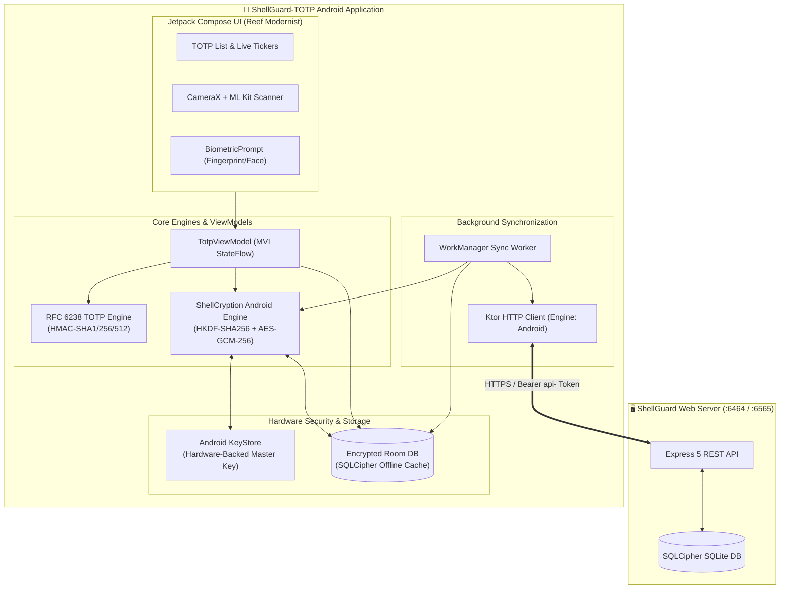

# 📱 ShellGuard-TOTP — Android Authenticator Application

> **Tagline**: *"Store and generate 2FA verification codes on your device."*  
> **Model**: Standalone Android Authenticator Client for the ShellGuard Secrets Vault Ecosystem.  
> **Target Tooling**: Google AI Studio (Android Application Build Mode).

---

## 🎯 Executive Summary & Product Vision

**ShellGuard-TOTP** is a hardened, privacy-first Android authenticator application engineered specifically for the ShellGuard ecosystem. Built on the architectural paradigm of the **Bitwarden Authenticator**, this client is not the heavy, full-featured password manager vault; rather, it is a streamlined, hyper-responsive **2FA companion app**.

### Core Value Proposition
1. **Targeted TOTP Synchronization**: Automatically connects to the user's self-hosted ShellGuard web server, retrieves vault entries (pearls) that contain `totp_secret` seeds, and securely decrypts them on the client.
2. **Offline-First Cryptographic Cache**: Cached 2FA tokens remain encrypted locally inside a hardware-backed SQLCipher Room database. If the server goes offline or the device is disconnected, **the authenticator continues generating valid 6-digit/8-digit codes seamlessly without requiring re-authentication or active network access**.
3. **Delta Sync & Server Reconciliation**: Whenever a network connection is detected, the app performs a silent delta sync—pulling newly added TOTP entries, updating edited credentials, and pruning deleted records from the local cache.
4. **Zero-Knowledge Invariant**: Plaintext TOTP seeds are never transmitted across the network, never logged to disk in plaintext, and never exposed to background telemetry.

---

## 🏛️ System Architecture Topology

---

## 🗂️ Documentation Directory Index

This `/android` directory contains complete architectural, cryptographic, and procedural blueprints ready for ingestion by **Google AI Studio**:

| File | Purpose |
|---|---|
| [**`architecture.md`**](./architecture.md) | Client mode architecture, client-server relationship boundaries, security boundaries, and threat model. |
| [**`routes-and-contracts.md`**](./routes-and-contracts.md) | REST API endpoints, DTO models, `ShellResponse<T>` envelopes, and delta sync reconciliation rules. |
| [**`crypto-and-keystore.md`**](./crypto-and-keystore.md) | Complete ShellCryption specification (HKDF, AES-GCM-256 with AAD), Android KeyStore, and Biometric prompt integration. |
| [**`room-storage-schema.md`**](./room-storage-schema.md) | Room Entities, DAOs, SQLCipher passphrase derivation, offline cache state management, and tombstone handling. |
| [**`totp-engine-spec.md`**](./totp-engine-spec.md) | RFC 6238 / RFC 4226 TOTP mathematical generation, Base32 decoders, live countdown flows, and URI parsing. |
| [**`DESIGN.md`**](./DESIGN.md) | Android-specific Material Design 3 adaptation of the Reef Modernist design system (flat cards, spring physics, canvas countdown arcs, and haptic feedback). |
| [**`app-icon-and-splash.md`**](./app-icon-and-splash.md) | Adaptive Launcher Icon vector drawables (`ic_launcher_foreground.xml`) derived from `public/favicon.svg` and Android 12+ Core Splashscreen setup. |
| [**`roadmap.md`**](./roadmap.md) | 3-Phase structured development roadmap (2 high-precision tasks per phase) following project standards. |
| [**`meta-prompt-ai-studio.md`**](./meta-prompt-ai-studio.md) | Master natural language Meta Prompt for Google AI Studio (Android build mode) to scaffold and implement the application. |

---

## 🛡️ Security Invariants

1. **Memory Cleansing**: Decrypted TOTP secret char arrays and byte buffers must be overwritten/zeroized immediately after code generation.
2. **Flag Secure**: All Activity windows must declare `FLAG_SECURE` to prevent screenshotting and screen recording by untrusted applications.
3. **Local Encryption**: All Room SQLite database tables on disk must be encrypted with SQLCipher using a key derived from the Android KeyStore.
4. **Independent Operability**: The app must operate 100% autonomously without internet once initial sync is complete.
