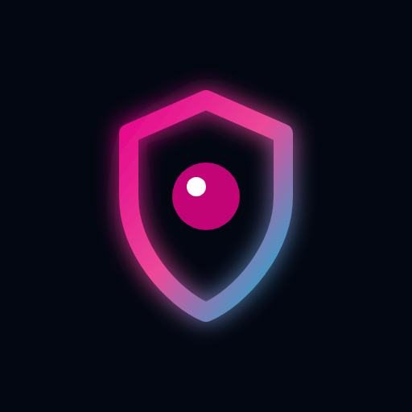
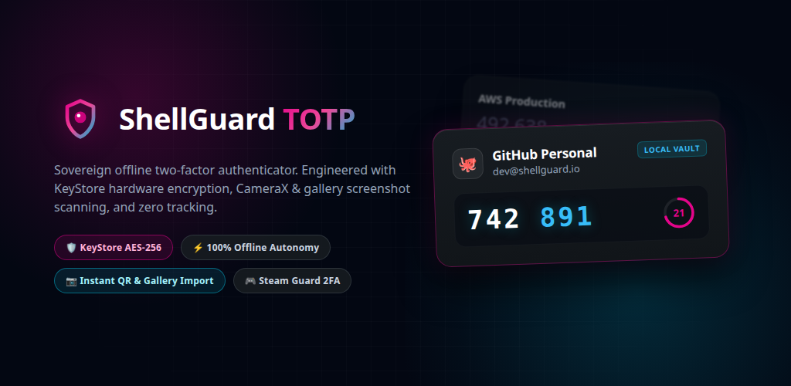
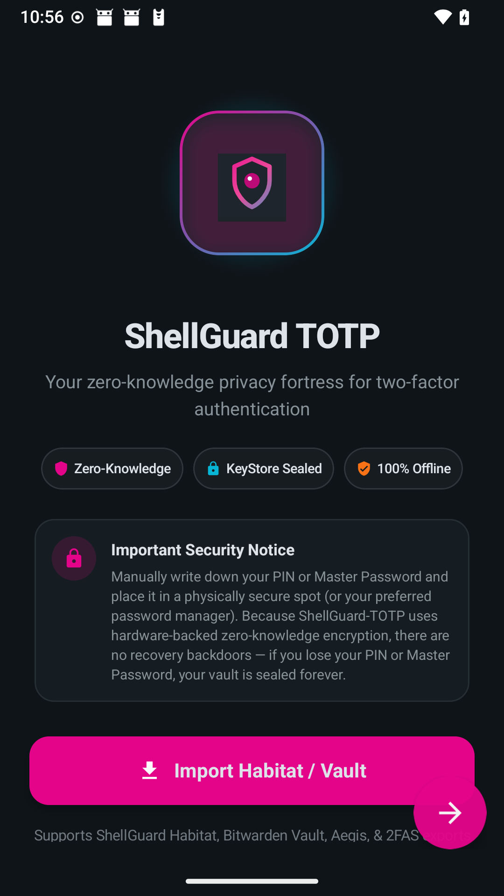
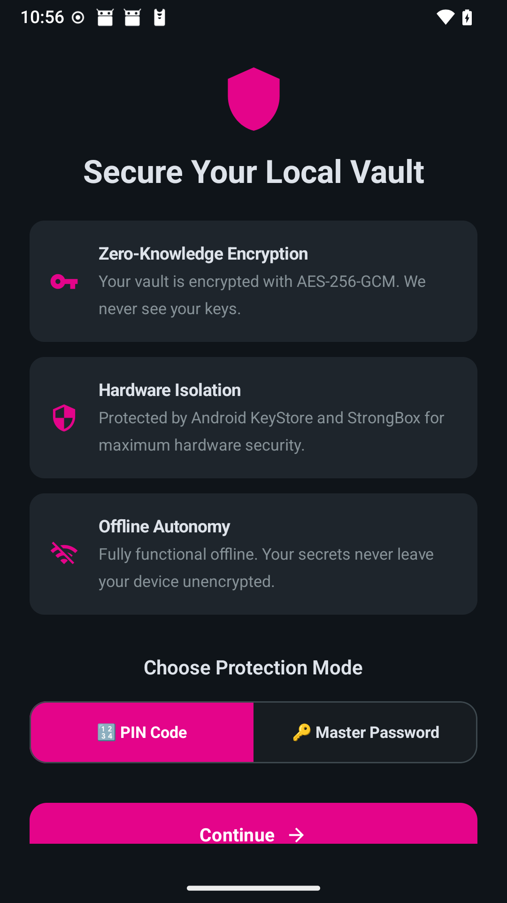
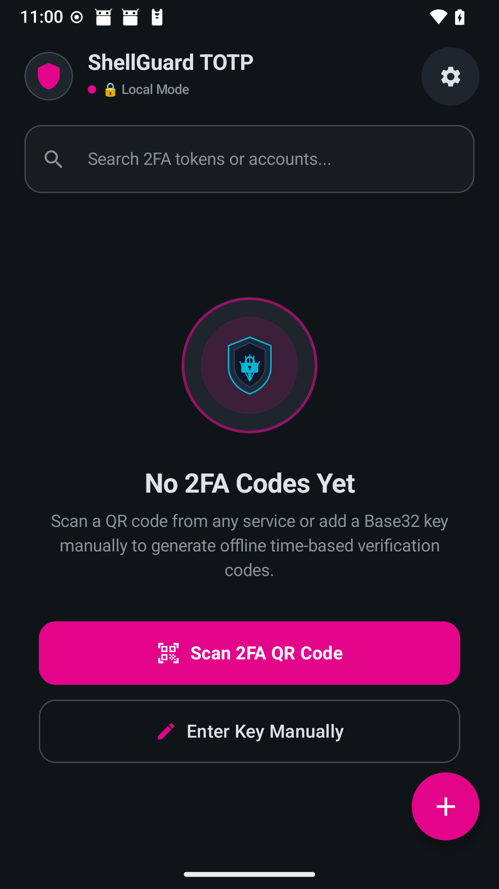
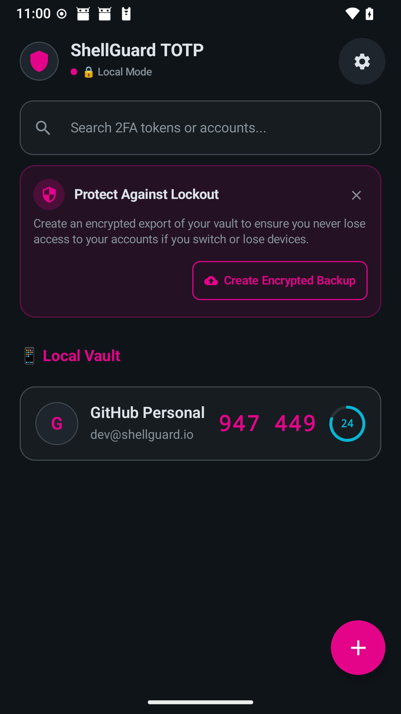
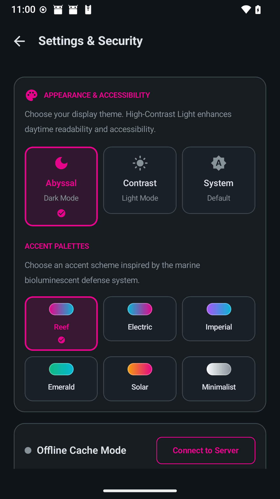
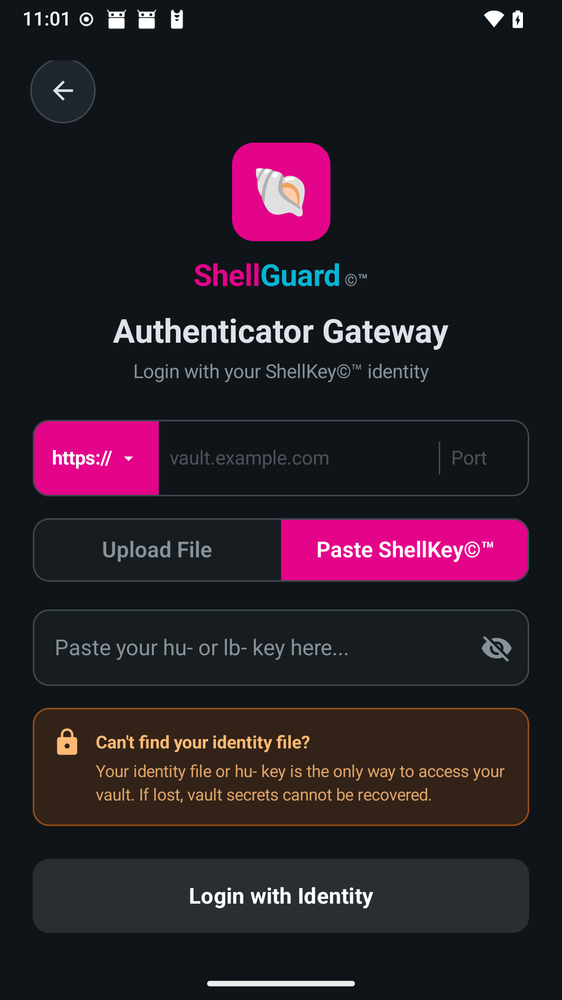
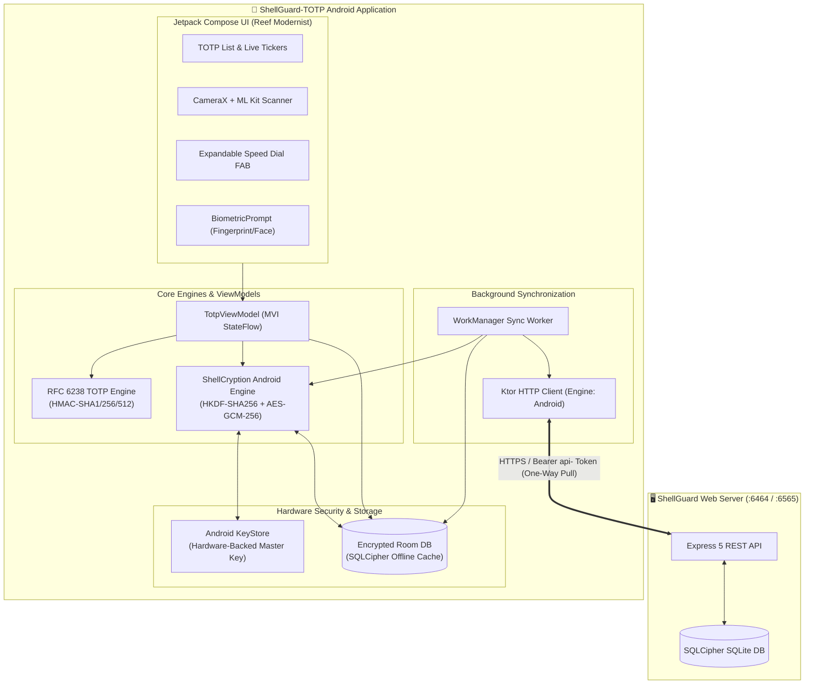

<div align="center">



# 🐚 ShellGuard-TOTP

### Secure, offline-first 2FA authenticator with hardware-encrypted vault storage.

[-E4048A?style=for-the-badge&logo=android&logoColor=white)](CHANGELOG.md)
[](app/build.gradle.kts)
[](project/crypto-and-keystore.md)
[](project/16kb-page-size-alignment-guide.md)
[](LICENSE)

<br/><br/>



<br/><br/>

<p align="center">
  <a href="#-device-screenshots">Screenshots</a> •
  <a href="#-executive-summary--product-vision">Vision</a> •
  <a href="#-key-features--capabilities">Key Features</a> •
  <a href="#-system-architecture">Architecture</a> •
  <a href="#-tech-stack">Tech Stack</a> •
  <a href="#-building--running">Build & Test</a> •
  <a href="#-documentation-index">Docs</a>
</p>

</div>

---

## 📱 Device Screenshots

Captured natively from physical Google Pixel hardware running Android 16 (API 36).

| 1. Launch & Onboarding | 2. Hardware Isolation | 3. Clean Empty State |
|:---:|:---:|:---:|
|  |  |  |
| **Welcome & Habitat Import**<br/>Restore backups or start a new vault | **Vault Security Selector**<br/>Hardware-backed PIN vs Password | **Encrypted Shell State**<br/>Fast scanner & manual entry |

| 4. Live Active Dashboard | 5. Settings & Theme Engine | 6. Remote Gateway Login |
|:---:|:---:|:---:|
|  |  |  |
| **Active 2FA Dashboard**<br/>Split digits & animated countdown ring | **Appearance & Themes**<br/>AMOLED dark, light & marine palettes | **Authenticator Gateway**<br/>Zero-knowledge ShellKey identity sync |

---

## 🎯 Executive Summary & Product Vision

**ShellGuard-TOTP** is a hardened, privacy-first Android authenticator application engineered for high-security digital identity protection. Built on the architectural paradigm of a streamlined, sovereign 2FA companion, this client is not a heavy, bloated password manager vault—it is a hyper-responsive, offline-first authenticator engineered to generate RFC 6238 time-based one-time passwords with zero cloud telemetry and zero third-party tracking.

### Core Pillars
1. **Zero-Knowledge Hardware Isolation**: All master keys are anchored to the Android KeyStore (StrongBox / TEE) using AES-256-GCM. 2FA seeds are stored in an encrypted SQLCipher SQLite database and never leave the device in plaintext.
2. **100% Offline Autonomy**: Generate standard verification codes indefinitely without requiring an internet connection, account registration, or remote server uptime.
3. **One-Way Mirror Sync (Optional)**: Connect to your self-hosted ShellGuard web server to automatically mirror 2FA credentials via end-to-end encrypted envelopes (`ShellCryption`), with strict client-side read-only protection.
4. **Universal Multi-Vault Migration**: Import and export your 2FA habitat seamlessly from Bitwarden, Aegis, 2FAS, Google Authenticator, or Steam Guard with zero data leakage.

---

## ✨ Key Features & Capabilities

### 🔒 Hardware-Grade Security
- **Android KeyStore & StrongBox**: Cryptographic keys never touch application memory in plaintext; all key generation occurs in dedicated hardware.
- **SQLCipher Full-Disk Encryption**: Sensitive vault tables are encrypted at rest with 256-bit AES cipher blocks.
- **FLAG_SECURE Privacy Shield**: Obfuscates app window contents in the Android Recents task switcher and blocks unauthorized screen captures.
- **Biometric & PIN Cold Lock**: Unlock your vault using biometric authentication (fingerprint / face) or custom Master PIN/Password.

### ⚡ Ergonomics & Usability
- **Real-Time Canvas Countdown Rings**: Smoothly animated circular countdown timer rings transition color as codes expire for immediate situational awareness.
- **Floating Speed Dial Action**: 45° morphing FAB button grants instant access to camera QR scanning, gallery screenshot decoding, and manual secret entry.
- **Split-Digit Formatting**: Large, legible verification codes formatted with space separation (`947 449`) and one-tap clipboard copy with auto-clearing memory buffer.
- **Instant Search**: Search through accounts, issuers, or categories with real-time substring filtering.

### 📷 Advanced QR & Migration Engine
- **CameraX QR Scanner**: Sub-100ms camera viewfinder scanner for standard `otpauth://` QR codes.
- **Image Gallery QR Decoder**: Import QR codes directly from screenshots stored in your device gallery using Google ML Kit.
- **Steam Guard Support**: Native generation for Steam's 5-character alphanumeric TOTP codes and `steam://` URIs.
- **Habitat Export/Import**: Full backup creation and restore supporting `.sgtotp.bak` encrypted archives.

### 🎨 Reef Modernist Design System
- **Curated Marine Accent Palettes**: 6 custom theme accents inspired by deep-sea bioluminescence (Reef Pink default, Electric Cyan, Imperial Gold, Emerald, Solar, Minimalist).
- **Abyssal Dark & High-Contrast Light**: Optimized contrast ratios for OLED battery conservation and high-glare daylight environments.

---

## 🏛️ System Architecture



---

## 🛠️ Tech Stack

| Layer | Technology | Description |
|---|---|---|
| **Language & Platform** | Kotlin 2.0+ / Android 14–16 (API 24 to 36) | Modern Kotlin toolchain targeting latest Android standards |
| **Architecture** | MVI (Unidirectional Data Flow) | Unidirectional state management with reactive `StateFlow` |
| **UI Framework** | Jetpack Compose (Material 3) | Declarative UI with custom Canvas rendering & spring physics |
| **Dependency Injection** | Dagger Hilt | Clean inversion of control across all repository and use case layers |
| **Local Database** | Room + SQLCipher 4.6.1+ | 256-bit AES-encrypted local storage; 16 KB page-size kernel ready |
| **Hardware Security** | Android KeyStore (StrongBox) | Hardware TEE master key derivation; zero plaintext leakage |
| **QR Vision** | CameraX + Google ML Kit | Dual-mode scanning: live camera feed and saved gallery images |
| **Background Sync** | AndroidX WorkManager | Battery-optimized periodic delta sync for self-hosted instances |
| **Network Client** | Ktor Client (Android Engine) | Lightweight direct HTTP/HTTPS transport |

---

## 🚀 Building & Running

### Prerequisites
- **JDK 17 or 21** (e.g. JetBrains Runtime `jbr`)
- **Android SDK** with Platforms `android-36` and Build-Tools `36.0.0`
- **Gradle 8.13+** (bundled via `./gradlew`)

### Verification & Testing
```bash
# Run the complete unit test suite (96+ tests passing green)
./gradlew testDebugUnitTest

# Assemble debug APK
./gradlew assembleDebug

# Build release Android App Bundle (.aab)
./gradlew bundleRelease
```

---

## 🗂️ Documentation Index

| File | Description |
|---|---|
| [**`ARCHITECTURE.md`**](ARCHITECTURE.md) | Client mode architecture, client-server relationship boundaries, and threat model. |
| [**`DESIGN.md`**](DESIGN.md) | Comprehensive Material 3 design system tokens, color palettes, and motion specs. |
| [**`ROADMAP.md`**](ROADMAP.md) | Multi-phase development roadmap tracking completed features and upcoming milestones. |
| [**`CHANGELOG.md`**](CHANGELOG.md) | Chronological version release history adhering to Keep a Changelog standards. |
| [**`RELEASE-PLAY.md`**](RELEASE-PLAY.md) | Google Play Store release notes single source of truth across all published versions. |
| [**`project/routes-and-contracts.md`**](project/routes-and-contracts.md) | REST API endpoints, DTO models, and delta sync reconciliation contracts. |
| [**`project/crypto-and-keystore.md`**](project/crypto-and-keystore.md) | Complete ShellCryption specification, KeyStore derivation, and biometric integration. |
| [**`project/room-storage-schema.md`**](project/room-storage-schema.md) | Room SQLite entity definitions, DAOs, and SQLCipher configuration. |
| [**`project/totp-engine-spec.md`**](project/totp-engine-spec.md) | RFC 6238 mathematical TOTP algorithm, Base32 decoders, and Steam Guard support. |
| [**`project/16kb-page-size-alignment-guide.md`**](project/16kb-page-size-alignment-guide.md) | Android 15+ 16 KB ELF segment alignment audit procedures and native verification. |

---

## 🛡️ Security Invariants

1. **Zero-Knowledge Principle**: Secret keys and seeds are decrypted strictly in ephemeral memory for the duration of code generation, never written to disk unencrypted, and wiped upon garbage collection.
2. **FLAG_SECURE Enforcement**: App windows declare `FLAG_SECURE` to prevent unauthorized screen capture and hide token values in task switchers.
3. **One-Way Read-Only Sync**: Sync from self-hosted ShellGuard servers is strictly downstream. Remote codes cannot overwrite or leak local vault seeds.
4. **Complete Offline Operability**: 100% of authenticator functionality operates fully autonomously without requiring an active network connection.

---

<div align="center">
  <sub>Engineered with precision for the ClawStack / ShellGuard ecosystem.</sub>
</div>
