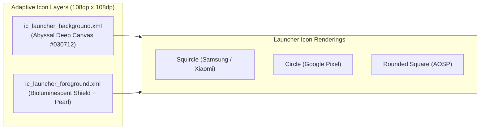

# 📱 ShellGuard-TOTP — Android Adaptive Icon & Splash Screen Guide

> **Production-Ready Vector Drawables, Adaptive Launcher Icons, and Android 12+ Splash Screen**  
> *Derived from `public/favicon.svg` for Direct Installation via Google AI Studio Web ADB.*

---

## 🎨 1. Adaptive Icon Architecture

Android 8.0+ (API 26+) requires Adaptive Icons composed of two separate layers:
- **Background Layer (`ic_launcher_background.xml`)**: Solid or subtle gradient canvas (`#030712` / `#080C14`).
- **Foreground Layer (`ic_launcher_foreground.xml`)**: Centered bioluminescent ShellGuard shield & pearl vector derived from `public/favicon.svg`.



---

## 📄 2. Vector Drawable Source Code

### A. `res/drawable/ic_launcher_background.xml`

```xml
<?xml version="1.0" encoding="utf-8"?>
<vector xmlns:android="http://schemas.android.com/apk/res/android"
    android:width="108dp"
    android:height="108dp"
    android:viewportWidth="108"
    android:viewportHeight="108">
    <path
        android:fillColor="#030712"
        android:pathData="M0,0h108v108h-108z" />
</vector>
```

---

### B. `res/drawable/ic_launcher_foreground.xml`

Faithfully translates `public/favicon.svg` into an Android Vector Drawable with the exact `#e4048a` → `#ec4899` → `#06b6d4` linear gradient:

```xml
<?xml version="1.0" encoding="utf-8"?>
<vector xmlns:android="http://schemas.android.com/apk/res/android"
    xmlns:aapt="http://schemas.android.com/aapt"
    android:width="108dp"
    android:height="108dp"
    android:viewportWidth="108"
    android:viewportHeight="108">
    <group
        android:scaleX="2.1"
        android:scaleY="2.1"
        android:translateX="20.4"
        android:translateY="20.4">
        
        <!-- Bioluminescent Shield Boundary -->
        <path
            android:pathData="M16,5 L24,8.5 V15 C24,20.5 19.5,25.5 16,27 C12.5,25.5 8,20.5 8,15 V8.5 L16,5 Z"
            android:strokeWidth="2"
            android:strokeLineJoin="round"
            android:strokeLineCap="round">
            <aapt:attr name="android:strokeColor">
                <gradient
                    android:startX="0"
                    android:startY="0"
                    android:endX="32"
                    android:endY="32"
                    android:type="linear">
                    <item android:color="#FFE4048A" android:offset="0.0" />
                    <item android:color="#FFEC4899" android:offset="0.5" />
                    <item android:color="#FF06B6D4" android:offset="1.0" />
                </gradient>
            </aapt:attr>
        </path>

        <!-- Clam Pearl Core -->
        <path
            android:pathData="M 16, 15 m -3.5, 0 a 3.5,3.5 0 1,0 7,0 a 3.5,3.5 0 1,0 -7,0"
            android:fillColor="#CCE4048A" />

        <!-- Pearl Specular Highlight -->
        <path
            android:pathData="M 15, 14 m -1, 0 a 1,1 0 1,0 2,0 a 1,1 0 1,0 -2,0"
            android:fillColor="#FFFFFFFF" />
    </group>
</vector>
```

---

### C. `res/mipmap-anydpi-v26/ic_launcher.xml` & `ic_launcher_round.xml`

```xml
<?xml version="1.0" encoding="utf-8"?>
<adaptive-icon xmlns:android="http://schemas.android.com/apk/res/android">
    <background android:drawable="@drawable/ic_launcher_background" />
    <foreground android:drawable="@drawable/ic_launcher_foreground" />
</adaptive-icon>
```

---

## ⚡ 3. Android 12+ Core Splash Screen Setup

To eliminate cold-start blank screens and provide a seamless branded launch:

### 1. Add Dependency in `app/build.gradle.kts`
```kotlin
implementation("androidx.core:core-splashscreen:1.0.1")
```

### 2. Configure Theme in `res/values/styles.xml` / `themes.xml`
```xml
<resources>
    <style name="Theme.App.Starting" parent="Theme.SplashScreen">
        <item name="windowSplashScreenBackground">#030712</item>
        <item name="windowSplashScreenAnimatedIcon">@drawable/ic_launcher_foreground</item>
        <item name="postSplashScreenTheme">@android:style/Theme.Material.NoActionBar</item>
    </style>
</resources>
```

### 3. Update `AndroidManifest.xml`
```xml
<application
    android:name=".ShellGuardTotpApp"
    android:theme="@style/Theme.App.Starting"
    android:icon="@mipmap/ic_launcher"
    android:roundIcon="@mipmap/ic_launcher_round"
    android:label="ShellGuard TOTP">
```

### 4. Initialize in `MainActivity.kt`
```kotlin
package com.clawstack.shellguard.totp

import android.os.Bundle
import android.view.WindowManager
import androidx.activity.ComponentActivity
import androidx.activity.compose.setContent
import androidx.activity.viewModels
import androidx.core.splashscreen.SplashScreen.Companion.installSplashScreen
import androidx.navigation.compose.rememberNavController
import com.clawstack.shellguard.totp.ui.navigation.TotpNavHost
import com.clawstack.shellguard.totp.ui.theme.ShellGuardTotpTheme
import com.clawstack.shellguard.totp.ui.viewmodels.AuthViewModel
import com.clawstack.shellguard.totp.ui.viewmodels.TotpListViewModel

class MainActivity : ComponentActivity() {
    private val authViewModel: AuthViewModel by viewModels()
    private val totpListViewModel: TotpListViewModel by viewModels()

    override fun onCreate(savedInstanceState: Bundle?) {
        // 1. Install Android 12+ Splash Screen before super.onCreate()
        installSplashScreen()
        super.onCreate(savedInstanceState)

        // 2. Enforce Screenshot & Task-Switcher Preview Shield
        window.setFlags(
            WindowManager.LayoutParams.FLAG_SECURE,
            WindowManager.LayoutParams.FLAG_SECURE
        )

        setContent {
            ShellGuardTotpTheme {
                val navController = rememberNavController()
                TotpNavHost(
                    navController = navController,
                    authViewModel = authViewModel,
                    totpListViewModel = totpListViewModel
                )
            }
        }
    }
}
```

---

## 🚀 4. Direct Browser Installation via Web ADB (Google AI Studio)

Google AI Studio's Android builder includes **direct browser-to-device deployment**:
1. Connect your Android phone to your computer via USB.
2. Enable **Developer Options** and **USB Debugging** on the device.
3. In Google AI Studio, click the **"Run on Device"** / **"Install via ADB"** button.
4. Accept the browser WebUSB prompt to pair with your phone.
5. The compiled APK with the official `com.clawstack.shellguard.totp` package and custom adaptive icon will install directly onto your device.
6. Connect to your live self-hosted ShellGuard instance (`http://192.168.x.x:6464`) and enjoy live zero-knowledge 2FA sync!
