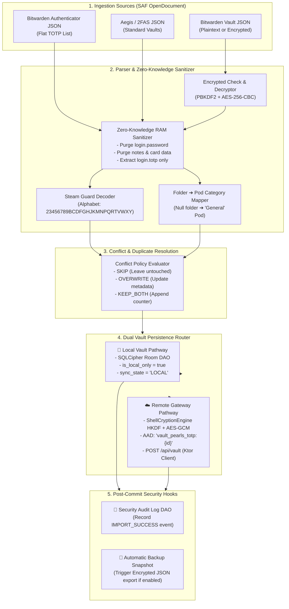

# 🛡️ ShellGuard-TOTP — Bitwarden Import & Migration Engine Specification

> **Deep Technical Architecture for Ingesting Bitwarden Vaults, Aegis, 2FAS, Zero-Knowledge Sanitization, Steam Guard Support & Dual Vault Routing**  
> *Targeted for Google AI Studio Android Application Generator.*

---

## 1. Master Architecture & Ingestion Pipeline

The ShellGuard Migration Engine provides a zero-knowledge intake pipeline that imports external 2FA vaults (Bitwarden Password Manager, Bitwarden Authenticator, Aegis Authenticator, 2FAS) while strictly isolating and stripping non-TOTP secrets (passwords, notes, credit card credentials) entirely in volatile memory before disk persistence.



---

## 2. Bitwarden Password Manager Vault Schema

Bitwarden Password Manager exports data as a structured JSON file containing collections, folders, and items.

### A. Plaintext JSON Structure (`encrypted: false`)

```json
{
  "encrypted": false,
  "folders": [
    { "id": "11111111-2222-3333-4444-555555555555", "name": "Work Infrastructure" },
    { "id": "66666666-7777-8888-9999-000000000000", "name": "Personal Finance" }
  ],
  "items": [
    {
      "id": "item-uuid-1",
      "folderId": "11111111-2222-3333-4444-555555555555",
      "type": 1,
      "name": "GitHub Enterprise",
      "notes": "INTERNAL NOTES - MUST BE STRIPPED",
      "login": {
        "username": "lucas@clawstack.com",
        "password": "SUPER_SECRET_PASSWORD_MUST_BE_STRIPPED",
        "totp": "otpauth://totp/GitHub:lucas@clawstack.com?secret=JBSWY3DPEHPK3PXP&issuer=GitHub&algorithm=SHA1&digits=6&period=30",
        "uris": [{ "uri": "https://github.com" }]
      }
    },
    {
      "id": "item-uuid-2",
      "folderId": null,
      "type": 1,
      "name": "Steam Account",
      "login": {
        "username": "gamer_lucas",
        "password": "PASSWORD_MUST_BE_STRIPPED",
        "totp": "steam://HXDMVJECJJWSRB3HWIZR4IFUGFTMXBOZ"
      }
    }
  ]
}
```

### B. In-Memory Sanitization Rules
1. **`login.totp` Extraction**: If `login.totp` is null or blank, the item is ignored (since ShellGuard is a dedicated 2FA vault).
2. **Password & Note Purge**: `login.password`, `notes`, `uris`, credit card numbers, and custom text fields are never read into persistent state.
3. **Folder Mapping**: The item's `folderId` is resolved against the `folders` array to populate `TotpItemEntity.category`. If `folderId == null` or unresolved, default category is `"General"`.

### C. Password-Protected Encrypted JSON (`encrypted: true`)
When encrypted, Bitwarden exports wrap data in `encType: 2` (AES-256-CBC with HMAC-SHA256):
- Prompt user for their **Bitwarden Export Password**.
- Derive 512-bit key via PBKDF2 (`salt = userUuid`, iterations = 600,000, SHA-256).
- Decrypt ciphertext to plaintext JSON stream in RAM, parse TOTP keys, and wipe decryption buffers immediately.

---

## 3. Bitwarden Authenticator Dedicated JSON Schema

The standalone Bitwarden Authenticator application exports a flat list of TOTP entries:

```json
[
  {
    "issuer": "Amazon Web Services",
    "name": "admin@clawstack.io",
    "key": "JBSWY3DPEHPK3PXP",
    "algorithm": "SHA1",
    "digits": 6,
    "period": 30
  },
  {
    "issuer": "Google",
    "name": "lucas@gmail.com",
    "key": "KRSXG5CTMVRXEZLUKN2XAZLS",
    "algorithm": "SHA1",
    "digits": 6,
    "period": 30
  }
]
```

---

## 4. Steam Guard 2FA Algorithm

Steam Guard generates 5-character alphanumeric authentication codes (e.g. `23K7B`) using a specialized Base32 character table.

### Custom Steam Base32 Translation Table:
```
Index:  0 1 2 3 4 5 6 7 8 9 10 11 12 13 14 15 16 17 18 19 20 21 22 23 24 25
Char:   2 3 4 5 6 7 8 9 B C  D  F  G  H  J  K  M  N  P  Q  R  T  V  W  X  Y
```

### Kotlin Steam Generator (`TotpEngine.kt` Extension):
```kotlin
fun generateSteamGuardCode(
    secretBase32: String,
    timestampMillis: Long = System.currentTimeMillis()
): String {
    val STEAM_CHARS = "23456789BCDFGHJKMNPQRTVWXY".toCharArray()
    val timeWindow = (timestampMillis / 1000L) / 30L
    val counterBytes = ByteBuffer.allocate(8).putLong(timeWindow).array()
    val keyBytes = Base32Decoder.decode(secretBase32.trim().uppercase())

    val mac = Mac.getInstance("HmacSHA1")
    mac.init(SecretKeySpec(keyBytes, "HmacSHA1"))
    val hash = mac.doFinal(counterBytes)

    val offset = hash[hash.size - 1].toInt() and 0x0F
    var fullCode = ((hash[offset].toInt() and 0x7F) shl 24) or
            ((hash[offset + 1].toInt() and 0xFF) shl 16) or
            ((hash[offset + 2].toInt() and 0xFF) shl 8) or
            (hash[offset + 3].toInt() and 0xFF)

    val codeBuilder = StringBuilder(5)
    for (i in 0 until 5) {
        codeBuilder.append(STEAM_CHARS[fullCode % STEAM_CHARS.size])
        fullCode /= STEAM_CHARS.size
    }
    return codeBuilder.toString()
}
```

---

## 5. Duplicate & Conflict Resolution Engine

During import, existing items in the database are indexed by `secret` and `(title + username)`.

```kotlin
enum class ConflictPolicy {
    SKIP_DUPLICATES, // Skips imported item if secret or title+username exists
    OVERWRITE_EXISTING, // Updates existing record with imported category and title
    KEEP_BOTH // Generates a fresh UUID and appends " (Imported)" to title
}
```

---

## 6. Dual Vault Persistence Router

When the user confirms the import preview, the `MigrationRepository` routes items based on the user's selected destination:

```kotlin
class MigrationPersister @Inject constructor(
    private val totpItemDao: TotpItemDao,
    private val client: ShellGuardTotpClient,
    private val shellCryptionEngine: ShellCryptionEngine,
    private val auditLogDao: AuditLogDao,
    private val backupManager: BackupManager
) {
    suspend fun persistImportedTokens(
        tokens: List<ParsedTotpItem>,
        destination: ImportDestination,
        policy: ConflictPolicy
    ): ImportResult = withContext(Dispatchers.IO) {
        var added = 0
        var updated = 0
        var skipped = 0

        val existingItems = totpItemDao.getAllTotpItemsSync()
        val existingSecrets = existingItems.map { it.secret }.toSet()

        val itemsToSave = mutableListOf<TotpItemEntity>()

        for (token in tokens) {
            val isDuplicate = existingSecrets.contains(token.secret)
            if (isDuplicate) {
                when (policy) {
                    ConflictPolicy.SKIP_DUPLICATES -> {
                        skipped++
                        continue
                    }
                    ConflictPolicy.OVERWRITE_EXISTING -> {
                        val existing = existingItems.first { it.secret == token.secret }
                        itemsToSave.add(existing.copy(
                            title = token.title,
                            username = token.username,
                            category = token.category,
                            localUpdatedAt = System.currentTimeMillis()
                        ))
                        updated++
                    }
                    ConflictPolicy.KEEP_BOTH -> {
                        itemsToSave.add(token.toEntity(
                            id = UUID.randomUUID().toString(),
                            title = "${token.title} (Imported)",
                            isLocalOnly = (destination == ImportDestination.LOCAL_VAULT)
                        ))
                        added++
                    }
                }
            } else {
                itemsToSave.add(token.toEntity(
                    id = UUID.randomUUID().toString(),
                    isLocalOnly = (destination == ImportDestination.LOCAL_VAULT)
                ))
                added++
            }
        }

        // 1. Persist to Local Room SQLCipher
        totpItemDao.upsertAll(itemsToSave)

        // 2. If Remote Destination, Encrypt & Sync with Gateway
        if (destination == ImportDestination.REMOTE_GATEWAY) {
            for (item in itemsToSave) {
                val pearlDto = item.toPearlDto()
                val encryptedEnvelope = shellCryptionEngine.encryptPayload(pearlDto)
                client.upsertRemotePearl(encryptedEnvelope)
            }
        }

        // 3. Emit Security Audit Log Entry
        auditLogDao.insert(
            AuditLogEntity(
                timestamp = System.currentTimeMillis(),
                eventType = "IMPORT_SUCCESS",
                description = "Imported ${added} accounts (${updated} updated, ${skipped} skipped) ➔ ${destination.name}"
            )
        )

        // 4. Trigger Auto-Backup if configured
        backupManager.triggerAutomaticBackupIfEnabled()

        ImportResult(added = added, updated = updated, skipped = skipped)
    }
}
```

---

## 7. Migration Verification Oracle

To verify Bitwarden import correctness without regressions:

1. **Unit Test Vectors**: Create `BitwardenMigrationTest.kt`:
   - Test plaintext Bitwarden JSON export with 20 items (10 login TOTPs, 5 passwords without TOTP, 5 secure notes) ➔ verifies exactly 10 TOTP items extracted and 0 passwords/notes retained.
   - Test Bitwarden Authenticator JSON export ➔ verifies issuer, secret, and algorithm mappings.
   - Test Steam Guard URI (`steam://...`) ➔ verifies 5-character alphanumeric token emission.
   - Test Conflict Policies (`SKIP`, `OVERWRITE`, `KEEP_BOTH`).
2. **Dual Routing Verification**:
   - Verify `destination = LOCAL_VAULT` sets `is_local_only = 1`.
   - Verify `destination = REMOTE_GATEWAY` generates valid ShellCryption HKDF + AES-GCM ciphertext with AAD `vault_pearls_totp:{id}`.
