# 🤖 Master Meta-Prompt: ShellGuard-TOTP Android Application

> **INSTRUCTIONS & MULTI-STAGE PROMPTS FOR GOOGLE AI STUDIO (ANDROID BUILD MODE)**  
> *Aligned with ClawStack Mobile Standards and Google AI Studio Feature Architecture.*

---

## 📋 Multi-Stage Execution Strategy

To ensure optimal token economy and avoid context degradation in **Google AI Studio**, development proceeds in deterministic 2-task stages mapped 1:1 to the **[`ROADMAP.md`](../ROADMAP.md)**:

```mermaid
flowchart TD
    Step0["🚀 Stage 0: Initial 'First Build' Prompt<br/>(Scaffold Structure, Gradle & Security Foundation)"]
    UploadContext["📂 Stage 1: Upload Full /android Context Files into AI Studio Project"]
    Phase1["⚡ Stage 2: Phase 1 — Cryptographic Engine & Live Display<br/>(Task 01: Core Crypto & TOTP · Task 02: Dynamic Theme & Countdown UI)"]
    Phase2["🗄️ Stage 3: Phase 2 — Local Persistence & Authenticator Screen<br/>(Task 03: SQLCipher Room · Task 04: List Screen, Gestures & Empty State)"]
    Phase3["🔐 Stage 4: Phase 3 — Vault Onboarding & Biometric Security<br/>(Task 05: KeyStore Biometrics & Auto-Lock · Task 06: Hatch Vault Wizard & LockScreen)"]
    Phase4["📷 Stage 5: Phase 4 — CameraX QR Scanner & Backup Engine<br/>(Task 07: UriParser & BackupManager · Task 08: Live Scanner & Manual Add)"]
    Phase5["🌐 Stage 6: Phase 5 — Self-Hosted Server Gateway & Bidirectional Sync<br/>(Task 09: Two-Way Delta Sync & WorkManager · Task 10: Spotlight Tour, Settings & Theme Picker)"]
    Phase6["🎨 Stage 7: Phase 6 — Adaptive Launcher Icon & Release Hardening<br/>(Task 11: ProGuard/R8 & Backup Rules · Task 12: Adaptive Icon, Splash & System Polish)"]
    Phase7["📥 Stage 8: Phase 7 — Architectural Refactor: One-Way Mirror Sync & Grouped Dashboard<br/>(Task 13: One-Way Sync Engine & Unified Export · Task 14: Grouped Authenticator Dashboard)"]
    Phase8["📥 Stage 9: Phase 8 — Welcoming First-Run Wizard & 'Import Habitat'<br/>(Task 15: Intake Engine & SAF Validator · Task 16: Brand Hero Screen & File Picker)"]
    Phase9["💡 Stage 10: Phase 9 — Vault Security Education & Enlarged Spotlight Tour<br/>(Task 17: Protection Orchestrator · Task 18: VaultSecurityScreen & Spacious Spotlight)"]
    Phase10["⚡ Stage 11: Phase 10 — Expandable Floating Actions Speed Dial<br/>(Task 19: Image QR Decoder & SpeedDialState · Task 20: Animated Speed Dial FAB & Pills)"]
    Phase11["⚙️ Stage 12: Phase 11 — Categorized Settings Hub & Appearance/Behavior<br/>(Task 21: Preferences Store · Task 22: SettingsMetaScreen & Sub-screens)"]
    Phase12["🛡️ Stage 13: Phase 12 — Security Suite, Panic Purge & Audit Logging<br/>(Task 23: Panic Trigger & Audit DAO · Task 24: Security Sub-screen & Audit Log)"]
    Phase13["📦 Stage 14: Phase 13 — Advanced Import/Export & Google Auth Multi-QR<br/>(Task 25: MultiFormat Migration · Task 26: Import/Export Hub & QR Viewer)"]
    Phase14["📱 Stage 15: Phase 14 — Home Screen Interactive Glance Widgets & Icon Packs<br/>(Task 27: Glance Widget Engine & Icon Store · Task 28: 2x2/4x2 Widgets & Icon Manager)"]
    Phase15["🗝️ Stage 16: Phase 15 — ClawKey Vault Creation, Import Auth & Duplicate Resolution<br/>(Task 29: ClawKey Mode Engine · Task 30: ClawKeyInputForm & UI Integration)"]

    Step0 --> UploadContext
    UploadContext --> Phase1
    Phase1 --> Phase2
    Phase2 --> Phase3
    Phase3 --> Phase4
    Phase4 --> Phase5
    Phase5 --> Phase6
    Phase6 --> Phase7
    Phase7 --> Phase8
    Phase8 --> Phase9
    Phase9 --> Phase10
    Phase10 --> Phase11
    Phase11 --> Phase12
    Phase12 --> Phase13
    Phase13 --> Phase14
    Phase14 --> Phase15
```



---

## 🚀 Stage 0: The "First Build" Initial Scaffold Prompt

> **📖 Required Reference Files Attached in AI Studio**:  
> 1. [`architecture.md`](./architecture.md) — System boundaries, security invariants, `FLAG_SECURE`, and build topology.  
> 2. [`crypto-and-keystore.md`](./crypto-and-keystore.md) — `ClawCrypto.hashHumanKey` and `AndroidKeyStoreHelper` biometric wrapper.  

Copy and paste this exact prompt into Google AI Studio as the **First Build Message**:

```markdown
# FIRST BUILD PROMPT: ShellGuard-TOTP Android Foundation

## 🎯 Objective
Initialize and scaffold the complete internal architecture and security foundation for **ShellGuard-TOTP**, a privacy-first 2FA companion Android application built on the **Bitwarden Authenticator** model and conforming to the **ClawStack Mobile Architecture** (`ClawChives-Mobile`).

**Tagline**: *"Store and generate 2FA verification codes on your device."*

## 📖 Reference Architecture Files
Before writing code, inspect and adhere to:
- `architecture.md`: Section 1 (System Role), Section 2 (Boundaries), and Section 4 (Threat Model).
- `crypto-and-keystore.md`: Section 4 (AndroidKeyStoreHelper) and Section 5 (ClawCrypto).

## 🛡️ Core Operating Invariant
"Build features around security, not security around features."
Do NOT build complex user interface components in this initial build. Focus 100% on scaffolding the project structure, Gradle build files, dependencies, SQLCipher initialization, Android KeyStore hardware wrappers, network security configuration, and application security boundaries.

## 🛠️ Technical Specifications & Dependencies
- **Target SDK**: 35 / 36 (Min SDK: 24), Java 11 / 17, Kotlin 2.2+
- **Package Name**: `com.clawstack.shellguard.totp`
- **Gradle Plugins (`app/build.gradle.kts` & `libs.versions.toml`)**:
  - `alias(libs.plugins.android.application)`
  - `alias(libs.plugins.kotlin.compose)`
  - `alias(libs.plugins.kotlin.serialization)`
  - `alias(libs.plugins.google.devtools.ksp)`
- **Key Dependencies**:
  - Jetpack Compose + Material 3 + Navigation Compose
  - AndroidX Coroutines + Kotlinx Serialization JSON (`1.7.3`)
  - Ktor HTTP Client (`io.ktor:ktor-client-core:2.3.12`, `io.ktor:ktor-client-android:2.3.12`, `io.ktor:ktor-client-content-negotiation:2.3.12`, `io.ktor:ktor-serialization-kotlinx-json:2.3.12`)
  - SQLCipher for Android (`net.zetetic:sqlcipher-android:4.5.4` or `4.6.0`)
  - AndroidX Room (`2.7.0`) with KSP
  - CameraX (`1.5.0`) + Google ML Kit Barcode Scanning (`17.3.0`)
  - AndroidX Biometric (`1.2.0-alpha05`) / `androidx.security:security-crypto:1.1.0-alpha06`
  - AndroidX WorkManager (`2.9.0`)

## 📐 Required Deliverables for this First Build:
1. `gradle/libs.versions.toml` & `app/build.gradle.kts`: Clean, conflict-free dependency resolution.
2. `AndroidManifest.xml`:
   - Permissions: `CAMERA`, `USE_BIOMETRIC`, `INTERNET`, `ACCESS_NETWORK_STATE`.
   - Declarations for Application class and `MainActivity`.
   - Network Security Config XML allowing cleartext traffic *only* on local LAN private IPs (`192.168.x.x`, `10.x.x.x`) for self-hosted instances over HTTP.
3. `ShellGuardTotpApp.kt` (Application Class):
   - Initializes SQLCipher library: `System.loadLibrary("sqlcipher")` or `SQLiteDatabase.loadLibs(this)`.
4. `MainActivity.kt`:
   - Enforces `window.setFlags(WindowManager.LayoutParams.FLAG_SECURE, WindowManager.LayoutParams.FLAG_SECURE)` on `onCreate` to block screen capture and task-switcher previews.
   - Minimal Compose container placeholder.
5. `crypto/ClawCrypto.kt` & `crypto/AndroidKeyStoreHelper.kt`:
   - `ClawCrypto.hashHumanKey(rawKey)`: SHA-256 lowercase 64-char hex string generator.
   - `AndroidKeyStoreHelper`: Generates and manages the hardware-backed AES-256-GCM key (`sg_totp_biometric_wrapper`) in `AndroidKeyStore` with `setUserAuthenticationRequired(true)` to securely tie biometric prompts to hardware key access.
6. Clean package hierarchy under `com.clawstack.shellguard.totp` (`crypto`, `data`, `engine`, `ui`).

Scaffold this foundational structure now. Verify compilation and ensure zero dependency conflicts.
```

---

## 📂 Stage 1: Uploading Context Files

Once the AI Studio agent finishes the First Build scaffold:
1. Upload the remaining documentation files from `/android/` into the AI Studio project directory (or attach them to the chat):
   - [`DESIGN.md`](./DESIGN.md)
   - [`app-icon-and-splash.md`](./app-icon-and-splash.md)
   - [`routes-and-contracts.md`](./routes-and-contracts.md)
   - [`room-storage-schema.md`](./room-storage-schema.md)
   - [`totp-engine-spec.md`](./totp-engine-spec.md)
   - [`ui-ux-design-system.md`](./ui-ux-design-system.md)
   - [`roadmap.md`](./roadmap.md)
   - [`README.md`](./README.md)

---

## ⚡ Stage 2: Phase 1 Prompt — Cryptographic Engine & Live Display

> 🗺️ **Master Roadmap Reference**: See [`ROADMAP.md`](../ROADMAP.md#phase-1-cryptographic-engine--live-countdown-display) for complete specifications on **Task 01** and **Task 02**.  
> **📖 Required Context Files for Phase 1**:  
> 1. [`totp-engine-spec.md`](project/totp-engine-spec.md) — Section 1 (RFC 6238 TotpEngine), Section 2 (Base32Decoder), Section 3 (TotpTicker with Kotlin Time).  
> 2. [`crypto-and-keystore.md`](project/crypto-and-keystore.md) — Section 1 (HKDF Parity), Section 2 (Envelope Schema), Section 3 (ShellCryptionEngine with AAD `vault_pearls_totp:{id}`).  
> 3. [`DESIGN.md`](DESIGN.md) — Section 2 (Theme Tokens), Section 4 (TotpCard with Spring Bounce), Section 5 (TotpCountdownRing Canvas Arc).  

Copy and paste this prompt to execute **Phase 1 (Tasks 01 & 02)**:

```markdown
# PHASE 1 EXECUTION: Cryptographic Engine & Live Countdown Display

## 📖 Reference Documentation
Before writing code, inspect:
- `totp-engine-spec.md`: Section 1 (TotpEngine.kt), Section 2 (Base32Decoder.kt), Section 3 (TotpTicker.kt).
- `crypto-and-keystore.md`: Section 1, 2, and 3 (ShellCryptionEngine.kt HKDF + AES-GCM AAD).
- `DESIGN.md`: Section 2 (Color Tokens), Section 4 (TotpCard.kt), Section 5 (TotpCountdownRing.kt).

Execute Phase 1 adhering to the Functionality + UI Component pairing:

### Task 01: [Functionality] Thread-Safe RFC 6238 TOTP Engine, ShellCryption HKDF & Comprehensive Unit Tests
- Create the core TOTP generation logic in `com.clawstack.shellguard.totp.engine` that implements RFC 6238, using the Kotlin Time library (`kotlin.time.Duration`, `kotlin.time.TimeSource`) for counter synchronization:
  - Standard time-based one-time password generator using stored secret keys from the Room database.
  - Generates current 6-digit or 8-digit codes based on system time.
  - Supports HMAC-SHA1, HMAC-SHA256, and HMAC-SHA512 hashing algorithms with 30s/60s time steps.
  - High performance, thread-safe, and zero memory allocations in hot loops.
- Implement `engine/Base32Decoder.kt` (RFC 4648 compliance).
- Implement `crypto/ShellCryptionEngine.kt`:
  - HKDF-SHA256 key derivation (`ikm = huKey.toByteArray()`, `salt = userUuid.toByteArray()`, `info = "clawchives-shellcryption-v1"`, length = 32 bytes).
  - AES-GCM-256 `decryptField(encryptedJson, shellKey, table, recordId)` and `encryptField(...)` with strict AAD binding verification (`vault_pearls_totp:<id>`).
- **Comprehensive Unit Tests (`test/` source set)**:
  - Add `TotpEngineTest.kt` in `test/` verifying RFC 6238 reference vectors (secret `"12345678901234567890"`, time `59s` -> `"287082"`, time `1111111109s` -> `"081804"`, time `1111111111s` -> `"140504"`, time `1234567890s` -> `"890059"`, time `2000000000s` -> `"692790"` across 6 and 8 digits).
  - Add `ShellCryptionEngineTest.kt` in `test/` verifying deterministic HKDF-SHA256 derivation per user, AES-GCM-256 roundtrip encryption/decryption, and AAD tamper detection (tampered `table` or `recordId` throwing authentication tag verification failure).

### Task 02: [UI Component] Dynamic Theme Engine, Live TOTP Countdown Display & Progress Ring
- Implement `ui/theme/Color.kt`, `Theme.kt`, and `Type.kt` matching the **Reef Modernist** design system in `DESIGN.md`:
  - Dual-mode base tokens: Dark base `#0F1419`, Dark surface `#171C21`, Dark elevated `#1E252C`, Text main `#DEE3EA`, Border `#3D484E`.
  - Brand accents: Lobster Red `#E4048A`, Claw Cyan `#06B6D4`, Deep Purple `#3B0764`, Coral Orange `#F97316`, Emerald `#10B981`.
  - Implement `ThemeAccent` enum with 6 curated palettes (`REEF_DEFAULT`, `CYAN_VENT`, `PURPLE_SHELL`, `EMERALD_TRENCH`, `AMBER_FLARE`, `MONOCHROME`).
  - Implement `LocalShellGuardColors` `staticCompositionLocalOf` for dynamic Compose color inheritance across dark/light and custom accents.
- Implement `engine/TotpTicker.kt` (reactive Flow emitting 1s ticks synchronized with Kotlin Time).
- Implement `ui/components/TotpCountdownRing.kt` (Canvas arc depleting counter-clockwise, smooth animated transition from secondary accent -> `BrandCoralOrange` -> `BrandLobsterRed` as expiration nears).
- Implement `ui/components/TotpCard.kt` displaying large monospace split codes (`123 456`), spring touch bounce scale (`0.97f`), haptic feedback, and the countdown ring.

Verify all unit tests pass and the countdown ring renders smoothly at 60fps.
```

---

## 🗄️ Stage 3: Phase 2 Prompt — Encrypted Persistence & Authenticator Screen

> 🗺️ **Master Roadmap Reference**: See [`ROADMAP.md`](../ROADMAP.md#phase-2-encrypted-local-persistence--authenticator-dashboard) for complete specifications on **Task 03** and **Task 04**.  
> **📖 Required Context Files for Phase 2**:  
> 1. [`room-storage-schema.md`](project/room-storage-schema.md) — Section 2 (Entities: TotpItemEntity, SyncMetadataEntity), Section 3 (DAOs), Section 4 (ShellGuardTotpDatabase SQLCipher Builder).  
> 2. [`DESIGN.md`](DESIGN.md) — Section 4 (TotpCard), Section 6 (PodFilterChips), Section 7 (ClipboardToastPill), Section 8 (TotpEmptyState).  
> 3. [`ui-ux-design-system.md`](project/ui-ux-design-system.md) — Section 2 & 4 (MVI TotpViewModel).  

Copy and paste this prompt to execute **Phase 2 (Tasks 03 & 04)**:

```markdown
# PHASE 2 EXECUTION: Local Encrypted Persistence & Offline Authenticator Screen

## 📖 Reference Documentation
Before writing code, inspect:
- `room-storage-schema.md`: Section 2 (TotpItemEntity.kt), Section 3 (TotpItemDao.kt), Section 4 (ShellGuardTotpDatabase.kt).
- `DESIGN.md`: Section 6 (PodFilterChips.kt), Section 7 (ClipboardToastPill.kt), Section 8 (TotpEmptyState.kt).
- `ui-ux-design-system.md`: Section 4 (TotpViewModel.kt).

Execute Phase 2 adhering to the Functionality + UI Component pairing:

### Task 03: [Functionality] AndroidX Room with SQLCipher Secure Persistence
- Define Room entity and DAO for storing encrypted TOTP secrets in `com.clawstack.shellguard.totp.data`, ensuring compatibility with SQLCipher for encrypted persistence:
  - Set up AndroidX Room with SQLCipher whole-database encryption (`net.zetetic:sqlcipher-android`) initialized in the Application class.
  - Define `data/local/entities/TotpItemEntity.kt` for storing TOTP secrets:
    - Account name/title, username/email, secret key, issuer, algorithm, period, digits, category/pod, and `is_local_only`.
  - Define `SyncMetadataEntity.kt` and `AppConfig.kt`.
  - Implement `data/local/dao/TotpItemDao.kt` for CRUD and reactive queries:
    - `observeAllTotpItems(ownerUuid)` returning `Flow<List<TotpItemEntity>>`.
    - `searchTotpItems(ownerUuid, query)` returning `Flow<List<TotpItemEntity>>`.
    - `pruneDeletedRemoteItems(ownerUuid, activeRemoteIds)` protecting `is_local_only` items.
  - Implement `data/local/ShellGuardTotpDatabase.kt` with SQLCipher `SupportFactory`.
- *Verification*: Write instrumented/unit tests verifying database creation, encryption, and CRUD operations.

### Task 04: [UI Component] Reef Modernist Authenticator List Screen, Empty State & Gestures
- Implement `ui/viewmodels/TotpListViewModel.kt` (MVI StateFlow combining Room DB Flow + TotpTicker + search query + pod category filter + `deleteItem` + `offlineCodesCount`).
- Develop a Material 3 'Empty State' component (`ui/components/TotpEmptyState.kt`) for the main dashboard integrating the 3D locked shell illustration (`R.drawable.ic_locked_shell`) that prompts the user to add their first 2FA code via QR code scanner or manual entry.
- Implement `ui/components/TotpCard.kt` & `SwipeableTotpCard.kt`:
  - Large monospace split digits (`123 456`) and dynamic Canvas countdown ring.
  - **Swipe-to-Delete**: Wrap card in `SwipeToDismissBox` (end-to-start swipe reveals LobsterRed trash bin action to delete item from Room DB).
  - **Tap-and-Hold (Long-Press) to Edit**: Trigger edit secret navigation/sheet on long-press.
  - **Tap to Copy**: Copy clean code to clipboard with haptic feedback and auto-clearing toast (`ClipboardToastPill.kt`).
  - **Provenance Indicator**: Show `📱 Local Only` vs `☁️ Synced` badge.
- Implement `ui/screens/TotpListScreen.kt`:
  - App opens directly to this dashboard in standalone offline mode.
  - Header with ShellGuard logo, settings navigation icon, and connectivity status badge (`🟢 Synced` or `🟡 Offline Vault`).
  - Search bar and horizontal Pod category filter chips (`PodFilterChips.kt`: `[All Accounts]`, `[☁️ Synced]`, `[📱 Local Only]`, dynamic pods).
  - Displays `TotpEmptyState` when 0 items exist.

Verify that searching filters items instantly, swipe-to-delete removes items, long-press triggers edit, and empty state renders cleanly.
```

---

## 🔐 Stage 4: Phase 3 Prompt — Vault Onboarding & Biometric Security Lifecycle

> 🗺️ **Master Roadmap Reference**: See [`ROADMAP.md`](../ROADMAP.md#phase-3-vault-onboarding--biometric-security-lifecycle) for complete specifications on **Task 05** and **Task 06**.  
> **📖 Required Context Files for Phase 3**:  
> 1. [`crypto-and-keystore.md`](./crypto-and-keystore.md) — Section 4 (AndroidKeyStoreHelper.kt Biometrics), Section 5 (ClawCrypto.kt).  
> 2. [`ui-ux-design-system.md`](./ui-ux-design-system.md) — Section 4.B (HatchVaultScreen.kt), Section 4.A (TotpNavHost.kt), Section 4.C (LoginScreen.kt / LockScreen.kt).  
> 3. [`DESIGN.md`](./DESIGN.md) — Section 10 (HatchVaultScreen Layout).  

Copy and paste this prompt to execute **Phase 3 (Tasks 05 & 06)**:

```markdown
# PHASE 3 EXECUTION: Vault Onboarding & Biometric Security Lifecycle

## 📖 Reference Documentation
Before writing code, inspect:
- `crypto-and-keystore.md`: Section 4 (AndroidKeyStoreHelper.kt), Section 5 (ClawCrypto.kt).
- `ui-ux-design-system.md`: Section 4 (TotpNavHost.kt, HatchVaultScreen.kt, LoginScreen.kt / LockScreen.kt).
- `DESIGN.md`: Section 10 (HatchVaultScreen.kt).

Execute Phase 3 adhering to the Functionality + UI Component pairing:

### Task 05: [Functionality] Hardware KeyStore Biometric Sealing, FLAG_SECURE & Inactivity Auto-Lock
- Implement `crypto/AndroidKeyStoreHelper.kt`:
  - Hardware-backed AES-256-GCM secret key generation in AndroidKeyStore (`setUserAuthenticationRequired(true)`, `setInvalidatedByBiometricEnrollment(true)`).
  - Cipher initialization (`getBiometricCipher`) for biometric crypto-object wrapping.
- Implement `crypto/ClawCrypto.kt` for `hu-`/`lb-` key SHA-256 hashing.
- Apply `FLAG_SECURE` in `MainActivity.kt` (`window.setFlags(WindowManager.LayoutParams.FLAG_SECURE, WindowManager.LayoutParams.FLAG_SECURE)`) to prevent screenshot leaks and task-switcher recents thumbnail snooping.
- Implement `AppLifecycleObserver.kt` (via `ProcessLifecycleOwner`) to observe app backgrounding and manage auto-lock timeouts.

### Task 06: [UI Component] "Hatch New Vault" Onboarding Wizard & Biometric LockScreen
- Implement `ui/screens/HatchVaultScreen.kt` (**"Hatch New Vault" Initial Launch Onboarding Wizard**):
  - **Step 1 (Welcome & Mode)**: 3D locked shell badge (`ic_locked_shell`), welcome text, and protection selector: `[ PIN Code (4–8 digits) ]` vs `[ Master Password ]`.
  - **Step 2 (Protection Setup)**: 4–8 digit PIN input (or strong passphrase) with confirmation match, and optional **Biometric Switch Card** (`"Enable Biometric Unlock?"` with explicit Skip/Toggle option).
  - **Step 3 (Success Orientation)**: Celebrates vault initialization and transitions to the dashboard.
- Implement `ui/screens/LockScreen.kt` / `LoginScreen.kt` (**AndroidKeyStore & Biometric Gate**):
  - Triggers `androidx.biometric.BiometricPrompt` with `BiometricPrompt.PromptInfo`.
  - Integrates with `AndroidKeyStoreHelper.getBiometricCipher()` to gate access to the main dashboard.
  - Handles authentication success (navigates to `CodeList`), failure, and PIN/Master Key fallback gracefully.
- Update `ui/navigation/TotpNavHost.kt`:
  - `startDestination` checks `isVaultHatched`:
    - `!isVaultHatched` -> `Screen.HatchVault.route`
    - `isVaultHatched && isBiometricEnabled` -> `Screen.Login.route`
    - Otherwise -> `Screen.CodeList.route`

Verify first install launches into Hatch Vault, allows skipping biometrics, and enforces biometric/PIN lock on subsequent cold boots.
```

---

## 📷 Stage 5: Phase 4 Prompt — CameraX QR Scanner & Multi-Format Backup Engine

> 🗺️ **Master Roadmap Reference**: See [`ROADMAP.md`](../ROADMAP.md#phase-4-camerax-qr-scanner--multi-format-backup-engine) for complete specifications on **Task 07** and **Task 08**.  
> **📖 Required Context Files for Phase 4**:  
> 1. [`totp-engine-spec.md`](./totp-engine-spec.md) — Section 4 (TotpUriParser.kt), Section 5 (QrCodeAnalyzer.kt CameraX Pipeline).  
> 2. [`room-storage-schema.md`](./room-storage-schema.md) — Section 6 (BackupManager.kt Encrypted JSON Export/Import).  
> 3. [`ui-ux-design-system.md`](./ui-ux-design-system.md) — Section 4.C (AddSecretScreen.kt).  
> 4. [`DESIGN.md`](./DESIGN.md) — Section 6 (ScannerFab.kt).  

Copy and paste this prompt to execute **Phase 4 (Tasks 07 & 08)**:

```markdown
# PHASE 4 EXECUTION: CameraX QR Scanner & Multi-Format Backup Engine

## 📖 Reference Documentation
Before writing code, inspect:
- `totp-engine-spec.md`: Section 4 (TotpUriParser.kt), Section 5 (QrCodeAnalyzer.kt).
- `room-storage-schema.md`: Section 6 (BackupManager.kt).
- `ui-ux-design-system.md`: Section 4 (AddSecretScreen.kt).
- `DESIGN.md`: Section 6 (ScannerFab.kt).

Execute Phase 4 adhering to the Functionality + UI Component pairing:

### Task 07: [Functionality] TotpUriParser, Migration Payloads & BackupManager Engine
- Implement `engine/TotpUriParser.kt`:
  - Parses standard `otpauth://totp/...` URIs extracting `secret`, `issuer`, `username`, `algorithm` (SHA1/SHA256/SHA512), `digits` (6/8), and `period` (30/60).
  - Handles raw Base32 secret string inputs.
- Implement `data/backup/BackupManager.kt`:
  - `exportEncryptedBackup(...)`: exports Room DB items into a ShellCrypted AES-256 JSON envelope (`shellguard-totp-backup-v1`) with SHA-256 integrity checksum.
  - `importEncryptedBackup(...)`: restores and verifies encrypted backup files, validating checksums before merging into Room DB.
  - Supports standard unencrypted JSON export for user data portability.

### Task 08: [UI Component] CameraX Live Scanner, Gallery QR Picker & Manual Entry Screen
- Integrate **CameraX (`1.5.0`)** and **ML Kit Barcode Scanning (`17.3.0`)**:
  - Implement `ui/screens/QrScannerScreen.kt` with live CameraX preview composable, targeted scanner reticle, flashlight toggle button, and camera runtime permission request handler.
  - Add **"Scan from Image / Gallery"** button using `rememberLauncherForActivityResult(ActivityResultContracts.GetContent())` to scan QR codes from screenshots or downloaded photos.
- Implement `ui/screens/AddSecretScreen.kt`:
  - Clean manual entry form: Title, Username, Base32 Secret, Category/Pod, Algorithm, Digits, and Period.
  - Validates Base32 input before saving to Room DB with `syncState = "PENDING_SYNC"`.

Verify that camera scanning detects 2FA codes immediately, gallery QR import works on saved images, and manual entry persists records into Room.
```

---

## 🌐 Stage 6: Phase 5 Prompt — Self-Hosted Server Gateway, Dynamic Theme & Settings Persistence

> 🗺️ **Master Roadmap Reference**: See [`ROADMAP.md`](../ROADMAP.md#phase-5-self-hosted-server-gateway--bidirectional-delta-sync) for complete specifications on **Task 09** and **Task 10**.  
> **📖 Required Context Files for Phase 5**:  
> 1. [`routes-and-contracts.md`](./routes-and-contracts.md) — Section 1 (ShellResponse), Section 2 (DTOs), Section 3 (ShellGuardTotpClient), Section 4 (ApiClient), Section 5 (Two-Way Sync), Section 6 (Cleartext/VPN Transport), Section 7 (TotpSyncWorker).  
> 2. [`ui-ux-design-system.md`](./ui-ux-design-system.md) — Section 3 (GatewayScreen.kt 1:1 ClawStack Port), Section 4.E (SpotlightOverlay.kt).  
> 3. [`DESIGN.md`](./DESIGN.md) — Section 2 (Theme Tokens), Section 9 (SettingsScreen.kt), Section 11 (SpotlightOverlay.kt), Section 12 (Self-Hosted Transport).  

Copy and paste this prompt to execute **Phase 5 (Tasks 09 & 10)**:

```markdown
# PHASE 5 EXECUTION: Self-Hosted Server Gateway, Dynamic Theme Engine & Settings Persistence

## 📖 Reference Documentation
Before writing code, inspect:
- `routes-and-contracts.md`: Section 3 (ShellGuardTotpClient.kt), Section 4 (ApiClient.kt), Section 5 (TotpRepository.kt Two-Way Sync), Section 6 (Cleartext/VPN), Section 7 (TotpSyncWorker.kt).
- `ui-ux-design-system.md`: Section 3 (GatewayScreen.kt), Section 4 (SpotlightOverlay.kt).
- `DESIGN.md`: Section 2 (Dynamic Tokens), Section 9 (SettingsScreen.kt), Section 11 (SpotlightOverlay.kt), Section 12 (Network Architecture).

Execute Phase 5 adhering to the Functionality + UI Component pairing:

### Task 09: [Functionality] Two-Way Bidirectional Sync, Ktor OkHttp Client & WorkManager
- Configure Android Cleartext & VPN Network Security (`res/xml/network_security_config.xml` & `AndroidManifest.xml`):
  - Set `<base-config cleartextTrafficPermitted="true">` allowing unencrypted HTTP over local LAN (`192.168.x.x`, `10.x.x.x`, `172.16.x.x`), `.local` domains, and Tailscale / WireGuard CGNAT VPN addresses (`100.64.0.0/10`).
  - Configure `AndroidManifest.xml` with `android:networkSecurityConfig="@xml/network_security_config"` and `android:usesCleartextTraffic="true"`.
- Implement `data/remote/ShellGuardTotpClient.kt` & `ApiClient.kt`:
  - Ktor OkHttp engine with `ConnectionSpec.CLEARTEXT` and `ConnectionSpec.MODERN_TLS`, relaxed X.509 TrustManager for self-signed certificates, and VPN tunnel routing.
  - `authenticate(keyHash)` -> POST `/api/auth/token`
  - `fetchVault(token)` -> GET `/api/vault`
  - `createVaultItem(token, payload)` -> POST `/api/vault` (**Upstream Push Endpoint**)
  - `updateVaultItem(token, id, payload)` -> PUT `/api/vault/:id`
- Implement `data/repository/TotpRepository.kt` (**Two-Way Bidirectional Sync**):
  - **Upstream Push**: For local items with `syncState == "PENDING_SYNC"`, derives HKDF `shellKey`, encrypts TOTP seed into `totp_secret` (AAD `vault_pearls_totp:{id}`), encrypts empty password into `secret` (AAD `vault_pearls:{id}`), and pushes via `createVaultItem` (`type = "password"`). On success, updates Room record to `isLocalOnly = false`, `syncState = "SYNCED"`.
  - **Downstream Pull**: Calls `fetchVault`, filters `totp_secret != null`, decrypts seeds, and upserts to Room DB.
- Implement `data/sync/TotpSyncWorker.kt` (**AndroidX WorkManager Periodic Delta Sync**):
  - Subclass `CoroutineWorker` scheduled via `PeriodicWorkRequestBuilder<TotpSyncWorker>(15, TimeUnit.MINUTES)`.
  - Enforce `Constraints.Builder().setRequiredNetworkType(NetworkType.CONNECTED).build()`.
  - Respect `AuthRepository` `withSyncLock` mutex to prevent concurrent sync races with UI operations.
- Implement Local Standalone vs Server Connected Mode Segregation:
  - Dynamically hide `[☁️ Synced]` / `[📱 Local Only]` filter chips on Dashboard when disconnected.
  - Display `🔒 Local Mode` indicator when offline and `🟢 Synced` when connected.

### Task 10: [UI Component] Interactive Spotlight Guided Tour, Server Gateway, Settings & Theme Customization
- Implement `ui/components/SpotlightOverlay.kt` (**Interactive Spotlight Guided Tour**):
  - Dims and blurs the screen background (`#E6030712`), blocking all background touches.
  - Punches a circular spotlight cutout around the **Settings Icon** in the top bar using `BlendMode.Clear`.
  - Displays a centered tooltip pill: *"To add a new server to sync to, open the settings menu"*.
  - Displays a centered `[ Skip Tutorial ]` button below the pill that dismisses the tour.
  - When Settings opens during the tour, spotlights the **"Connect to Server"** button: *"Tap 'Connect to Server' to authenticate and sync your 2FA codes with your self-hosted ShellGuard instance."*
- Implement `ui/screens/GatewayScreen.kt` & `GatewayViewModel.kt`:
  - Faithful 1:1 port of ClawStack Gateway: protocol/host/port segment bar, animated port width, key file dropzone + paste ShellKey view, and warning card.
  - Full dynamic `MaterialTheme.colorScheme` binding honoring active theme accent.
- Implement `ui/screens/SettingsScreen.kt` & Full Settings Persistence:
  - **Appearance & Theme Accents Card**:
    - Mode toggle selector: `[ System | Dark | Light ]` (persisted in SharedPreferences as `pref_theme_mode`).
    - Curated accent palettes: `REEF_DEFAULT` (Reef Pink `#E4048A` - Default), `CYAN_VENT`, `PURPLE_SHELL`, `EMERALD_TRENCH`, `AMBER_FLARE`, `MONOCHROME` (persisted in `pref_theme_accent`).
  - **Server Synchronization Card**:
    - Disconnected mode: Shows "Standalone Offline Vault" with a prominent "[ Connect to Server ]" button that navigates to Gateway.
    - Connected mode: Displays `Server: [IP]`, `User: [Name]`, `Last Synced`, "[ Sync Now ]", and "[ Disconnect ]".
  - **Local Storage & Offline Codes Section**:
    - Displays total offline codes stored on device.
    - "[ Display Offline Codes on Dashboard ]" button that sets the category filter to local codes.
  - **Encrypted Backup & Restore**: "Export JSON" and "Import JSON" file pickers.
  - **Biometric Quick Unlock Switch**: Hardware KeyStore biometric prompt toggle (persisted in `pref_biometric_enabled`).
  - **Vault Protection Method**: Update PIN / Master Password dialog (persisted in `pref_vault_mode` and `EncryptedDeviceVault`).
  - **Auto-Scrub Clipboard**: 30-second clipboard purge toggle (persisted in `pref_auto_clear_clipboard` and observed by `TotpViewModel.copyToClipboard`).

Verify that local 2FA tokens push to the server and appear in the Web UI under Passwords, remote tokens sync down, the theme accent picker dynamically updates app colors to Reef Pink by default, settings persist across cold restarts, and the Spotlight Tour navigates seamlessly.
```

---

## 🎨 Stage 7: Phase 6 Prompt — Adaptive App Icon, Splash Screen, 16 KB Alignment & Release Hardening

> 🗺️ **Master Roadmap Reference**: See [`ROADMAP.md`](../ROADMAP.md#phase-6-final-polish--adaptive-app-icon-splash-screen--release-hardening) for complete specifications on **Task 11** and **Task 12**.  
> **📖 Required Context Files for Phase 6**:  
> 1. [`app-icon-and-splash.md`](./app-icon-and-splash.md) — Vector Drawables for Adaptive Icon and Android 12+ SplashScreen Setup.  
> 2. [`16kb-page-size-alignment-guide.md`](./16kb-page-size-alignment-guide.md) — Android 15+ 16 KB memory page size alignment requirements and SQLCipher 4.6.1.  

Copy and paste this prompt to execute **Phase 6 (Tasks 11 & 12)**:

```markdown
# PHASE 6 EXECUTION: Adaptive Launcher Icon, Splash Screen, 16 KB Page Alignment & Release Hardening

## 📖 Reference Documentation
Before writing code, inspect:
- `app-icon-and-splash.md`: Section 2 (Vector Drawables), Section 3 (Android 12+ Core Splash Screen).
- `16kb-page-size-alignment-guide.md`: Section 1 (Root Causes), Section 2 (Resolution Plan), Section 3 (Invariants).

Execute Phase 6 adhering to the Functionality + UI Component pairing:

### Task 11: [Functionality] 16 KB Page Size Compatibility, ProGuard/R8 Hardening & Cloud Backup Rules
- **16 KB Memory Page-Size Alignment**:
  - Upgrade SQLCipher for Android to `net.zetetic:sqlcipher-android:4.6.1` in `gradle/libs.versions.toml`.
  - Configure `jniLibs.useLegacyPackaging = false` in `app/build.gradle.kts` to store native shared libraries (`.so`) uncompressed and page-aligned on 16 KB boundaries for Android 15+ devices.
- **ProGuard & R8 Hardening**:
  - Create `app/proguard-rules.pro` with keep rules for SQLCipher, Ktor OkHttp, Kotlinx Serialization, Room entities, and WorkManager.
- **Cloud Backup Exclusion Rules**:
  - Configure `res/xml/backup_rules.xml` and `data_extraction_rules.xml` to exclude encrypted Room databases (`shellguard_totp.db*`) and KeyStore preferences from unencrypted Android Cloud backups.
- Set release versioning and signing configuration in `build.gradle.kts`.

### Task 12: [UI Component] Adaptive Launcher Icon, Android 12+ Splash Screen & Edge-to-Edge Polish
- **Adaptive Launcher Icon**:
  - Create `res/drawable/ic_launcher_background.xml` (solid `#030712` canvas vector drawable).
  - Create `res/drawable/ic_launcher_foreground.xml` (ShellGuard shield vector with `#E4048A` → `#EC4899` → `#06B6D4` gradient and clam pearl within 72dp safe zone).
  - Create `res/mipmap-anydpi-v26/ic_launcher.xml` and `res/mipmap-anydpi-v26/ic_launcher_round.xml` referencing the adaptive icon layers.
- **Android 12+ Splash Screen**:
  - Add `androidx.core:core-splashscreen:1.0.1` and configure `Theme.App.Starting` in `res/values/themes.xml`.
  - Create static vector drawable `res/drawable/ic_splash_icon.xml` avoiding inline AAPT gradient inflation exceptions on API <31.
  - Update `MainActivity.kt` calling `installSplashScreen()` prior to `super.onCreate(savedInstanceState)`.
- Configure edge-to-edge transparent system navigation and status bar styling.
- Comprehensive Test Oracle Verification: Run full verification gate (`./gradlew clean testDebugUnitTest assembleDebug`) verifying 100% test pass rate.

Verify release compilation, build the APK, and verify launcher icon appearance, splash transition, and 16 KB alignment!
```

---


## 📥 Stage 8: Phase 7 Prompt — Architectural Refactor (One-Way Sync & Grouped Dashboard) [v0.0.1.0 (Build 7) — Milestone 1]

> 🗺️ **Master Roadmap Reference**: See [`ROADMAP.md`](../ROADMAP.md#phase-7-architectural-refactor--one-way-mirror-sync-grouped-dashboard--unified-export-v0100-build-7--milestone-1) for complete specifications on **Task 13** and **Task 14**.  
> **📖 Required Context Files for Phase 7**:  
> 1. [`room-storage-schema.md`](./room-storage-schema.md) — BackupManager.kt & JSON schema.  

Copy and paste this prompt to execute **Phase 7 (Tasks 13 & 14)**:

```markdown
# PHASE 7 EXECUTION: Architectural Refactor — One-Way Mirror Sync, Grouped Dashboard & Unified Export [v0.0.1.0 (Build 7)]

## 📖 Reference Documentation & Roadmap
Before writing code, inspect:
- `ROADMAP.md`: Phase 7 (Task 13: One-Way Sync Engine · Task 14: Grouped Dashboard).

Execute Phase 7 adhering to the Functionality + UI Component pairing:

### Task 13: [Functionality] One-Way Sync Engine, Grouped Repository & Unified Export Schema
- Overhaul `TotpRepository` to only pull down remote codes as read-only mirror items. Remove upstream pushes completely.
- Modify `TotpItemDao` and `TotpViewModel` to expose explicitly grouped streams (Local vs Synced).
- Revamp `BackupManager` to only export local codes, adopting the canonical `sgtotp.bak` backup schema that aligns perfectly with the ShellGuard web server import pipeline.
- Write a `compatibility_layer.md` doc in the ShellGuard repo to detail this integration.

### Task 14: [UI Component] Grouped Authenticator Dashboard & Simplified Import Flow
- Refactor `TotpListScreen.kt` to present a unified vertically-scrollable list with clear sticky-headers/dividers grouping "📱 Local Vault" at the top and "☁️ Synced from ShellGuard" below.
- Remove the old connection Snackbar and top-bar filter chips for local/synced.
- Update the Add Secret and QR Scanner flows to strictly save to local vault.

Verify Dashboard renders two distinct grouped sections clearly, and creating new items automatically appends them to the Local Vault group!
```

---
## 📥 Stage 9: Phase 8 Prompt — Welcoming First-Run Wizard & "Import Habitat" Intake Flow [v0.0.0.2 (Build 4)]

> 🗺️ **Master Roadmap Reference**: See [`ROADMAP.md`](../ROADMAP.md#phase-8-welcoming-first-run-wizard--import-habitat-intake-flow-v0002-build-4) for complete specifications on **Task 15** and **Task 16**.  
> **📖 Required Context Files for Phase 8**:  
> 1. [`room-storage-schema.md`](./room-storage-schema.md) — BackupManager.kt & JSON schema.  
> 2. [`DESIGN.md`](./DESIGN.md) — Section 10 (Onboarding & Hero Theme Tokens).  

Copy and paste this prompt to execute **Phase 8 (Tasks 15 & 16)**:

```markdown
# PHASE 8 EXECUTION: Welcoming First-Run Wizard & "Import Habitat" Intake Flow [v0.0.0.2 (Build 4)]

## 📖 Reference Documentation & Roadmap
Before writing code, inspect:
- `ROADMAP.md`: Phase 8 (Task 15: Intake Engine & SAF Validator · Task 16: IntakeWelcomeScreen).
- `room-storage-schema.md`: Section 6 (BackupManager.kt).
- `DESIGN.md`: Section 10 (First-Run Intake Experience).

Execute Phase 7 adhering to the Functionality + UI Component pairing:

### Task 15: [Functionality] First-Run Intake Engine, Multi-Vault Backup Pre-Validator & Dynamic Route State
- Implement the intake state machine in `com.clawstack.shellguard.totp.ui.onboarding.IntakeState`:
  - States: `WELCOME`, `IMPORTING_HABITAT`, `SECURITY_SETUP`, `COMPLETED`.
- Integrate Android Storage Access Framework (SAF) `OpenDocument` parser:
  - Validates selected backup files supporting ShellGuard Habitat (`shellguard-totp-backup-v1`), Bitwarden Vault (`items[].login.totp`), Bitwarden Authenticator, and Aegis.
  - Prepares decryption cipher state for encrypted files and zero-knowledge sanitizer for third-party imports.

### Task 16: [UI Component] Brand Hero Welcome Screen & "Import Habitat" File Picker Launcher
- Implement `ui/screens/onboarding/IntakeWelcomeScreen.kt`:
  - **Brand Hero Header**: High-resolution ShellGuard launcher shield vector (`ic_launcher_foreground`) with glowing ambient backdrop.
  - **Introduction**: Minimalist title and tagline introducing ShellGuard-TOTP.
  - **Import Habitat Button**: `[ 📥 Import Habitat / Vault ]` primary button launching native file picker (`rememberLauncherForActivityResult(ActivityResultContracts.OpenDocument())`).
  - **Decryption / Migration Prompt**: Modal bottom sheet for PIN or Master Password if encrypted, or summary sheet for Bitwarden imports.
  - **Fresh Vault Forward Arrow**: Floating action icon button (`Icons.AutoMirrored.Filled.ArrowForward`) in bottom right corner with smooth breathing pulse, navigating fresh users to Vault Security setup.

Verify file picker imports valid habitats and Bitwarden vaults, presents password/summary sheets, and transitions fresh users forward!
```

---

## 💡 Stage 10: Phase 9 Prompt — Vault Security Education, Enlarged Spotlight Tour & Empty Vault Landing [v0.0.1.1 (Build 8) — Milestone 1]

> 🗺️ **Master Roadmap Reference**: See [`ROADMAP.md`](../ROADMAP.md#phase-9-vault-security-education-enlarged-spotlight-tour--empty-vault-landing-v0011-build-8--milestone-1) for complete specifications on **Task 17** and **Task 18**.  
> **📖 Required Context Files for Phase 9**:  
> 1. [`crypto-and-keystore.md`](./crypto-and-keystore.md) — KeyStore Protection Orchestration.  
> 2. [`DESIGN.md`](./DESIGN.md) — Section 11 (Spotlight Geometry & Spacious Cutouts).  

Copy and paste this prompt to execute **Phase 9 (Tasks 17 & 18)**:

```markdown
# PHASE 9 EXECUTION: Vault Security Education, Enlarged Spotlight Tour & Empty Vault Landing [v0.0.1.1 (Build 8)]

## 📖 Reference Documentation & Roadmap
Before writing code, inspect:
- `ROADMAP.md`: Phase 8 (Task 17: Protection Orchestrator · Task 18: VaultSecurityScreen & Spacious SpotlightOverlay).
- `crypto-and-keystore.md`: Section 4 & 5 (KeyStore Biometric Binding).
- `DESIGN.md`: Section 11 (Spotlight Geometry & Tooltips).

Execute Phase 8 adhering to the Functionality + UI Component pairing:

### Task 17: [Functionality] Android KeyStore Protection Orchestrator & Spotlight Geometry Engine
- Implement protection orchestrator managing PIN, Master Password, and Biometric initialization in Android KeyStore AES-256-GCM hardware envelopes.
- Upgrade `SpotlightOverlay.kt` geometry engine:
  - Add configurable breathing radial padding (+16dp to +20dp offset beyond target bounds) so spotlight cutouts comfortably frame icons without crowding.

### Task 18: [UI Component] Vault Security Orientation Screen & Enhanced Spotlight Overlay
- Implement `ui/screens/onboarding/VaultSecurityScreen.kt`:
  - Educational cards explaining zero-knowledge offline encryption.
  - Interactive mode selector: `[ 🔢 PIN Code (4–8 digits) ]` vs `[ 🔑 Master Password ]`.
  - Biometric quick toggle switch card.
- Update `SpotlightOverlay.kt`:
  - Render enlarged, spacious circular cutouts with pulsating cyan glow rings and centered tooltips.
  - Complete tutorial transitions directly into pristine empty local vault (`TotpEmptyState`).

Verify security setup binds to KeyStore, spotlight cutouts are spacious and clear, and users land cleanly in the empty vault!
```

---

## ⚡ Stage 11: Phase 10 Prompt — Expandable Floating Actions Speed Dial (QR, Image & Manual) [v0.0.1.2 (Build 8)]

> 🗺️ **Master Roadmap Reference**: See [`ROADMAP.md`](../ROADMAP.md#phase-10-expandable-floating-actions-speed-dial-qr-image--manual-v0012-build-8) for complete specifications on **Task 19** and **Task 20**.  
> **📖 Required Context Files for Phase 10**:  
> 1. [`totp-engine-spec.md`](./totp-engine-spec.md) — ML Kit QrCodeAnalyzer.kt.  
> 2. [`DESIGN.md`](./DESIGN.md) — Section 6 (ScannerFab & Speed Dial tokens).  

Copy and paste this prompt to execute **Phase 10 (Tasks 19 & 20)**:

```markdown
# PHASE 10 EXECUTION: Expandable Floating Actions Speed Dial (QR, Image & Manual) [v0.0.1.2 (Build 8)]

## 📖 Reference Documentation & Roadmap
Before writing code, inspect:
- `ROADMAP.md`: Phase 10 (Task 19: Image QR Decoder · Task 20: ExpandableSpeedDialFab).
- `totp-engine-spec.md`: Section 5 (QrCodeAnalyzer.kt & Image URI decoder).
- `DESIGN.md`: Section 6 (Floating Actions & Scrim Tokens).

Execute Phase 10 adhering to the Functionality + UI Component pairing:

### Task 19: [Functionality] Image QR Decoder Pipeline & Expandable FAB Interaction Controller
- Implement `ImageQrDecoder` using Google ML Kit Barcode Scanning (`InputImage.fromFilePath` / `fromBitmap`) on URI streams.
- Implement `SpeedDialState` controller managing expand/collapse transitions, back-handler interception, outside touch scrim dismissals, and permission requests.

### Task 20: [UI Component] Animated Speed Dial FAB & Elevated Action Pills
- Implement `ExpandableSpeedDialFab.kt` on `TotpListScreen.kt`:
  - **Main FAB**: Smooth 45-degree rotation morphing from `+` to `✕`.
  - **Background Scrim**: Subtle dark alpha dimming dismissible by tapping anywhere outside.
  - **Elevated Action Pills** (staggered slide-and-fade entrance from bottom to top):
    1. `[ 📷 Scan QR code ]` (Navigates to live CameraX preview scanner)
    2. `[ 🖼️ Scan image ]` (Launches SAF image gallery picker to decode screenshot QR)
    3. `[ ✏️ Enter manually ]` (Navigates to manual secret entry form)

Verify FAB rotates smoothly, scrim dims background, tapping outside closes menu, and all three pill actions navigate correctly!
```

---

## ⚙️ Stage 12: Phase 11 Prompt — Categorized Settings Hub & Appearance/Behavior Customization [v0.0.2.0 (Build 10) — Milestone 2]

> 🗺️ **Master Roadmap Reference**: See [`ROADMAP.md`](../ROADMAP.md#phase-11-categorized-settings-hub--appearancebehavior-customization-v0020-build-10--milestone-2) for complete specifications on **Task 21** and **Task 22**.  
> **📖 Required Context Files for Phase 11**:  
> 1. [`DESIGN.md`](./DESIGN.md) — Section 2 (Theme Tokens) & Section 9 (Settings Navigation).  
> 2. [`ui-ux-design-system.md`](./ui-ux-design-system.md) — Section 4 (Settings Architecture).  

Copy and paste this prompt to execute **Phase 11 (Tasks 21 & 22)**:

```markdown
# PHASE 11 EXECUTION: Categorized Settings Hub & Appearance/Behavior Customization [v0.0.2.0 (Build 10)]

## 📖 Reference Documentation & Roadmap
Before writing code, inspect:
- `ROADMAP.md`: Phase 11 (Task 21: Preferences Store · Task 22: SettingsMetaScreen, Appearance & Behavior Screens).
- `DESIGN.md`: Section 9 (Settings List Design).

Execute Phase 11 adhering to the Functionality + UI Component pairing:

### Task 21: [Functionality] Preferences Store Architecture & Entry Formatting Engine
- Expand `AuthRepository` and `DataStore` / `SharedPreferences` to manage structured preferences:
  - `AppearancePreferences` (view mode, show icons, show next code, expire blink indicator, digit grouping, issuer/account display rules, group manager).
  - `BehaviorPreferences` (search focus on start, search scope, minimize on copy, haptic feedback, multiselect categories, highlight tokens on tap, freeze tokens on tap).

### Task 22: [UI Component] Categorized Settings Hub (`SettingsMetaScreen`), Appearance & Behavior Sub-screens
- Implement `SettingsMetaScreen.kt` with master category list and descriptive subtitles:
  - 🎨 **Appearance** (`Adjust theme, language, and other appearance settings`)
  - ⚡ **Behavior** (`Customize behavior when interacting with entry list`)
  - 📦 **Icon packs** (`Manage and import icon packs`)
  - 🔐 **Security** (`Configure encryption, biometric unlock, auto lock`)
  - ☁️ **Backups** (`Automatic backups & Android cloud backup system`)
  - 🛠️ **Import & Export** (`Import from Aegis/Bitwarden/Google, export vault`)
  - 📈 **Audit log** (`Security event audit trail`)
- Implement `SettingsAppearanceScreen.kt` (theme modes, dynamic colors, view mode, expiration indicators, grouping, account name display rules).
- Implement `SettingsBehaviorScreen.kt` (focus search on start, minimize on copy, token tap highlights, freeze on tap).

Verify category navigation transitions smoothly and settings updates reflect immediately in the UI!
```

---

## 🛡️ Stage 13: Phase 12 Prompt — Security Suite, Panic Purge & Security Audit Logging [v0.0.2.1 (Build 11)]

> 🗺️ **Master Roadmap Reference**: See [`ROADMAP.md`](../ROADMAP.md#phase-12-security-suite-panic-purge--security-audit-logging-v0021-build-11) for complete specifications on **Task 23** and **Task 24**.  
> **📖 Required Context Files for Phase 12**:  
> 1. [`crypto-and-keystore.md`](./crypto-and-keystore.md) — KeyStore & Panic Purge.  
> 2. [`room-storage-schema.md`](./room-storage-schema.md) — Audit Log Room Schema.  

Copy and paste this prompt to execute **Phase 12 (Tasks 23 & 24)**:

```markdown
# PHASE 12 EXECUTION: Security Suite, Panic Purge & Security Audit Logging [v0.0.2.1 (Build 11)]

## 📖 Reference Documentation & Roadmap
Before writing code, inspect:
- `ROADMAP.md`: Phase 12 (Task 23: Panic Trigger & Audit DAO · Task 24: SecurityScreen & AuditLogScreen).
- `crypto-and-keystore.md`: Section 4 (Security Lifecycle).
- `room-storage-schema.md`: Section 2 (Room Entities).

Execute Phase 11 adhering to the Functionality + UI Component pairing:

### Task 23: [Functionality] Security Preference Controller, Panic Trigger Handler & Room Audit Log DAO
- Implement `AuditLogDao` and `AuditLogEntity` in Room recording chronological security events (vault unlocked, biometric failed, backup created, secret added, panic triggered).
- Implement `PanicTriggerReceiver` (supporting broadcast/intent triggers to wipe encryption keys and purge Room DB on emergency).
- Implement configurable Tap-to-Reveal timeout timer (default 30s).

> NOTE (Task 24 dependency): The `SecurityPreferenceController` (this task) owns the `allowScreenshots` DataStore preference consumed by the Task 24 FLAG_SECURE toggle — expose it as a `StateFlow<Boolean>` (default `false`) plus a setter that emits an `SCREEN_SECURITY_CHANGED` audit event. See the full toggle specification under Task 24 in `ROADMAP.md`.

### Task 24: [UI Component] Security Sub-screen (Tap-to-Reveal, Screen Security, Panic Purge) & Audit Log Screen
- Implement `SettingsSecurityScreen.kt`:
  - Encryption status tile, Screen security toggle (`FLAG_SECURE`), Tap to reveal codes toggle with configurable timeout duration, Delete vault on panic trigger toggle.

  **Screen Security Toggle (FLAG_SECURE) — Full Specification** (context: validated live 2026-09-04 during UI debugging when FLAG_SECURE blocked ADB `screencap` verification):
  - **Preference**: `allowScreenshots: Boolean` in DataStore, default `false` (secure-by-default).
  - **Opt-in confirmation dialog** with explicit risk copy: "Other apps, screen recorders, and the task-switcher may capture your 2FA codes while this is enabled." Cancel reverts; accept persists + applies immediately.
  - **Immediate runtime apply**: `MainActivity` collects the preference as a `StateFlow` and toggles `window.setFlags/clearFlags(FLAG_SECURE)` on change — no app restart required.
  - **Forced-protection invariant**: FLAG_SECURE is ALWAYS enforced when the vault is locked (LockScreen/LoginScreen) or app is backgrounded pre-auto-lock — the toggle only governs the unlocked session, never the lock screen or recents thumbnails.
  - **Debug exemption preserved**: `!BuildConfig.DEBUG` gate stays so ADB `screencap` can verify UI work in debug builds.
  - **QA note**: a uniform-black small `screencap` PNG means the display was suspended at capture time (screen sleep), NOT FLAG_SECURE — wake the display immediately before capture when verifying over ADB.
  - **Audit integration**: record `SCREEN_SECURITY_CHANGED` (old → new) in the Audit Log.
  - **Settings copy**: label "Allow screenshots"; subtitle "Disables anti-snoop protection for this device."
- Implement `SettingsAuditLogScreen.kt`:
  - Chronological event list with status chips (Unlock, Export, Failed Attempt, Sync), search filter, export audit log action, and empty state illustration (`No reported events`).

Verify security toggles enforce immediate runtime protection and audit log records events accurately!
```

---

## 📦 Stage 14: Phase 13 Prompt — Advanced Import/Export, Bitwarden Migration & Google Authenticator Multi-QR [v0.0.3.0 (Build 12) — Milestone 3]

> 🗺️ **Master Roadmap Reference**: See [`ROADMAP.md`](../ROADMAP.md#phase-13-advanced-importexport-bitwarden-migration--google-authenticator-multi-qr-v0030-build-12--milestone-3) for complete specifications on **Task 25** and **Task 26**.  
> **📖 Required Context Files for Phase 13**:  
> 1. [`bitwarden-and-migration-spec.md`](./bitwarden-and-migration-spec.md) — Master Ingestion Pipeline, Schemas, Steam Guard & Dual Router.  
> 2. [`room-storage-schema.md`](./room-storage-schema.md) — Section 6 (BackupManager.kt) & Section 7 (AuditLogDao).  
> 3. [`crypto-and-keystore.md`](./crypto-and-keystore.md) — Section 3 (ShellCryptionEngine AAD binding).  

Copy and paste this prompt to execute **Phase 13 (Tasks 25 & 26)**:

```markdown
# PHASE 13 EXECUTION: Advanced Import/Export, Bitwarden Migration & Google Authenticator Multi-QR [v0.0.3.0 (Build 12)]

## 📖 Reference Documentation & Roadmap
Before writing code, inspect:
- `ROADMAP.md`: Phase 13 (Task 25: Bitwarden & MultiFormat Migration · Task 26: Bitwarden Migration Wizard & Backups Screen).
- `bitwarden-and-migration-spec.md`: Complete parsing schemas, Steam Guard 2FA, conflict policies, and dual persistence router.
- `room-storage-schema.md`: Section 6 (BackupManager.kt) & Section 7 (AuditLogDao).
- `crypto-and-keystore.md`: Section 3 (ShellCryptionEngine AAD binding).

Execute Phase 12 adhering to the Functionality + UI Component pairing:

### Task 25: [Functionality] Multi-Format Import Engine (Bitwarden Vault/Auth, Aegis, 2FAS) & Dual Vault Persister
- Implement `MultiFormatMigrationEngine` in `data/migration`:
  - **Bitwarden Vault Parser**: Extracts TOTP keys from Bitwarden Password Manager exports (`items[].login.totp` containing `otpauth://totp/...` or raw Base32 seeds; maps `folders[]` ➔ ShellGuard Pod categories; uncategorized items default to `"General"`).
  - **Bitwarden Authenticator Parser**: Parses standalone Bitwarden Authenticator JSON (`issuer`, `name`, `key`, `algorithm`, `digits`, `period`).
  - **Password-Protected Encrypted Bitwarden JSON**: Detects `encrypted: true` and derives AES-256-CBC decryption key with PBKDF2 from user's export password.
  - **Steam Guard 2FA Support**: Decodes `steam://` URIs and uses Steam's 26-char alphanumeric alphabet (`23456789BCDFGHJKMNPQRTVWXY`) for 5-char code generation.
  - **Zero-Knowledge Sanitizer**: Strictly purges passwords (`login.password`), credit cards, secure notes, and personal data from RAM.
  - **Conflict Resolution Engine**: Evaluates `ConflictPolicy` (`SKIP_DUPLICATES`, `OVERWRITE_EXISTING`, `KEEP_BOTH`).
  - **Dual Vault Persistence Router**:
    - *Local Pathway*: Directly inserts sanitized TOTP entities into Room SQLCipher with `is_local_only = 1`.
    - *Remote Synchronized Pathway*: Converts tokens to ShellGuard Pearl DTOs, encrypts via `ShellCryptionEngine` (`huKey` + `userUuid` + AAD `vault_pearls_totp:{id}`), and pushes upstream via `POST /api/vault`.
  - **Post-Commit Hooks**: Emits `IMPORT_SUCCESS` event to `AuditLogDao` and triggers `BackupManager.triggerAutomaticBackupIfEnabled()`.
  - **Google Authenticator Protobuf Exporter**: Generates standard `otpauth-migration://offline?data=...` Protobuf envelopes.

### Task 26: [UI Component] Import & Export Screen, Bitwarden Migration Preview Wizard & Multi-QR Viewer
- Implement `SettingsImportExportScreen.kt`:
  - Category tiles for "Import Bitwarden Vault", "Import ShellGuard Habitat", "Import Aegis / 2FAS", "Export Encrypted Vault", and "Export for Google Authenticator".
- Implement `BitwardenImportPreviewDialog.kt`:
  - Interactive migration wizard showing summary (*"Found 14 2FA tokens across 3 categories. Passwords and notes have been securely excluded"*), category mapping previews, conflict strategy radio buttons (`Skip`, `Overwrite`, `Keep Both`), and destination toggle: `[ 📱 Save to Local Vault Only ]` vs `[ ☁️ Save & Sync with Remote Gateway ]`.
- Implement `GoogleAuthExportViewerDialog.kt`: Paged QR code carousel for multi-account migrations with account count badges and brightness boost.
- Implement `SettingsBackupsScreen.kt`: Automatic backups toggle, Backup reminder toggle, and Android cloud backups toggle.

Verify Bitwarden JSON exports parse accurately, zero passwords/notes leak into storage, destination routing functions properly, and Google Auth QR codes scan!
```

---

## 📱 Stage 15: Phase 14 Prompt — Home Screen Interactive Glance Widgets & Icon Pack Manager [v0.1.0.0 (Build 13) — Open Beta Candidate]

> 🗺️ **Master Roadmap Reference**: See [`ROADMAP.md`](../ROADMAP.md#phase-14-home-screen-interactive-glance-widgets--icon-pack-manager-v0100-build-13--open-beta-candidate) for complete specifications on **Task 27** and **Task 28**.  
> **📖 Required Context Files for Phase 14**:  
> 1. [`totp-engine-spec.md`](./totp-engine-spec.md) — Background TOTP calculation.  
> 2. [`DESIGN.md`](./DESIGN.md) — Section 4 (Widget Modernist Layout).  

Copy and paste this prompt to execute **Phase 14 (Tasks 27 & 28)**:

```markdown
# PHASE 14 EXECUTION: Home Screen Interactive Glance Widgets & Icon Pack Manager [v0.1.0.0 (Build 13)]

## 📖 Reference Documentation & Roadmap
Before writing code, inspect:
- `ROADMAP.md`: Phase 14 (Task 27: Glance Widget Engine & Icon Store · Task 28: Glance Widgets & Icon Manager).
- `totp-engine-spec.md`: Section 1 (TotpEngine.kt).
- `DESIGN.md`: Section 4 (TotpCard & Widget Tokens).

Execute Phase 13 adhering to the Functionality + UI Component pairing:

### Task 27: [Functionality] AndroidX Glance AppWidget Engine & Custom Issuer Icon Pack Store
- Integrate `androidx.glance:glance-appwidget` and `androidx.glance:glance-material3`.
- Implement `TotpGlanceReceiver` and `TotpGlanceWidgetService`.
- Implement `IconPackManager` supporting loading, parsing, and caching vector/PNG icon packs for popular web services (GitHub, Google, AWS, Microsoft, Discord).

### Task 28: [UI Component] Modernist Glance 2FA Widgets (2x2 & 4x2) & Icon Pack Manager Screen
- Implement Glance 2FA Widgets: Compact 2x2 single-token and expanded 4x2 multi-account list with live countdown progress bars, split digits (`123 456`), and one-tap copy actions.
- Implement `SettingsIconPacksScreen.kt`: Icon pack browser, import custom icon pack `.zip`, enable/disable icon packs, and icon preview grid.

Verify widgets update reliably on home screens with tap-to-copy responsiveness, and icon packs render custom brand glyphs!
```


---

## 📱 Stage 16: Phase 15 Prompt — ClawKey Vault Creation, Import Authentication & Duplicate Resolution [v0.1.1.0 (Build 14)]

> 🗺️ **Master Roadmap Reference**: See [`ROADMAP.md`](../ROADMAP.md#phase-15-clawkey-vault-creation-import-authentication--duplicate-resolution-v0110-build-14) for complete specifications on **Task 29** and **Task 30**.
> **📖 Required Context Files for Phase 15**:
> 1. [`crypto-and-keystore.md`](./crypto-and-keystore.md) — Section 2 (AndroidKeyStoreHelper patterns).
> 2. [`room-storage-schema.md`](./room-storage-schema.md) — Section 6 (BackupManager.kt import/export).
> 3. [`ui-ux-design-system.md`](./ui-ux-design-system.md) — Section 9 (VaultSecurityScreen dual-tab pattern).
> 4. **External Reference**: [`ShellGuard/src/components/QuickLoginModal.tsx`](../../ShellGuard/src/components/QuickLoginModal.tsx) — The web platform's dual-tab ClawKey form (Paste / Upload) that the Android `ClawKeyInputForm` must mirror in UX behaviour.

Copy and paste this prompt to execute **Phase 15 (Tasks 29 & 30)**:

```markdown
# PHASE 15 EXECUTION: ClawKey Vault Creation, Import Authentication & Duplicate Resolution [v0.1.1.0 (Build 14)]

## 📖 Reference Documentation & Roadmap
Before writing code, inspect:
- `ROADMAP.md`: Phase 15 (Task 29: ClawKey Mode Engine · Task 30: ClawKeyInputForm & UI Integration).
- `crypto-and-keystore.md`: Section 2 (AndroidKeyStoreHelper KEY_ALIAS patterns).
- `room-storage-schema.md`: Section 6 (BackupManager.kt — importEncryptedBackup, importPlainJsonBackup, upsertItems).
- `ui-ux-design-system.md`: Section 9 (VaultSecurityScreen tab selector pattern).
- `ShellGuard/src/components/QuickLoginModal.tsx`: The canonical dual-tab (Key Paste / Upload File) reference implementation. The Android form must mirror this UX exactly.

Execute Phase 15 adhering to the Functionality + UI Component pairing:

### Task 29: [Functionality] ClawKey Mode Engine — VaultProtectionMode, AndroidKeyStoreHelper, AuthRepository & Duplicate Resolver
- **`VaultProtectionMode`**: Add `CLAWKEY` as a fourth enum value.
- **`AndroidKeyStoreHelper.kt`**: Add `KEY_ALIAS_CLAWKEY_WRAPPER` and `getOrCreateClawKeySecretKey()`.
- **`AuthRepository.kt`**: Add `CLAWKEY` branch in `hatchVault()` and `updateVaultSecret()`. Store the validated `hu-` key string as vault secret via the existing password KDF pathway.
- **`ClawKeyValidator.kt`** (new, `crypto/` package): Pure-function object with:
  ```kotlin
  fun isValid(key: String): Boolean = key.trim().startsWith("hu-") && key.trim().length == 67
  ```
  This is the single source of truth — used by all three surfaces.
- **`BackupManager.kt` — Duplicate Resolution**: Before `upsertItems()` in both `importEncryptedBackup()` and `importPlainJsonBackup()`:
  - Compute per-record fingerprint: `secret.uppercase().replace(" ","").replace("-","")` + `title.trim().lowercase()`.
  - Query existing items, build a fingerprint set.
  - Filter incoming list to only items whose fingerprint is NOT already present.
  - Call `upsertItems()` only on the filtered list.
  - Return count of actually inserted items.
- **`BackupManager.kt` — Export**: Confirm `SettingsScreen` passes `vaultMode.name` as `protectionMode`, which now correctly emits `"CLAWKEY"`.

### Task 30: [UI Component] ClawKeyInputForm, VaultSecurityScreen Integration, LockScreen Branch & Settings Import Sheet
- **`ClawKeyInputForm.kt`** (new, `ui/components/`): Reusable dual-tab composable:
  - **"Key Paste" tab**: Monospace `OutlinedTextField`, `hu-xxxxxxxx...` placeholder, `KeyboardType.Password`. CTA disabled until `ClawKeyValidator.isValid()` is true. Inline error on invalid format.
  - **"Upload File" tab**: SAF `OpenDocument` launcher (MIME `application/json`). Parse `identity.token` from JSON. Validate with `ClawKeyValidator`. Show file name badge on success.
  - Both tabs call `onKeyResolved(huKey: String)` — consumer is tab-agnostic.
- **`VaultSecurityScreen.kt`**: Add third tab `ClawKey` to PIN / Password selector row. Render `ClawKeyInputForm` when selected. On `onKeyResolved`, call `onVaultHatched(huKey, isPin = false, enableBiometrics = false)`.
- **`LockScreen.kt`**: Add `VaultProtectionMode.CLAWKEY` branch — render `ClawKeyInputForm`. On `onKeyResolved`, call `onUnlockWithSecret(huKey)`.
- **`SettingsScreen.kt`**: In the import file launcher callback, after `MultiVaultBackupPreValidator` resolves the file:
  - If `result.protectionMode == "CLAWKEY"`: show `ModalBottomSheet` containing `ClawKeyInputForm`.
  - On `onKeyResolved`, call `backupManager.importEncryptedBackup(input, huKey, ownerUuid)`.
  - On decryption failure, surface sanitized error: *"Invalid ClawKey — vault could not be decrypted."*

Verify: A user can create a ClawKey vault (paste or upload), be correctly prompted for their ClawKey on lock/restart, export a `.sgtotp.bak` with `protectionMode = "CLAWKEY"` stamped in the envelope, re-import on another device using their ClawKey, and duplicate TOTP entries are silently skipped during all import flows.
```
