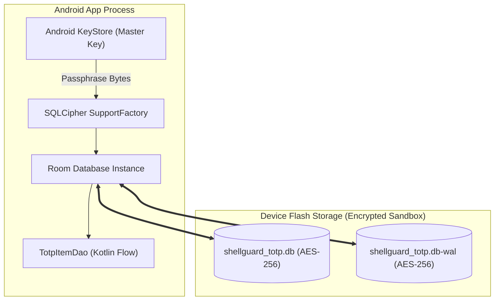

# 🗄️ ShellGuard-TOTP — Android Room Database Schema & Storage

> **Specification of Encrypted Room Entities, DAOs, SQLCipher Configuration & Offline Cache Engine**  
> *Targeted for Google AI Studio Android Application Generator.*

---

## 1. Room Storage Architecture

The local storage subsystem provides an **offline-first, hardware-encrypted cache** for all 2FA tokens. The database uses **SQLCipher for Android** (`net.zetetic:sqlcipher-android`) to guarantee that all SQLite tables, indices, and WAL journals on disk are encrypted with AES-256 using a passphrase managed by the Android KeyStore.



---

## 2. Room Database Entities

### A. `TotpItemEntity`
Represents an individual 2FA / TOTP token record.

```kotlin
package com.clawstack.shellguard.totp.data.local.entities

import androidx.room.ColumnInfo
import androidx.room.Entity
import androidx.room.Index
import androidx.room.PrimaryKey

@Entity(
    tableName = "totp_items",
    indices = [
        Index(value = ["owner_uuid"]),
        Index(value = ["category"]),
        Index(value = ["is_local_only"]),
        Index(value = ["sync_state"])
    ]
)
data class TotpItemEntity(
    @PrimaryKey
    @ColumnInfo(name = "id")
    val id: String, // Matches server pearl UUID, or generated UUID for local-only items

    @ColumnInfo(name = "owner_uuid")
    val ownerUuid: String,

    @ColumnInfo(name = "title")
    val title: String, // Service / Account Name (e.g., "GitHub", "AWS Console")

    @ColumnInfo(name = "username")
    val username: String? = null, // e.g., "lucas@example.com"

    @ColumnInfo(name = "category")
    val category: String? = null, // Pod / Folder path (e.g., "Work/DevOps")

    @ColumnInfo(name = "secret")
    val secret: String, // Decrypted Base32 secret string (stored encrypted on disk via SQLCipher)

    @ColumnInfo(name = "algorithm")
    val algorithm: String = "SHA1", // SHA1, SHA256, SHA512

    @ColumnInfo(name = "digits")
    val digits: Int = 6, // 6 or 8 digits

    @ColumnInfo(name = "period")
    val period: Int = 30, // 30 or 60 seconds

    @ColumnInfo(name = "is_local_only")
    val isLocalOnly: Boolean = false, // True if created via QR scan without server sync

    @ColumnInfo(name = "sync_state")
    val syncState: String = "SYNCED", // "SYNCED", "PENDING_SYNC", "ERROR"

    @ColumnInfo(name = "remote_updated_at")
    val remoteUpdatedAt: String? = null,

    @ColumnInfo(name = "local_updated_at")
    val localUpdatedAt: Long = System.currentTimeMillis()
)
```

---

### B. `SyncMetadataEntity`
Tracks server synchronization state, offline status, and last sync timestamps.

```kotlin
package com.clawstack.shellguard.totp.data.local.entities

import androidx.room.ColumnInfo
import androidx.room.Entity
import androidx.room.PrimaryKey

@Entity(tableName = "sync_metadata")
data class SyncMetadataEntity(
    @PrimaryKey
    @ColumnInfo(name = "id")
    val id: Int = 1, // Singleton row

    @ColumnInfo(name = "server_url")
    val serverUrl: String,

    @ColumnInfo(name = "owner_uuid")
    val ownerUuid: String,

    @ColumnInfo(name = "last_sync_timestamp")
    val lastSyncTimestamp: Long = 0L,

    @ColumnInfo(name = "last_sync_status")
    val lastSyncStatus: String = "IDLE", // "SUCCESS", "FAILED", "OFFLINE", "IDLE"

    @ColumnInfo(name = "item_count")
    val itemCount: Int = 0,

    @ColumnInfo(name = "last_error_message")
    val lastErrorMessage: String? = null
)
```

---

## 3. Data Access Objects (DAOs)

### A. `TotpItemDao`

```kotlin
package com.clawstack.shellguard.totp.data.local.dao

import androidx.room.*
import com.clawstack.shellguard.totp.data.local.entities.TotpItemEntity
import kotlinx.coroutines.flow.Flow

@Dao
interface TotpItemDao {
    @Query("SELECT * FROM totp_items WHERE owner_uuid = :ownerUuid ORDER BY title ASC")
    fun observeAllTotpItems(ownerUuid: String): Flow<List<TotpItemEntity>>

    @Query("SELECT * FROM totp_items WHERE owner_uuid = :ownerUuid AND category = :category ORDER BY title ASC")
    fun observeTotpItemsByPod(ownerUuid: String, category: String): Flow<List<TotpItemEntity>>

    @Query("SELECT * FROM totp_items WHERE id = :id LIMIT 1")
    suspend fun getItemById(id: String): TotpItemEntity?

    @Query("SELECT * FROM totp_items WHERE owner_uuid = :ownerUuid AND (title LIKE '%' || :query || '%' OR username LIKE '%' || :query || '%')")
    fun searchTotpItems(ownerUuid: String, query: String): Flow<List<TotpItemEntity>>

    @Insert(onConflict = OnConflictStrategy.REPLACE)
    suspend fun upsertItems(items: List<TotpItemEntity>)

    @Insert(onConflict = OnConflictStrategy.REPLACE)
    suspend fun upsertItem(item: TotpItemEntity)

    @Query("SELECT * FROM totp_items WHERE owner_uuid = :ownerUuid AND sync_state = 'PENDING_SYNC'")
    suspend fun getPendingSyncItems(ownerUuid: String): List<TotpItemEntity>

    @Query("SELECT * FROM totp_items WHERE owner_uuid = :ownerUuid AND is_local_only = 1")
    suspend fun getLocalOnlyItems(ownerUuid: String): List<TotpItemEntity>

    @Query("DELETE FROM totp_items WHERE id = :id")
    suspend fun deleteById(id: String)

    @Delete
    suspend fun deleteItem(item: TotpItemEntity)

    /**
     * Delta sync reconciliation: Deletes remote items that no longer exist on the server,
     * while strictly preserving user items created locally on device (is_local_only = 1).
     */
    @Query("DELETE FROM totp_items WHERE owner_uuid = :ownerUuid AND is_local_only = 0 AND id NOT IN (:activeRemoteIds)")
    suspend fun pruneDeletedRemoteItems(ownerUuid: String, activeRemoteIds: List<String>)

    @Query("DELETE FROM totp_items WHERE owner_uuid = :ownerUuid")
    suspend fun clearVault(ownerUuid: String)

    @Query("SELECT COUNT(*) FROM totp_items WHERE owner_uuid = :ownerUuid")
    suspend fun getItemCount(ownerUuid: String): Int
}
```

---

### B. `SyncMetadataDao`

```kotlin
package com.clawstack.shellguard.totp.data.local.dao

import androidx.room.*
import com.clawstack.shellguard.totp.data.local.entities.SyncMetadataEntity
import kotlinx.coroutines.flow.Flow

@Dao
interface SyncMetadataDao {
    @Query("SELECT * FROM sync_metadata WHERE id = 1 LIMIT 1")
    fun observeMetadata(): Flow<SyncMetadataEntity?>

    @Query("SELECT * FROM sync_metadata WHERE id = 1 LIMIT 1")
    suspend fun getMetadata(): SyncMetadataEntity?

    @Insert(onConflict = OnConflictStrategy.REPLACE)
    suspend fun updateMetadata(metadata: SyncMetadataEntity)
}
```

---

## 4. Room Database Builder & SQLCipher Factory

```kotlin
package com.clawstack.shellguard.totp.data.local

import android.content.Context
import androidx.room.Database
import androidx.room.Room
import androidx.room.RoomDatabase
import com.clawstack.shellguard.totp.data.local.dao.SyncMetadataDao
import com.clawstack.shellguard.totp.data.local.dao.TotpItemDao
import com.clawstack.shellguard.totp.data.local.entities.SyncMetadataEntity
import com.clawstack.shellguard.totp.data.local.entities.TotpItemEntity
import net.sqlcipher.database.SupportFactory

@Database(
    entities = [
        TotpItemEntity::class,
        SyncMetadataEntity::class
    ],
    version = 1,
    exportSchema = false
)
abstract class ShellGuardTotpDatabase : RoomDatabase() {
    abstract fun totpItemDao(): TotpItemDao
    abstract fun syncMetadataDao(): SyncMetadataDao

    companion object {
        private const val DB_NAME = "shellguard_totp_encrypted.db"

        fun create(context: Context, dbPassphraseBytes: ByteArray): ShellGuardTotpDatabase {
            val factory = SupportFactory(dbPassphraseBytes)
            return Room.databaseBuilder(
                context.applicationContext,
                ShellGuardTotpDatabase::class.java,
                DB_NAME
            )
                .openHelperFactory(factory)
                .fallbackToDestructiveMigration()
                .build()
        }
    }
}
```

---

## 5. Offline Cache Guarantees

1. **Zero Expiration of Cached Tokens**: Unlike session tokens which expire after 24h, the local TOTP database remains valid indefinitely offline.
2. **Cold Start Fidelity**: Upon cold boot, if biometric authorization succeeds, the UI immediately displays cached TOTP codes with zero blocking network calls.
3. **Optimistic Updates**: If a user updates or adds a local 2FA code, it is immediately persisted in Room DB and reflected in the UI within 16ms.

---

## 6. Encrypted Backup & Restore Engine (`BackupManager.kt`)

Enables users to export their encrypted Room database items into a portable, encrypted JSON backup file and restore it with cryptographic integrity verification via `ShellCryptionEngine`:

```kotlin
package com.clawstack.shellguard.totp.data.backup

import com.clawstack.shellguard.totp.crypto.ShellCryptionEngine
import com.clawstack.shellguard.totp.data.local.dao.TotpItemDao
import com.clawstack.shellguard.totp.data.local.entities.TotpItemEntity
import kotlinx.coroutines.Dispatchers
import kotlinx.coroutines.withContext
import kotlinx.serialization.Serializable
import kotlinx.serialization.json.Json
import java.security.MessageDigest

@Serializable
data class BackupItemDto(
    val id: String,
    val title: String,
    val username: String? = null,
    val category: String? = null,
    val encryptedSecret: String, // Encrypted ShellCryption envelope
    val algorithm: String = "SHA1",
    val digits: Int = 6,
    val period: Int = 30,
    val isLocalOnly: Boolean = true
)

@Serializable
data class ShellGuardBackupEnvelope(
    val format: String = "shellguard-totp-backup-v1",
    val createdAt: Long = System.currentTimeMillis(),
    val ownerUuid: String,
    val checksum: String, // SHA-256 integrity hash of items JSON
    val items: List<BackupItemDto>
)

class BackupManager(
    private val totpItemDao: TotpItemDao
) {
    private val json = Json { prettyPrint = true; ignoreUnknownKeys = true }

    /**
     * Exports all local Room items into an encrypted JSON backup string.
     */
    suspend fun exportEncryptedBackup(rawHuKey: String, userUuid: String, items: List<TotpItemEntity>): String = withContext(Dispatchers.IO) {
        val shellKey = ShellCryptionEngine.deriveShellKey(rawHuKey, userUuid)
        
        val backupItems = items.map { entity ->
            val encryptedSeed = ShellCryptionEngine.encryptField(
                plaintext = entity.secret,
                shellKey = shellKey,
                table = "vault_pearls_totp",
                recordId = entity.id
            )
            BackupItemDto(
                id = entity.id,
                title = entity.title,
                username = entity.username,
                category = entity.category,
                encryptedSecret = encryptedSeed,
                algorithm = entity.algorithm,
                digits = entity.digits,
                period = entity.period,
                isLocalOnly = entity.isLocalOnly
            )
        }

        val itemsRaw = json.encodeToString(kotlinx.serialization.builtins.ListSerializer(BackupItemDto.serializer()), backupItems)
        val digest = MessageDigest.getInstance("SHA-256")
        val checksum = digest.digest(itemsRaw.toByteArray(Charsets.UTF_8)).joinToString("") { "%02x".format(it) }

        val envelope = ShellGuardBackupEnvelope(
            ownerUuid = userUuid,
            checksum = checksum,
            items = backupItems
        )
        json.encodeToString(ShellGuardBackupEnvelope.serializer(), envelope)
    }

    /**
     * Restores and verifies an encrypted JSON backup file, merging decrypted records into Room DB.
     */
    suspend fun importEncryptedBackup(rawHuKey: String, userUuid: String, backupJson: String): Result<Int> = withContext(Dispatchers.IO) {
        runCatching {
            val envelope = json.decodeFromString<ShellGuardBackupEnvelope>(backupJson)
            require(envelope.format.startsWith("shellguard-totp-backup")) { "Unsupported backup format version" }

            // 1. Verify Checksum Integrity
            val itemsRaw = json.encodeToString(kotlinx.serialization.builtins.ListSerializer(BackupItemDto.serializer()), envelope.items)
            val digest = MessageDigest.getInstance("SHA-256")
            val computedChecksum = digest.digest(itemsRaw.toByteArray(Charsets.UTF_8)).joinToString("") { "%02x".format(it) }
            require(computedChecksum == envelope.checksum) { "Backup checksum integrity check failed! File may be corrupt or tampered." }

            // 2. Decrypt each item seed using ShellCryptionEngine
            val shellKey = ShellCryptionEngine.deriveShellKey(rawHuKey, userUuid)
            val restoredEntities = envelope.items.map { dto ->
                val decryptedSeed = ShellCryptionEngine.decryptField(
                    encryptedJson = dto.encryptedSecret,
                    shellKey = shellKey,
                    table = "vault_pearls_totp",
                    recordId = dto.id
                )
                TotpItemEntity(
                    id = dto.id,
                    ownerUuid = userUuid,
                    title = dto.title,
                    username = dto.username,
                    category = dto.category,
                    secret = decryptedSeed,
                    algorithm = dto.algorithm,
                    digits = dto.digits,
                    period = dto.period,
                    isLocalOnly = true,
                    syncState = "PENDING_SYNC"
                )
            }

            // 3. Upsert into Room DB
            totpItemDao.upsertItems(restoredEntities)
            restoredEntities.size
        }
    }
}
```
